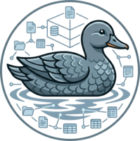

# SlateDuck

**Your entire lakehouse — data, catalog, and streaming pipeline — in a single S3 bucket. No database server required.**

[](https://github.com/trickle-labs/slateduck/actions)
[](LICENSE)
[](https://www.rust-lang.org)

---



## What Is SlateDuck?

Modern data teams are drowning in infrastructure. You want a lakehouse — fast analytical queries over Parquet files in object storage — but every existing solution demands a zoo of running services: a managed PostgreSQL for catalog metadata, a Kafka cluster for streaming, a Flink or Spark job for maintaining fresh aggregates, and a dedicated database to serve the results. SlateDuck makes the entire zoo disappear.

SlateDuck is a catalog backend for [DuckLake](https://ducklake.select/), the elegant open-source lakehouse format from the DuckDB team. Instead of routing catalog metadata through an external database, SlateDuck stores it directly in [SlateDB](https://slatedb.io/) — a battle-hardened, LSM-based embedded key-value store that runs entirely inside object storage. The result is a lakehouse where **both your Parquet data files and your catalog live in the same S3 bucket**, connected to DuckDB over the standard PostgreSQL wire protocol, requiring absolutely no servers beyond lightweight stateless binaries. Point at a bucket, start the sidecar, and you are querying within seconds.


---

## Why SlateDuck?

### Truly Serverless — All the Way Down

There is no "catalog database" to operate. The entire durable state of your catalog — schemas, tables, columns, snapshots, and data-file references — is stored as SlateDB key-value pairs that live as ordinary objects in S3 (or GCS, Azure Blob Storage, or even the local filesystem for development). Every SlateDuck binary is stateless. If it crashes, you restart it; no recovery ceremony, no WAL replays, no replica promotion. The ground truth is always in object storage, and it always has been.


### Immutability as the Load-Bearing Foundation

SlateDuck makes a binding architectural promise: **committed facts are never physically deleted by normal operation.** Every schema change, every table creation, every file addition, every checkpoint advance is recorded as a versioned fact. The default `slateduck gc` command only advances the query-visibility floor — it never deletes bytes. Physical deletion is reserved for the explicit, audited `slateduck excise` command, which exists for compliance erasure and is designed to be rare. This immutability is not a safety blanket bolted on afterward; it is the principle that makes time travel trivial and read scale-out free.

### Time Travel That Actually Works

Because every row ever written to the catalog is preserved, time travel is not a special mode — it is the natural way the storage engine works. You can read the complete, consistent state of your catalog at any historical `dl_snapshot_id` with no extra overhead, no snapshot tables, no log-file archaeology. Whether you want to audit what your schema looked like last Tuesday or reproduce the exact table state from which a quarterly report was generated six months ago, you do it with a single snapshot ID and a `SELECT`.

### Horizontal Read Scale-Out

Because catalog keys are stable once written, an **unbounded number of stateless reader replicas** can serve queries at any historical snapshot without coordinating with the writer or with each other. No consensus, no rebalancing protocol — just SlateDB's CAS primitive and immutable catalog snapshots.

---

## Architecture at a Glance

SlateDuck operates as three logically separable planes, all sharing the same SlateDB/object-store substrate:

```
┌─────────────────────────────────────────────────────────────┐
│                        DuckDB Client                        │
│                   (ducklake extension)                      │
└─────────────────────┬───────────────────────────────────────┘
                      │ PostgreSQL Wire Protocol
                      ▼
┌─────────────────────────────────────────────────────────────┐
│               CONTROL PLANE: slateduck-pgwire               │
│   PG wire protocol · bounded SQL · catalog writer/reader    │
└─────────────────────┬───────────────────────────────────────┘
                      │ catalog snapshots (SlateDB)
                      ▼
┌─────────────────────────────────────────────────────────────┐
│                   CATALOG (SlateDB)                         │
│           28 DuckLake tables (v1.0 schema)                  │
└──────┬──────────────────────────────────────────────────────┘
       │
                      ┌───────────────────────────────────────┐
                      │   Object Storage (S3 / GCS / Azure)   │
                      │                                       │
                      │  catalogs/warehouse-a/  (SlateDB SSTs)│
                      │  data/warehouse-a/      (Parquet)     │
                      └───────────────────────────────────────┘
```

DuckDB speaks to SlateDuck using the PostgreSQL wire protocol — the same protocol it already uses for PostgreSQL-backed DuckLake. No changes to DuckDB, no patched extensions, no custom drivers.

The **control plane** (`slateduck-pgwire`) handles DDL and ingest. It implements exactly the finite set of SQL shapes that DuckDB's `ducklake` extension emits. The vocabulary is small, the conformance test suite is exhaustive, and the security profile is tight.


---

## Getting Started

### Prerequisites

- Rust stable toolchain ([rustup.rs](https://rustup.rs))
- An S3-compatible object store (or just a local directory to start)

### Build

```bash
git clone https://github.com/trickle-labs/slateduck
cd slateduck
cargo build --release
```

### Run the Sidecar

```bash
# Start with a local catalog directory
./target/release/slateduck serve --catalog /path/to/catalog

# Bind to a specific address
./target/release/slateduck serve --catalog /path/to/catalog --bind 0.0.0.0:5432

# Limit concurrent sessions
./target/release/slateduck serve --catalog /path/to/catalog --max-sessions 16
```

### Connect with DuckDB

```sql
-- Install and load the ducklake extension
INSTALL ducklake;
LOAD ducklake;

-- Attach SlateDuck as your catalog backend
ATTACH 'ducklake:postgres:host=localhost port=5432 dbname=slateduck' AS my_lake (DATA_PATH '/tmp/ducklake');
USE my_lake;

-- Create a base table
CREATE TABLE events (id BIGINT, name VARCHAR, ts TIMESTAMP);
INSERT INTO events VALUES (1, 'launch', NOW());

SELECT * FROM events;
```

---

## Workspace Layout

SlateDuck is a Cargo workspace of focused crates, each with a clear responsibility boundary:

| Crate | Purpose |
|---|---|
| `slateduck-core` | Foundational types: binary key layout, MVCC visibility logic, protobuf encoding, counter allocation |
| `slateduck-catalog` | All 28 DuckLake v1.0 catalog operations: schemas, tables, columns, snapshots, and data files |
| `slateduck-sql` | Bounded SQL parser and AST dispatcher — only the shapes DuckDB actually emits |
| `slateduck-pgwire` | PostgreSQL wire protocol sidecar binary (startup, simple query, extended query) |
| `slateduck-datafusion` | DataFusion integration for query planning |
| `slateduck-sqlite-vfs` | SQLite VFS layer (planned: native embedded extension path) |
| `slateduck-ffi` | C/C++ FFI bindings (planned: native DuckDB extension) |

---

---

## Design Principles

SlateDuck is an opinionated piece of software. It makes strong bets and does not try to be all things to all people. These bets are worth stating plainly:

**Immutability everywhere.** No data, intermediate or final, is ever overwritten. State advances by appending new immutable batches; obsolete data is reclaimed only by retention-bounded compaction. This makes time travel and read scale-out fall out of the same substrate for free.

**Stateless workers.** Every SlateDuck binary is designed to be killed and restarted at any time with no ceremony. All durable progress lives in the catalog in object storage. Killing a process loses no progress.


**Bounded SQL surface.** The PG wire sidecar implements exactly the finite set of SQL shapes DuckDB emits. The vocabulary is finite, the conformance tests are exhaustive, and the failure mode for an unexpected shape is a clean error rather than a silent wrong answer.

**GC and excision are separate operations.** Garbage collection only advances the query-visibility floor. It does not delete catalog bytes. Physical deletion is a separate, audited, rare operation reserved for compliance and retention enforcement. This separation makes the common case (GC) safe to automate and the exceptional case (excision) easy to audit.

---

## Roadmap

| Version | Theme | Status |
|---|---|---|
| v0.9.x | Write-protocol correctness, security enforcement, operational safety, GA readiness | In progress |
| v0.10 | Streaming ingest | Released |
| v1.0 | GA: all acceptance tests green, full docs, migration tooling | Planned |

See [ROADMAP.md](ROADMAP.md) for full milestone details.

---

## Testing

```bash
# Run all tests
cargo test --all

# Run the catalog integration tests specifically
cargo test -p slateduck-catalog

# Run benchmarks
cargo bench -p slateduck-catalog
```

The test suite includes unit tests, property-based tests (via `proptest`), integration tests against real SlateDB instances, and golden-file conformance tests derived from actual DuckDB wire captures.

---

## Contributing

Contributions are welcome. Please read [CONTRIBUTING.md](CONTRIBUTING.md) for the development setup, code style requirements, and pull request process. The short version: `cargo fmt --all`, `cargo clippy --all-targets`, tests for new functionality, and a clear PR description.

---

## License

Apache License 2.0 — see [LICENSE](LICENSE) for details.
