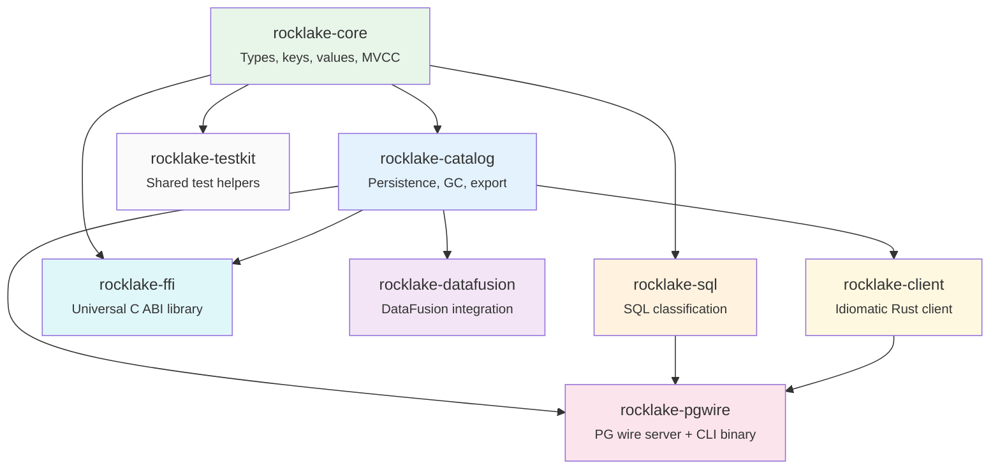

# Crate Structure

RockLake is organized as a Rust workspace with **eight crates**, each with a distinct responsibility and clear dependency boundaries. This structure is not merely organizational — it enforces separation of concerns at the compilation level. A crate cannot accidentally depend on another crate's internals without an explicit dependency declaration in `Cargo.toml`. If a developer tries to import the PG-Wire server's session type from within the catalog store, the code will not compile. This makes architectural violations impossible rather than merely discouraged.

This page documents each crate's purpose, its key modules, its dependencies, and the layering rules that govern the overall workspace structure. Understanding the crate structure is essential for contributors who want to know where new code belongs, and valuable for users who want to embed specific RockLake functionality (like the catalog store) without pulling in the entire binary.

## Workspace Dependency Graph

The arrows point from dependency to dependent. `rocklake-core` is the leaf (depends on no other workspace crate). `rocklake-pgwire` is the root (produces the main binary and depends on multiple crates). No circular dependencies exist — Cargo's resolver would reject them.

## rocklake-core

**Role:** Foundation types shared across all other crates. This is the "vocabulary" of the system — every other crate speaks in terms of types defined here.

**Why it exists separately:** By isolating types into their own crate with no heavy dependencies (no SlateDB, no Tokio, no async runtime), the types can be used anywhere: in the catalog store, in the SQL classifier, in the FFI layer, in test utilities, and in external tools. If these types were defined inside `rocklake-catalog`, then `rocklake-sql` would need to depend on the catalog (and transitively on SlateDB), which would defeat the separation.

**Key modules:**

| Module | Contents |
|--------|----------|
| `tags.rs` | The tag registry: defines all 28+ DuckLake catalog tables plus internal tables. Each tag entry specifies the tag byte value, key schema, MVCC behavior, and human-readable name. This is the single source of truth for key structure. |
| `keys.rs` | Binary key encoding and decoding functions. Every key construction goes through this module to ensure consistent big-endian encoding. Provides both encoding (`encode_table_key(schema_id, table_id, begin_snapshot) -> Vec<u8>`) and decoding (`decode_table_key(bytes) -> (schema_id, table_id, begin_snapshot)`) functions. |
| `values.rs` | Value envelope encoding: magic byte check, version prefix, protobuf serialization wrapper. The `encode_value(row) -> Vec<u8>` and `decode_value<T>(bytes) -> T` functions handle the envelope automatically. |
| `rows.rs` | Protobuf message definitions (generated by `prost`) for all row types: `SnapshotRow`, `SchemaRow`, `TableRow`, `ColumnRow`, `DataFileRow`, `DeleteFileRow`, `TableStatsRow`, `FileColumnStatsRow`, `InlinedInsertRow`, `InlinedDeleteRow`, `HotKeyValue`, and many more. |
| `mvcc.rs` | MVCC visibility functions: `is_visible(begin, end, target)`, `latest_visible_version(versions, target)`, `is_gc_eligible(end, retain_from)`. Pure logic with no I/O. |
| `counters.rs` | Counter domain definitions and allocation logic. Defines which counters exist (snapshot, catalog, file, column-per-table) and how they are incremented. |
| `types.rs` | DuckLake type system mapping. Maps DuckDB type strings to internal type representations and provides type-aware comparison functions for column statistics (how to compare min/max values of different types). |
| `path.rs` | Path canonicalization and resolution. Handles the relationship between catalog paths, data paths, and file paths within those paths. |
| `validation.rs` | Integration tests that validate assumptions about SlateDB's API behavior (e.g., that WriteBatch is truly atomic, that prefix scans are bounded correctly). |

**External dependencies:** `prost` (protobuf code generation), `thiserror` (ergonomic error types), `bytes` (byte buffer utilities). Deliberately minimal — no async runtime, no network I/O, no file I/O.

## rocklake-catalog

**Role:** The core persistence and operational layer. This crate owns the SlateDB database handle and provides all catalog operations: reads, writes, garbage collection, excision, export, import, verification, repair, metrics, and more.

**Why it exists separately:** The catalog operations are useful independently of the network server. You might want to run garbage collection from a CLI tool, export a catalog from a script, verify integrity from a monitoring system, or embed the catalog directly in a Rust application (via DataFusion or FFI). By keeping the catalog separate from the PG-Wire server, all of these use cases are supported without pulling in network dependencies.

**Key modules:**

| Module | Contents |
|--------|----------|
| `store.rs` | `CatalogStore`: the primary entry point. Opens or creates a catalog, registers the writer epoch, provides `CatalogReader` and `CatalogWriter` handles. |
| `init.rs` | First-time catalog initialization: creates system keys, sets format version, initializes counters. Handles concurrent initialization attempts safely. |
| `reader.rs` | `CatalogReader`: snapshot-bound read operations. Prefix scans with MVCC filtering, point lookups, file listing with statistics, schema/table/column enumeration. All reads go through this struct. |
| `writer.rs` | `CatalogWriter`: all mutation operations. Creates schemas, tables, columns, views, macros. Registers data files and delete files. Records snapshots. Updates statistics. All writes are accumulated into a `WriteBatch` and committed atomically. |
| `gc.rs` | Garbage collection: plans retention horizon advancement, identifies GC-eligible rows, applies the new `retain_from` value. Does not physically delete rows (that is excision). |
| `excise.rs` | Physical deletion of superseded rows. Identifies rows where `end_snapshot <= retain_from`, deletes them from SlateDB, and logs the excision for audit. Irreversible. |
| `checkpoint.rs` | Checkpoint creation and restoration for point-in-time recovery. Creates a consistent snapshot of the catalog that can be stored separately for disaster recovery. |
| `export.rs` | NDJSON export and import. Serializes the entire catalog (or a subset) to newline-delimited JSON for backup, migration, or debugging. |
| `repair.rs` | Conservative repair: fixes orphaned rows (where a successor version is missing), stale counters, and minor inconsistencies. Refuses to proceed if corruption is unrecoverable. |
| `verify.rs` | Integrity verification: checks format version, counter consistency, MVCC invariants (no overlapping versions, no orphaned supersessions), and key-value structural validity. |
| `audit.rs` | Audit log management: writes per-snapshot audit entries recording what changed, reads audit entries for a snapshot range. |
| `metrics.rs` | Prometheus-compatible metrics: operation counts (reads, writes, scans), latencies (p50, p99), resource usage (open SST files, cache hit rate). |
| `partition.rs` | Multi-writer via dataset partitioning: `CatalogRegistry` manages multiple independent catalogs, `PartitionedWriter` routes writes to the correct catalog based on table metadata. |
| `encryption.rs` | At-rest encryption configuration: AES-256-GCM encryption via SlateDB's block transformer interface. Encrypts/decrypts transparently during read and write. |
| `performance.rs` | Performance optimizations: hot key maintenance (packed current state for cold-start), secondary index management, bloom filter hints. |
| `cleanup.rs` | Orphaned file detection: identifies Parquet files in the data path that are not referenced by any catalog entry (possible after failed writes or excision). |

**External dependencies:** `rocklake-core`, `slatedb`, `object_store`, `tokio`, `prost`, `serde_json`, `chrono`, `prometheus`. This crate has the heaviest dependency footprint because it orchestrates actual I/O.

## rocklake-sql

**Role:** Bounded SQL classification. Takes a SQL string and produces a typed `StatementKind` enum variant. Pure function, no side effects, no I/O.

**Why it exists separately:** SQL classification is a self-contained concern that does not need access to the catalog or network. Separating it:

- Allows the classifier to be tested independently (feed it SQL strings, assert on the classified output)
- Prevents the classifier from accidentally performing I/O or state mutation
- Makes the classifier reusable in contexts where the full catalog is not available (e.g., a SQL validation tool)

**Key modules:**

| Module | Contents |
|--------|----------|
| `classifier.rs` | The main classification logic: approximately 50 match arms covering all supported DuckLake SQL patterns. Each match arm extracts parameters from the AST and constructs a `StatementKind` variant. |
| `lib.rs` | Public API: `classify_statement(sql, params) -> Result<StatementKind, SqlDispatchError>`. Single entry point for the entire crate. |

**External dependencies:** `rocklake-core` (for types like `StatementKind`), `sqlparser` (SQL parsing with PostgreSQL dialect). Does NOT depend on `rocklake-catalog`.

## rocklake-pgwire

**Role:** PostgreSQL wire protocol server. This crate produces the main `rocklake` binary. It accepts DuckDB connections, manages sessions, dispatches classified SQL to the catalog store, and encodes results as PG-Wire messages.

**Why it exists as the top-level binary crate:** It integrates all other crates into a running server. It is the only crate that "knows about" all the other crates simultaneously (core types, SQL classification, and catalog operations).

**Key modules:**

| Module | Contents |
|--------|----------|
| `main.rs` | Binary entry point: CLI argument parsing (using `clap`), configuration loading, signal handling, server startup and graceful shutdown. |
| `server.rs` | TCP accept loop with TLS negotiation, session count limiting, and task spawning. |
| `handler.rs` | Protocol handler implementing `SimpleQueryHandler` and `ExtendedQueryHandler` traits from the `pgwire` crate. Routes messages to the appropriate session operations. |
| `executor.rs` | Statement execution: maps each `StatementKind` variant to the corresponding `CatalogReader` or `CatalogWriter` operation and constructs PG-Wire result sets (RowDescription + DataRow messages). |
| `session.rs` | Per-connection state: transaction buffering (`PendingCatalogTxn`), session settings, prepared statement cache, snapshot binding. |
| `types.rs` | PostgreSQL OID mapping: converts internal types to PG type OIDs and formats values as text for wire transmission. |
| `error.rs` | SQLSTATE error mapping: converts internal error types to PostgreSQL ErrorResponse messages with appropriate severity, code, and message. |

**External dependencies:** `rocklake-core`, `rocklake-catalog`, `rocklake-sql`, `pgwire`, `tokio`, `tokio-rustls`, `clap`, `tracing`.

## rocklake-datafusion

**Role:** Apache DataFusion integration. Exposes RockLake catalogs as DataFusion catalog providers, enabling query planning against RockLake-managed tables from pure Rust applications.

**Why it exists:** DataFusion is a popular embeddable query engine for Rust applications. By providing a `CatalogProvider` implementation, any DataFusion-based application can read from RockLake catalogs without going through the PG-Wire protocol or depending on DuckDB.

**Key modules:**

| Module | Contents |
|--------|----------|
| `catalog_provider.rs` | `RockLakeCatalogProvider`: implements DataFusion's `CatalogProvider` trait. Lists schemas. |
| `schema_provider.rs` | `RockLakeSchemaProvider`: implements `SchemaProvider`. Lists tables within a schema and provides `TableProvider` instances. |
| `table_provider.rs` | `RockLakeTableProvider`: implements `TableProvider`. Returns the Arrow schema (mapped from DuckLake column types) and provides scan execution plans that read from the registered Parquet files. |

**External dependencies:** `rocklake-core`, `rocklake-catalog`, `datafusion`, `arrow`.

## rocklake-ffi

**Role:** C/C++ foreign function interface for embedding RockLake directly in DuckDB as a native extension. Provides `extern "C"` functions with C-compatible types and opaque handle-based resource management.

**Why it exists:** The FFI crate enables "Strategy C" — running RockLake as a DuckDB extension rather than a network server. This eliminates network round-trips entirely, reducing catalog operation latency from milliseconds (network) to microseconds (in-process function calls).

**Key modules:**

| Module | Contents |
|--------|----------|
| `lib.rs` | Complete FFI surface: `rocklake_open(path) -> Handle`, `rocklake_close(handle)`, `rocklake_list_schemas(handle) -> SchemaArray`, `rocklake_list_tables(handle, schema_id) -> TableArray`, `rocklake_describe_table(handle, table_id) -> ColumnArray`, `rocklake_list_data_files(handle, table_id) -> FileArray`, plus error retrieval and memory deallocation functions. |

**External dependencies:** `rocklake-core`, `rocklake-catalog`, `tokio` (for async bridge — the FFI creates a Tokio runtime internally to drive SlateDB's async operations).

## Dependency Layering Rules

The crates follow strict layering rules enforced by Cargo's dependency resolver:

1. **`rocklake-core`** — depends on no workspace crates (the foundation leaf)
2. **`rocklake-catalog`** — depends only on `rocklake-core`
3. **`rocklake-sql`** — depends only on `rocklake-core`
4. **Higher-level crates** (`pgwire`, `datafusion`, `ffi`) — depend on `core` + `catalog` and optionally `sql`
5. **No circular dependencies** — enforced by Cargo (compile error if violated)

This layering provides concrete benefits:

- You can use `rocklake-core` + `rocklake-catalog` in a custom application without the PG-Wire server
- You can use `rocklake-sql` as a standalone SQL classifier without any catalog or network code
- Changes to `rocklake-pgwire` never require recompiling `rocklake-catalog` or `rocklake-core`
- Test suites for lower crates run faster because they don't compile higher-level dependencies

## Build Characteristics

| Crate | Lines of Code (approx) | Compile Time | Binary Contribution |
|-------|----------------------|--------------|-------------------|
| rocklake-core | ~5,000 | Fast (no proc macros except prost) | Shared types |
| rocklake-catalog | ~8,000 | Medium (SlateDB + async) | Core logic |
| rocklake-sql | ~3,000 | Fast (only sqlparser) | SQL classifier |
| rocklake-pgwire | ~4,000 | Medium (network + TLS) | Binary entry point |
| rocklake-datafusion | ~1,500 | Medium (DataFusion is large) | Optional feature |
| rocklake-ffi | ~1,000 | Fast (thin wrapper) | Shared library |

The total workspace compiles in approximately 60–90 seconds on a modern machine (M1/M2 Mac or equivalent). Incremental builds after changing a single file in `rocklake-pgwire` take 5–10 seconds because only the changed crate and its dependents need recompilation.

## Removed Crates

### `rocklake-sqlite-vfs` (removed in v0.27.2)

An experimental crate that aimed to expose the RockLake catalog via an
[SQLite VFS](https://www.sqlite.org/vfs.html) shim was removed in v0.27.2.
The crate contained no functional code — it was a speculative placeholder
without a planned near-term implementation. Retaining it inflated the
workspace build graph and could mislead contributors into expecting a SQLite
compatibility layer that does not exist. The removal is tracked in
`docs/internals/open-findings-verification.md` (N-06).

## Further Reading

- **[Contributing: Development Setup](../contributing/development-setup.md)** — How to clone, build, and test the workspace
- **[Contributing: Architecture Guide](../contributing/architecture-guide.md)** — Guidelines for where new code belongs
- **[Architecture Overview](overview.md)** — How the crates fit together at runtime
