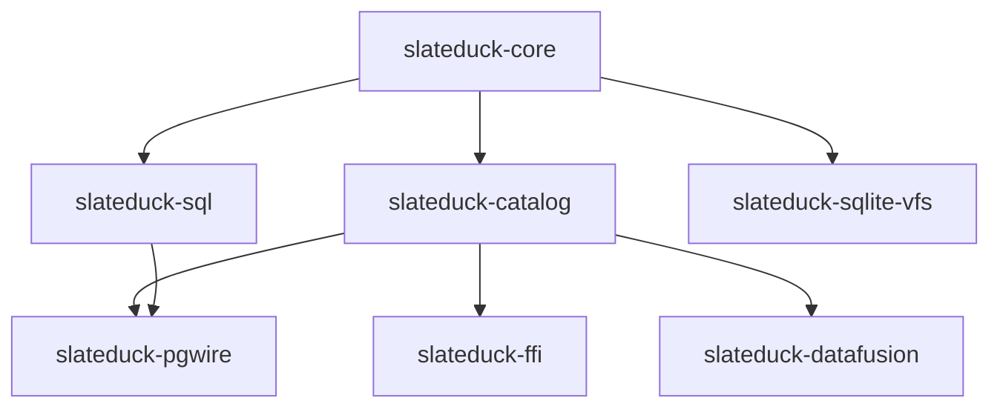

# Crate Structure

SlateDuck is organized as a Cargo workspace with 7 crates.

## Crate Responsibilities

| Crate | Role |
|-------|------|
| `slateduck-core` | Key encoding, value types, MVCC logic, tags |
| `slateduck-catalog` | CatalogStore (reader), CatalogWriter (writer), all DuckLake ops |
| `slateduck-sql` | Bounded SQL dispatcher, statement classifier |
| `slateduck-pgwire` | PG wire protocol, session management, binary entry point |
| `slateduck-ffi` | C ABI for native DuckDB extension |
| `slateduck-datafusion` | DataFusion CatalogProvider |
| `slateduck-sqlite-vfs` | Experimental SQLite VFS layer |

## Dependency Rules

1. All crates may depend on `slateduck-core`
2. Only leaf crates depend on `slateduck-catalog`
3. Only `slateduck-pgwire` depends on `slateduck-sql`
4. No circular dependencies
