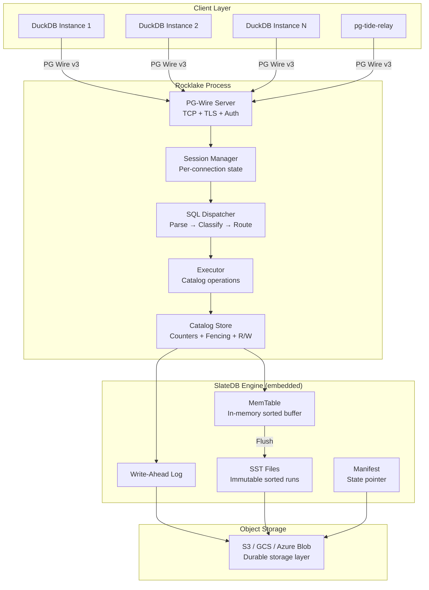
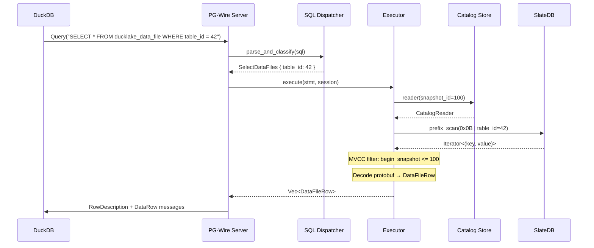
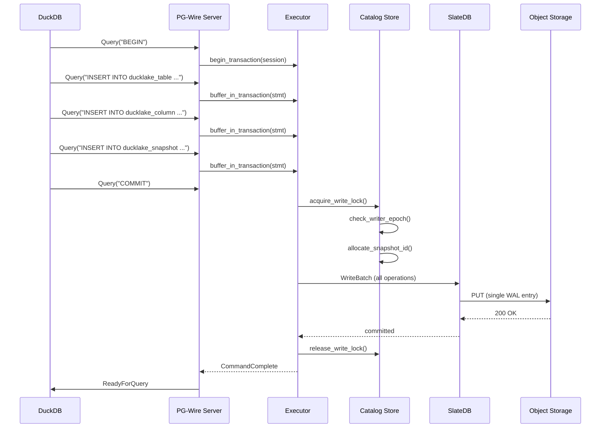
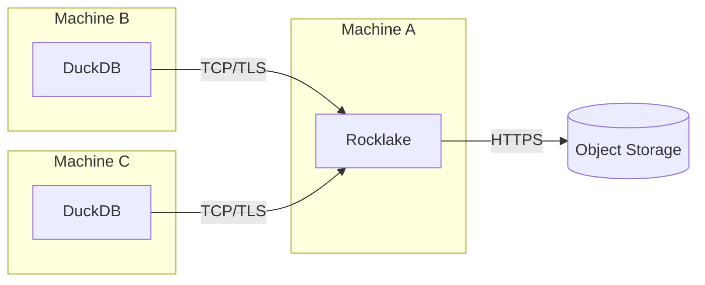
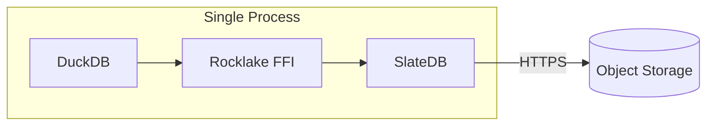
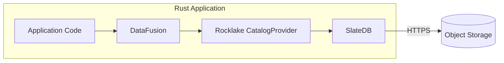

# Architecture Overview

Rocklake is a bridge between DuckDB's DuckLake catalog protocol and SlateDB's cloud-native key-value storage. It accepts connections from DuckDB instances speaking the PostgreSQL wire protocol, translates their catalog SQL into key-value operations, and persists catalog state to object storage through SlateDB's LSM-tree engine. The entire system runs as a single Rust process with no external dependencies beyond an object store bucket — no PostgreSQL, no Redis, no ZooKeeper, no Kafka.

This page provides the bird's-eye view of the architecture: what the components are, how they fit together, how data flows through the system for reads and writes, and how the deployment topology works in practice. Subsequent pages in this section drill into each component in detail.

## System Architecture Diagram

## Component Responsibilities

The architecture is layered with clear boundaries between concerns. Each layer handles exactly one responsibility and delegates everything else downward.

### PG-Wire Server

The outermost layer accepts TCP connections from PostgreSQL-compatible clients. It handles:

- **TCP listener** — Binds to the configured address and port, accepts new connections, spawns a Tokio task per connection
- **TLS termination** — Optional TLS using `rustls`, supporting both server certificates (for encryption) and client certificates (for mutual TLS authentication)
- **Startup negotiation** — Implements the PostgreSQL v3 startup sequence: SSLRequest → StartupMessage → authentication → parameter status
- **Authentication** — Optional username/password authentication using the PostgreSQL SCRAM-SHA-256 mechanism or cleartext password
- **Protocol framing** — Reads length-prefixed frontend messages (Query, Parse, Bind, Execute, Sync, Terminate) and writes backend messages (RowDescription, DataRow, CommandComplete, ReadyForQuery, ErrorResponse)

The PG-Wire server uses the `pgwire` crate for protocol message types and framing. It implements both Simple Query mode (used by DuckDB for most operations) and Extended Query mode (used for prepared statements and parameter binding).

### Session Manager

Each connection gets its own session that maintains per-connection state:

- **Transaction status** — One of: idle (no active transaction), in-transaction (between BEGIN and COMMIT), or failed (transaction encountered an error and must be rolled back)
- **Pending operations** — A `PendingCatalogTxn` buffer that accumulates catalog mutations within a transaction before atomic commit
- **Snapshot binding** — The snapshot ID that the session reads from (either the latest at connection time, or a specific historical snapshot specified in the ATTACH parameters)
- **Session variables** — Parameters like timezone, client encoding, and application name that PostgreSQL clients expect to negotiate during startup

The session manager is not a global singleton — there is no shared session state between connections. Each connection is fully independent, communicating with the catalog store through the executor.

### SQL Dispatcher

The dispatcher is a pure function: it takes a SQL string and returns a classified statement kind. It:

1. Parses the SQL using `sqlparser-rs` with PostgreSQL dialect
2. Pattern-matches the resulting AST against approximately 50 known DuckLake statement shapes
3. Extracts parameters (table names, column definitions, values, predicates) from the AST
4. Returns a `StatementKind` enum variant with structured parameters

The dispatcher is intentionally bounded. It does not implement a general-purpose SQL engine. If the incoming SQL does not match any known pattern, the dispatcher returns `StatementKind::Unknown`, which the executor rejects with an appropriate error. This design ensures that Rocklake's behavior is predictable and auditable: there is a finite set of things it can do, and that set is enumerable.

### Executor

The executor is the bridge between classified statements and catalog operations. For each `StatementKind`:

- **Read operations** (SELECT from catalog tables) acquire a `CatalogReader` bound to the session's snapshot and execute prefix scans or point lookups against the key-value store
- **Write operations** (INSERT, UPDATE, DELETE on catalog tables) buffer mutations in the session's `PendingCatalogTxn`
- **DDL operations** (CREATE, ALTER, DROP) are translated to the equivalent INSERT/UPDATE on the underlying catalog tables and then buffered
- **Transaction control** (BEGIN, COMMIT, ROLLBACK) manages the session's transaction lifecycle and triggers atomic commit on COMMIT

The executor enforces MVCC invariants: it assigns `begin_snapshot` and `end_snapshot` values to new and superseded rows, allocates unique IDs from the counter system, and checks writer epoch fencing before committing.

### Catalog Store

The deepest application layer, sitting directly above SlateDB. It manages:

- **SlateDB database handle** — The embedded LSM-tree database that stores all key-value pairs
- **Counter allocation** — Persistent counters for snapshot IDs, schema IDs, table IDs, column IDs, file IDs, and other entities that need unique monotonic identifiers
- **Writer epoch fencing** — The mechanism that prevents split-brain writes when a new Rocklake instance takes over from an old one
- **CatalogReader** — A snapshot-bound read interface that filters keys through the MVCC visibility rules
- **CatalogWriter** — A write interface that constructs a SlateDB `WriteBatch` from a set of catalog mutations and commits it atomically

The catalog store is the only component that interacts with SlateDB directly. Everything above it operates on structured catalog concepts (schemas, tables, columns, files) without knowledge of the underlying key-value representation.

## Data Flow: Read Path

When DuckDB needs to know which Parquet files to scan for a table, the following sequence occurs:

Key characteristics of the read path:

- **Lock-free reads.** No mutex is acquired for read operations. Multiple connections can read concurrently without contention.
- **Prefix-bounded scans.** The key layout ensures that all data files for a given table are stored under the same key prefix. A prefix scan touches only the relevant keys — there is no full-store scan.
- **MVCC filtering.** Each key-value pair carries version information (begin_snapshot, end_snapshot). The reader filters out pairs not visible at its bound snapshot. For append-only entities like data files, only `begin_snapshot` is checked.
- **Zero-copy where possible.** Row data is decoded from protobuf directly into the wire format without intermediate allocation where the type systems align.

### Cold Read Performance

On a cold start (no in-memory state), the read path must:

1. Read the SlateDB manifest from object storage (1 GET)
2. Identify which SST files contain the relevant key prefix (manifest lookup)
3. Read the relevant SST block(s) from object storage (1–3 GETs depending on catalog size)
4. Decode and filter the results

After the first read, SST block indices and frequently-accessed data are cached in memory. Subsequent reads for the same or nearby key prefixes are served from cache without additional object storage round-trips.

## Data Flow: Write Path

When DuckDB commits a catalog transaction (creating tables, registering files, etc.):

Key characteristics of the write path:

- **Single-writer serialization.** A mutex (or equivalent locking mechanism) ensures only one transaction commits at a time. This eliminates write conflicts by construction.
- **Batch atomicity.** All operations within a transaction are written as a single SlateDB `WriteBatch`, which maps to a single WAL entry, which maps to a single PUT to object storage. Either all operations are durable or none are.
- **Epoch fencing.** Before committing, the writer verifies its epoch is still current. If another Rocklake instance has taken over (incremented the epoch), the commit is rejected with a fencing error.
- **Counter allocation.** Snapshot IDs, table IDs, and other entity IDs are allocated from persistent counters within the same atomic batch. This ensures no ID is ever reused, even across process restarts.

### Write Amplification

A single DuckDB transaction (for example, `CREATE TABLE` with 10 columns) produces one logical batch containing:

- 1 `TableRow` (key + value)
- 10 `ColumnRow` entries (10 keys + values)
- 1 `SnapshotRow` (key + value)
- Counter updates (key + value)

This entire batch is written as a single WAL entry (approximately 2–5 KB depending on column metadata). The write amplification is 1x at the WAL level — one user transaction = one object storage PUT.

During compaction (which happens asynchronously), SlateDB may rewrite this data into SST files, which involves additional PUTs. But compaction is transparent to the application and does not block reads or writes.

## Deployment Topologies

Rocklake supports several deployment patterns depending on your requirements:

### Network Sidecar (Primary)

The most common deployment runs Rocklake as a network process that DuckDB connects to via the PostgreSQL wire protocol:

Advantages: multiple DuckDB instances share one catalog, network isolation, independent scaling, independent failure domains.

### In-Process Extension

For single-machine deployments where network latency is unacceptable, the FFI crate (`rocklake-ffi`) provides a DuckDB native extension that embeds Rocklake directly in the DuckDB process:

Advantages: zero network round-trips (microsecond catalog operations), single binary deployment, no port management.

Trade-offs: shares crash domain with DuckDB, cannot serve multiple DuckDB processes.

### DataFusion Integration

For Rust applications using Apache DataFusion:

Advantages: native Rust integration, no wire protocol overhead, direct access to catalog APIs, custom query engines.

## Concurrency Model

Rocklake uses Tokio for async I/O with a task-per-connection model:

- Each incoming connection spawns a Tokio task
- Read operations are fully concurrent — no global locks
- Write operations are serialized through the catalog store's write lock
- SlateDB's internal compaction runs on background Tokio tasks
- The PG-Wire server's TCP accept loop runs on a dedicated task

This model supports hundreds of concurrent read connections with minimal overhead while maintaining write serialization for correctness.

## Error Handling Philosophy

Rocklake follows a fail-fast philosophy:

- Unknown SQL → immediate error response with SQLSTATE `42601` (syntax error)
- Epoch mismatch → connection terminated with SQLSTATE `57P03` (cannot connect now)
- Object storage failure → error propagated to client with SQLSTATE `58000` (system error)
- Protocol violation → connection terminated immediately

There is no retry logic within Rocklake for transient failures. Retries are the responsibility of the client (DuckDB). This keeps the server's behavior deterministic and makes debugging straightforward: if an operation failed, it failed for a clear reason that is reported in the error response.

## Further Reading

- **[Crate Structure](crate-structure.md)** — How the Rust workspace is organized
- **[Key Layout](key-layout.md)** — The binary key encoding that makes prefix scans efficient
- **[SQL Dispatcher](sql-dispatcher.md)** — How SQL strings become structured operations
- **[PG-Wire Protocol](pg-wire-protocol.md)** — The wire protocol implementation details
- **[Transaction Model](transaction-model.md)** — Atomic commit semantics
- **[MVCC Implementation](mvcc-implementation.md)** — Version filtering at the storage level
