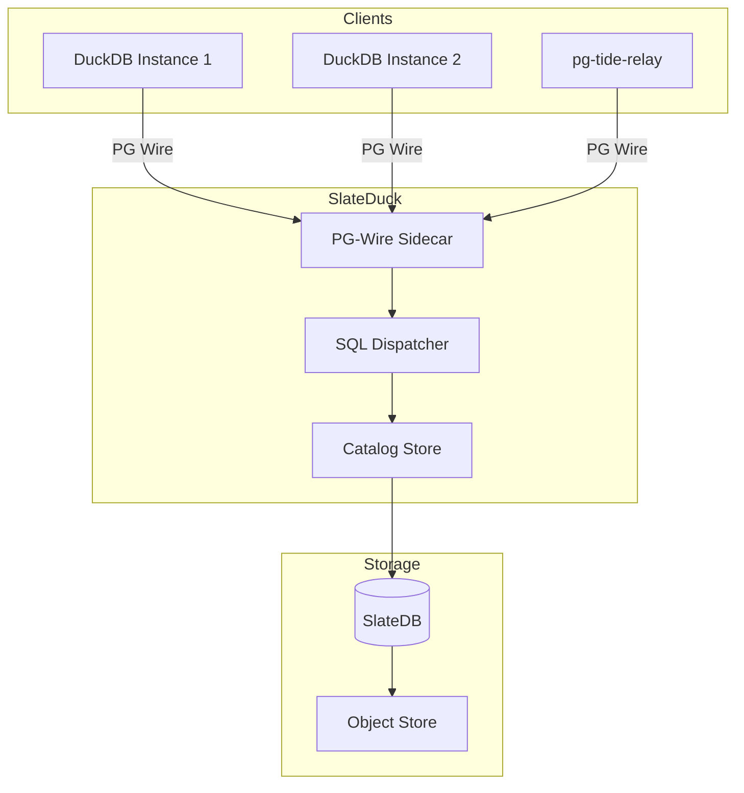

# Architecture Overview

SlateDuck bridges DuckDB's DuckLake catalog protocol and SlateDB's cloud-native key-value storage.

## Data Flow (Read)

1. DuckDB sends `SELECT * FROM ducklake_table WHERE schema_id = 1`
2. PG-Wire decodes the wire message
3. SQL Dispatcher classifies it as `ListTables { schema_id: 1 }`
4. Catalog Store executes prefix scan on `0x05 | schema_id`
5. MVCC filter selects visible rows
6. Results encoded as PG-wire DataRow messages

## Data Flow (Write)

1. DuckDB sends INSERT into `ducklake_data_file`
2. Dispatcher classifies as `RegisterDataFile { ... }`
3. Writer assembles a `DbTransaction`
4. Transaction committed atomically
5. New snapshot ID allocated
