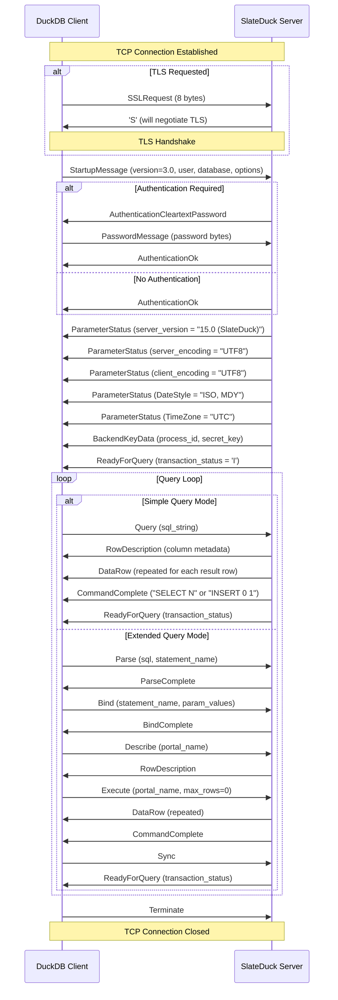

# PG-Wire Protocol

SlateDuck implements a subset of the PostgreSQL wire protocol (version 3) — just enough to serve DuckDB's `ducklake` extension. It does not implement a full PostgreSQL server, does not support arbitrary SQL execution, and does not aim for compatibility with general-purpose PostgreSQL clients. Instead, it implements precisely the protocol messages and behaviors that DuckDB uses when communicating with a DuckLake catalog server, and nothing more.

This deliberate minimalism means the implementation is small (approximately 2,000 lines of Rust), auditable, and unlikely to contain bugs in rarely-exercised protocol paths. If DuckDB does not use a particular protocol feature, SlateDuck does not implement it. This page describes the full connection lifecycle, the supported protocol messages, authentication, query execution, type mapping, error handling, and the operational limits that protect the server from resource exhaustion.

## Why PostgreSQL Wire Protocol?

The choice of PostgreSQL wire protocol is not arbitrary. DuckDB's `ducklake` extension communicates with its catalog server using this protocol because:

1. **Ubiquitous tooling.** PostgreSQL wire protocol is supported by virtually every database client library in every programming language. This means DuckDB does not need a custom driver.
2. **Well-documented standard.** The PostgreSQL frontend/backend protocol specification is publicly documented with precise byte-level descriptions.
3. **Existing infrastructure.** Load balancers, proxies, connection poolers, and monitoring tools all understand PostgreSQL wire protocol.
4. **Simple for catalog operations.** The protocol supports the exact operations needed: send SQL, receive tabular results. No streaming, no cursors, no notifications — just request-response.

SlateDuck uses the `pgwire` Rust crate for protocol message framing and type definitions, adding custom handlers for the specific messages DuckDB sends.

## Connection Lifecycle

Every connection follows the same lifecycle from initial TCP connection to final termination:



### Phase 1: Connection Setup

When a client connects, SlateDuck's TCP accept loop checks the concurrent session count against the configured limit (default: 50). If the limit is reached, the connection is immediately closed. Otherwise, a new Tokio task is spawned to handle the connection.

The first message from the client is either an `SSLRequest` (indicating the client wants to negotiate TLS) or a `StartupMessage` (indicating the client wants to proceed without TLS or has already completed TLS in a prior exchange).

### Phase 2: TLS Negotiation

If configured with TLS (`--tls-cert` and `--tls-key`), SlateDuck responds to `SSLRequest` with byte `'S'` and then performs a TLS handshake using `tokio-rustls`. The server supports TLS 1.2 and 1.3 with modern cipher suites. After the handshake completes, all subsequent protocol messages are encrypted.

If not configured with TLS, SlateDuck responds to `SSLRequest` with byte `'N'` (not available). The client can then choose to continue unencrypted or disconnect.

### Phase 3: Authentication

SlateDuck supports two authentication modes:

**No authentication (default).** The server sends `AuthenticationOk` immediately after parsing the `StartupMessage`. This is suitable for local development, environments where network-level access control (security groups, VPC) provides sufficient isolation, or when SlateDuck is used as an in-process sidecar.

**Cleartext password.** When `--auth-user` and `--auth-password` are configured, the server sends `AuthenticationCleartextPassword`, waits for a `PasswordMessage` from the client, verifies the credentials using constant-time comparison (to prevent timing attacks), and responds with `AuthenticationOk` on success or `ErrorResponse` on failure.

!!! warning "Always use TLS with password authentication"
    Cleartext password authentication sends the password in plain text over the wire. Without TLS, the password is visible to any network observer. Always enable TLS when using password authentication in any non-local deployment.

### Phase 4: Parameter Negotiation

After authentication, the server sends several `ParameterStatus` messages to inform the client about server configuration:

- `server_version` — `"15.0 (SlateDuck)"` (mimics PostgreSQL to satisfy client drivers)
- `server_encoding` — `"UTF8"`
- `client_encoding` — `"UTF8"`
- `DateStyle` — `"ISO, MDY"`
- `TimeZone` — `"UTC"`
- `integer_datetimes` — `"on"`

The `BackendKeyData` message provides a process ID and secret key that the client can use for cancellation requests. SlateDuck generates a random process ID per connection (it has no real notion of processes) and a random secret key.

Finally, `ReadyForQuery` with transaction status `'I'` (idle) signals that the connection is ready to accept queries.

### Phase 5: Query Execution

The connection enters the main query loop, handling messages until the client sends `Terminate` or the connection is interrupted.

## Simple Query Mode

In Simple Query mode, the client sends a `Query` message containing a complete SQL string with all parameter values embedded as literals. SlateDuck:

1. Receives the `Query` message
2. Splits on semicolons if multiple statements are present
3. For each statement:
    a. Passes the SQL string to the SQL dispatcher for classification
    b. Executes the classified statement against the catalog
    c. Encodes results as `RowDescription` + `DataRow` messages
    d. Sends `CommandComplete` with the appropriate tag

DuckDB uses Simple Query mode for most catalog operations. The simplicity of this mode (one message in, results back) makes it the default choice.

## Extended Query Mode

In Extended Query mode, the client separates statement preparation from execution, allowing parameter binding. The message flow is:

1. **Parse** — The client sends a SQL string with `$1`, `$2` parameter placeholders. SlateDuck stores the SQL string keyed by the statement name but does not pre-process it (classification is cheap enough to defer to execution time).

2. **Bind** — The client provides parameter values for a previously parsed statement. SlateDuck captures the values into a `ParamValues` struct with typed accessors.

3. **Describe** — The client requests column metadata for the prepared statement. SlateDuck classifies the statement (if not already classified) and returns `RowDescription` based on the expected output columns for that statement kind.

4. **Execute** — The client requests execution of the bound statement. SlateDuck classifies the SQL with the bound parameters, executes against the catalog, and streams results as `DataRow` messages.

5. **Sync** — The client signals the end of the extended query pipeline. SlateDuck sends `ReadyForQuery`.

DuckDB uses Extended Query mode for parameterized operations — particularly INSERT statements where column values vary between executions. The `ducklake` extension prepares statements like `INSERT INTO ducklake_data_file ($1, $2, $3, ...)` once and executes them multiple times with different file metadata.

## Type System Mapping

SlateDuck maps DuckLake's logical types to PostgreSQL OIDs for wire protocol encoding:

| PostgreSQL Type | OID | Format | Used For |
|----------------|-----|--------|----------|
| int8 (bigint) | 20 | Text | Entity IDs, counters, row counts, file sizes |
| int4 (integer) | 23 | Text | Column ordinal positions, small integers |
| text | 25 | Text | Names, paths, SQL types, JSON blobs |
| bool | 16 | Text | Flags (is_nullable, in_stock, etc.) |
| float8 | 701 | Text | Floating-point statistics (min/max) |
| timestamp | 1114 | Text | Snapshot timestamps (ISO 8601) |
| uuid | 2950 | Text | Generated UUIDs (gen_random_uuid()) |

All values are transmitted in **text format** (not binary). While PostgreSQL's wire protocol supports binary encoding for efficiency, DuckDB's `ducklake` extension expects text-format responses. Text format adds a small overhead (numbers are formatted as decimal strings) but ensures maximum compatibility and simplifies debugging (you can read the wire traffic with a protocol analyzer).

## Error Handling and SQLSTATE Mapping

Errors are encoded as PostgreSQL `ErrorResponse` messages with structured fields:

| Field | Description |
|-------|-------------|
| Severity | "ERROR", "FATAL", or "PANIC" |
| SQLSTATE code | 5-character error classification |
| Message | Human-readable error description |
| Detail | Additional context (optional) |
| Hint | Suggested action (optional) |

SlateDuck maps internal errors to PostgreSQL SQLSTATE codes:

| Internal Error | SQLSTATE | Category | Meaning |
|---------------|----------|----------|---------|
| WriterFenced | 57P04 | Operator Intervention | Another writer has taken over |
| EpochMismatch | 57P03 | Operator Intervention | Cannot connect (epoch check failed) |
| NotFound | 02000 | No Data | Entity does not exist |
| Duplicate | 23505 | Integrity Constraint | Unique violation |
| Unsupported | 0A000 | Feature Not Supported | Unrecognized SQL pattern |
| ParseError | 42601 | Syntax Error | Invalid SQL syntax |
| TypeMismatch | 42804 | Datatype Mismatch | Parameter type conversion failed |
| BatchTooLarge | 54001 | Program Limit Exceeded | Transaction exceeds 64 MiB |
| ObjectStore | 08006 | Connection Exception | Storage I/O failure |
| Corruption | XX001 | Internal Error | Data corruption detected |
| InternalError | XX000 | Internal Error | Unexpected internal failure |

The SQLSTATE mapping enables DuckDB (and other PostgreSQL-aware clients) to classify errors and make retry decisions without parsing error message text.

## Session State

Each connection maintains per-session state in a `SessionState` struct:

- **Transaction status** — One of: idle (`'I'`), in transaction (`'T'`), or failed transaction (`'E'`). Sent in every `ReadyForQuery` message.
- **Pending transaction buffer** — A `PendingCatalogTxn` that accumulates write operations between `BEGIN` and `COMMIT`.
- **Snapshot binding** — The DuckLake snapshot ID this session reads from (set during ATTACH from the client's `SNAPSHOT` parameter).
- **Session variables** — Key-value pairs returned by `SHOW` statements (timezone, client_encoding, application_name).
- **Prepared statements** — Named prepared statements from `Parse` messages, stored as raw SQL strings.

## Connection Limits and Resource Protection

SlateDuck enforces several limits to prevent resource exhaustion:

| Limit | Default | Purpose |
|-------|---------|---------|
| Max concurrent sessions | 50 | Prevents memory exhaustion from too many connections |
| Max active scans | 25 | Prevents excessive concurrent prefix scans from overwhelming SlateDB |
| Max message size | 64 MiB | Prevents memory exhaustion from oversized messages |
| Idle timeout | 300 seconds | Closes idle connections that may be leaked |

These limits are configurable via the server configuration. Exceeding a limit results in an immediate error response (for per-connection limits) or connection rejection (for server-wide limits).

## TLS Configuration Details

TLS is configured via command-line arguments:

```bash
slateduck \
    --catalog s3://bucket/catalog/ \
    --bind 0.0.0.0:5432 \
    --tls-cert /path/to/certificate.pem \
    --tls-key /path/to/private-key.pem
```

SlateDuck supports:

- TLS 1.2 and TLS 1.3
- ECDSA and RSA certificates
- Certificate chains (full chain in the cert PEM file)
- SNI (Server Name Indication) for multi-domain deployments
- OCSP stapling is not supported (certificates must not require it)

For development, self-signed certificates work. For production, use certificates from a trusted CA (Let's Encrypt, your organization's private CA, or a commercial CA).

## Protocol Compatibility Notes

SlateDuck intentionally does not implement several PostgreSQL protocol features:

- **COPY protocol** — Bulk data loading/unloading (not needed for catalog operations)
- **Notifications (LISTEN/NOTIFY)** — Async event channels
- **Cancellation** — CancelRequest messages are accepted but ignored
- **Streaming replication** — WAL-based replication protocol
- **SASL authentication** — SCRAM-SHA-256 (planned for a future release)
- **SSL session resumption** — Each connection performs a full TLS handshake

These omissions are intentional: DuckDB's `ducklake` extension does not use any of these features. If a client sends an unexpected message type, SlateDuck responds with an `ErrorResponse` (SQLSTATE `0A000`, "feature not supported") rather than silently ignoring it.

## Further Reading

- **[SQL Dispatcher](sql-dispatcher.md)** — How the SQL strings received over the wire are classified
- **[Transaction Model](transaction-model.md)** — How BEGIN/COMMIT/ROLLBACK messages interact with the catalog
- **[Architecture Overview](overview.md)** — The system-level view of how PG-Wire fits in the architecture
- **[Deployment: TLS](../deployment/tls.md)** — Production TLS configuration guide
- **[Deployment: Networking](../deployment/networking.md)** — Network topology and firewall considerations
