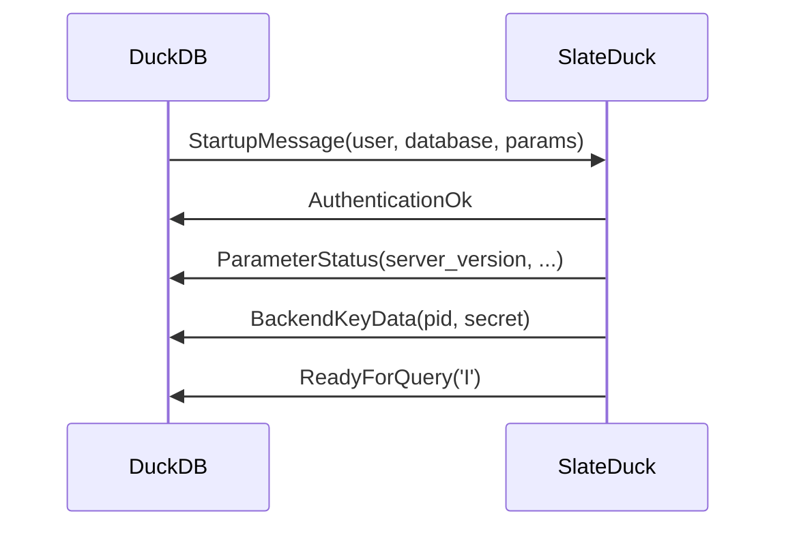
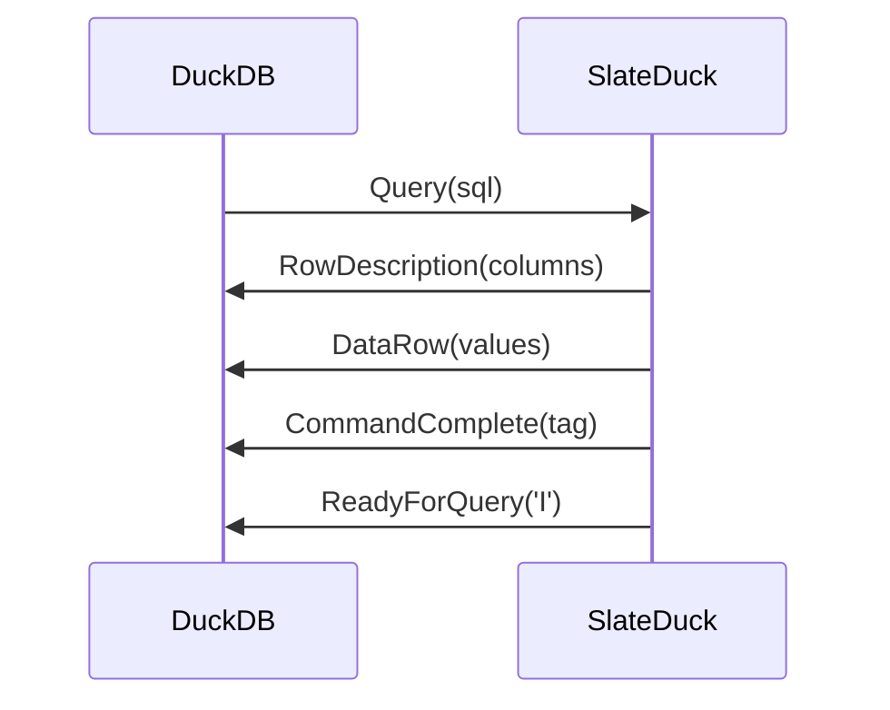

# PG-Wire Protocol

SlateDuck implements PostgreSQL wire protocol v3.

## Startup Sequence

## Simple Query Protocol

## What Is Not Implemented

- SSL/TLS (use a proxy)
- SASL authentication (use network-level access control)
- COPY protocol (not used by DuckLake)
