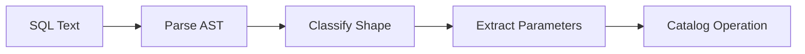

# SQL Dispatcher

The SQL dispatcher maps SQL text to catalog operations.

## Pipeline



## Classification

```rust
match &stmt {
    Statement::Query(q) => classify_select(q),
    Statement::Insert { table_name, .. } => classify_insert(table_name, ..),
    Statement::Update { table_name, .. } => classify_update(table_name, ..),
    Statement::CreateTable { .. } => Ok(CatalogOp::CreateTable { .. }),
    Statement::Drop { .. } => classify_drop(..),
    _ => Err(SqlError::UnsupportedStatement),
}
```

## Error Handling

Unrecognized shapes return `SQLSTATE 0A000` (feature not supported).
