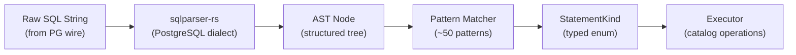

# SQL Dispatcher

The SQL dispatcher is the heart of Rocklake's translation layer. It sits between the raw SQL strings that arrive over the PostgreSQL wire protocol and the structured catalog operations that the executor performs against the key-value store. Its job is deceptively simple: take a SQL string, determine which specific catalog operation it represents, extract its parameters, and hand everything off to the executor in a strongly-typed form. No ambiguity, no interpretation, no creative SQL execution — just pattern recognition against a finite set of known statement shapes.

The dispatcher is intentionally bounded. It recognizes approximately 50 statement patterns and rejects everything else. This is not a limitation born of laziness — it is a deliberate architectural choice that provides security guarantees (no SQL injection, no information disclosure), predictability (the complete behavior of Rocklake is enumerable), and testability (every supported pattern can be exhaustively tested against recorded wire sessions).

This page explains how the classification pipeline works, catalogs every recognized statement kind, describes the pattern matching algorithm, and discusses the security and extensibility properties of this design.

## The Classification Pipeline



The pipeline has four distinct stages, each with clear inputs and outputs:

### Stage 1: Parsing

The raw SQL string is parsed using `sqlparser-rs` configured with the PostgreSQL dialect. This produces a structured Abstract Syntax Tree (AST) that represents the syntactic structure of the SQL without any semantic interpretation. Parse errors at this stage (malformed SQL, unrecognized syntax) are returned immediately as `SqlDispatchError::ParseError` with the original error message, which is then encoded as a PostgreSQL ErrorResponse wire message with SQLSTATE `42601` (syntax error).

The parser is intentionally lenient about SQL features it does not need to understand deeply. It parses `SELECT`, `INSERT`, `UPDATE`, `DELETE`, `BEGIN`, `COMMIT`, `ROLLBACK`, `SET`, `SHOW`, `CREATE`, `ALTER`, and `DROP` at the syntactic level. The semantic filtering (determining whether the specific statement is one Rocklake supports) happens in the next stage.

### Stage 2: Classification

The AST is matched against a catalog of known patterns. Each pattern is a structural predicate: "Is this a SELECT from the table named `ducklake_schema`?" or "Is this an INSERT into `ducklake_data_file` with these specific columns?" The classification checks the shape of the AST — which tables are referenced, what columns appear in the SELECT list or INSERT column list, what the WHERE clause looks like — and maps it to a specific `StatementKind` variant.

If no pattern matches, the statement is classified as `StatementKind::Unsupported`, and the executor returns an error. There is no fallback execution path, no "try to run it anyway" behavior, and no pass-through to an underlying database. If Rocklake does not explicitly recognize a statement pattern, it does not execute it.

### Stage 3: Parameter Extraction

Once the pattern is identified, relevant values are extracted from the AST and converted to their expected types:

- Integer literals become `u64` or `i64`
- String literals become `String`
- Boolean literals become `bool`
- NULL values become `Option::None`
- Parameter placeholders (`$1`, `$2`) are resolved against the provided parameter values

The extracted parameters become the fields of the `StatementKind` variant. For example, `SelectColumns { table_id: 42, snapshot_id: Some(100) }` contains everything the executor needs to perform the operation without re-examining the original SQL.

### Stage 4: Dispatch to Executor

The fully-classified, parameterized `StatementKind` is handed to the executor, which performs the corresponding catalog operation. The executor never sees raw SQL — it only sees typed enum variants with validated parameters. This separation ensures that the executor cannot accidentally misinterpret SQL and that all SQL interpretation is concentrated in one auditable location (the dispatcher).

## Complete Statement Catalog

The following tables document every recognized statement kind, organized by category. This is the complete, bounded set — there are no hidden statement types or undocumented behaviors.

### Session and Connection Management

| Statement Kind | SQL Pattern | Purpose |
|---------------|-------------|---------|
| `SelectVersion` | `SELECT version()` | Returns Rocklake's version string (mimics PostgreSQL) |
| `SelectCurrentSchema` | `SELECT current_schema` | Returns "public" (DuckDB compatibility) |
| `SelectCurrentDatabase` | `SELECT current_database()` | Returns "ducklake" |
| `SelectPgType` | `SELECT * FROM pg_type WHERE ...` | OID resolution for DuckDB type mapping |
| `ShowVariable(name)` | `SHOW timezone`, `SHOW client_encoding` | Returns session variable values |
| `SetVariable(name, value)` | `SET timezone = 'UTC'` | Sets session variables (minimal set) |
| `SelectOne` | `SELECT 1` | Connection health check |

### Transaction Control

| Statement Kind | SQL Pattern | Purpose |
|---------------|-------------|---------|
| `Begin` | `BEGIN` or `START TRANSACTION` | Opens a new transaction |
| `Commit` | `COMMIT` or `END` | Commits and flushes buffered operations |
| `Rollback` | `ROLLBACK` or `ABORT` | Discards buffered operations |

### Catalog Reads — Schemas and Tables

| Statement Kind | SQL Pattern | Purpose |
|---------------|-------------|---------|
| `SelectMaxSnapshot` | `SELECT MAX(snapshot_id) FROM ducklake_snapshot` | Current snapshot ID |
| `SelectSchemas` | `SELECT * FROM ducklake_schema WHERE ...` | List schemas (MVCC-filtered) |
| `SelectTables` | `SELECT * FROM ducklake_table WHERE schema_id = $1` | List tables in a schema |
| `SelectColumns` | `SELECT * FROM ducklake_column WHERE table_id = $1` | List columns for a table |
| `SelectViews` | `SELECT * FROM ducklake_view WHERE schema_id = $1` | List views in a schema |
| `SelectMacros` | `SELECT * FROM ducklake_macro WHERE ...` | List macros |
| `SelectMacroImpls` | `SELECT * FROM ducklake_macro_impl WHERE ...` | Macro implementations |
| `SelectMacroParams` | `SELECT * FROM ducklake_macro_parameters WHERE ...` | Macro parameters |

### Catalog Reads — Files and Statistics

| Statement Kind | SQL Pattern | Purpose |
|---------------|-------------|---------|
| `SelectDataFiles` | `SELECT * FROM ducklake_data_file WHERE table_id = $1` | List data files for query planning |
| `SelectDeleteFiles` | `SELECT * FROM ducklake_delete_file WHERE ...` | List delete files (for merge-on-read) |
| `SelectFileColumnStats` | `SELECT * FROM ducklake_file_column_stats WHERE ...` | Column statistics for predicate pushdown |
| `SelectFileVariantStats` | `SELECT * FROM ducklake_file_variant_stats WHERE ...` | Variant type statistics |
| `SelectTableStats` | `SELECT * FROM ducklake_table_stats WHERE ...` | Aggregate table statistics |
| `SelectInlinedData` | `SELECT * FROM ducklake_inlined_data_tables WHERE ...` | Small table data stored in catalog |
| `SelectMetadata` | `SELECT * FROM ducklake_metadata WHERE ...` | Key-value metadata entries |
| `SelectSnapshots` | `SELECT * FROM ducklake_snapshot WHERE ...` | Snapshot history |
| `SelectSnapshotChanges` | `SELECT * FROM ducklake_snapshot_changes WHERE ...` | Per-snapshot change log |

### Catalog Writes — Entity Creation

| Statement Kind | SQL Pattern | Purpose |
|---------------|-------------|---------|
| `InsertSchema` | `INSERT INTO ducklake_schema (...) VALUES (...)` | Create a new schema |
| `InsertTable` | `INSERT INTO ducklake_table (...) VALUES (...)` | Create a new table |
| `InsertColumn` | `INSERT INTO ducklake_column (...) VALUES (...)` | Add a column to a table |
| `InsertView` | `INSERT INTO ducklake_view (...) VALUES (...)` | Create a view |
| `InsertMacro` | `INSERT INTO ducklake_macro (...) VALUES (...)` | Create a macro |
| `InsertDataFile` | `INSERT INTO ducklake_data_file (...) VALUES (...)` | Register a data file |
| `InsertDeleteFile` | `INSERT INTO ducklake_delete_file (...) VALUES (...)` | Register a delete file |
| `InsertSnapshot` | `INSERT INTO ducklake_snapshot (...) VALUES (...)` | Record a new snapshot |
| `InsertSnapshotChanges` | `INSERT INTO ducklake_snapshot_changes (...) VALUES (...)` | Record snapshot changes |
| `InsertFileColumnStats` | `INSERT INTO ducklake_file_column_stats (...) VALUES (...)` | Record column statistics |
| `InsertMetadata` | `INSERT INTO ducklake_metadata (...) VALUES (...)` | Store metadata key-value |

### Catalog Writes — Updates

| Statement Kind | SQL Pattern | Purpose |
|---------------|-------------|---------|
| `UpdateEndSnapshot` | `UPDATE ducklake_X SET end_snapshot = $1 WHERE ...` | Supersede a versioned entity |
| `UpdateTableStats` | `UPDATE ducklake_table_stats SET ... WHERE ...` | Update aggregate statistics |
| `UpdateMetadata` | `UPDATE ducklake_metadata SET ... WHERE ...` | Update metadata value |
| `DeleteMetadata` | `DELETE FROM ducklake_metadata WHERE ...` | Remove metadata entry |
| `DeleteScheduledFiles` | `DELETE FROM ducklake_files_scheduled_for_deletion WHERE ...` | Clear file deletion schedule |

## How Pattern Matching Works

The classifier uses a multi-step structural matching approach. Let's walk through two examples to make this concrete.

### Example: Matching a SELECT Query

When the dispatcher receives:

```sql
SELECT * FROM ducklake_column WHERE table_id = 42 AND begin_snapshot <= 100
AND (end_snapshot IS NULL OR end_snapshot > 100)
```

The matching process:

1. **Statement type check:** Is this a `SELECT`? Yes.
2. **FROM clause check:** Is the table referenced `ducklake_column`? Yes.
3. **WHERE clause decomposition:** Extract the conjuncts:
    - `table_id = 42` → numeric equality filter on known column
    - `begin_snapshot <= 100` → MVCC lower bound
    - `end_snapshot IS NULL OR end_snapshot > 100` → MVCC upper bound
4. **Pattern match:** This matches the `SelectColumns` pattern with `table_id = 42, snapshot_id = 100`.
5. **Classification:** Return `StatementKind::SelectColumns { table_id: 42, snapshot_id: Some(100) }`.

### Example: Matching an INSERT Statement

When the dispatcher receives:

```sql
INSERT INTO ducklake_data_file (table_id, data_file_id, path, format, row_count, file_size, snapshot_id)
VALUES (5, 1001, 's3://bucket/file.parquet', 'parquet', 50000, 4194304, 42)
```

The matching process:

1. **Statement type check:** Is this an `INSERT`? Yes.
2. **Target table check:** Is the target `ducklake_data_file`? Yes.
3. **Column list check:** Do the columns match the expected set for this table? Yes.
4. **Value extraction:** Extract each value and convert to the appropriate type.
5. **Classification:** Return `StatementKind::InsertDataFile { table_id: 5, data_file_id: 1001, path: "s3://...", format: "parquet", row_count: 50000, file_size: 4194304, snapshot_id: 42 }`.

## Extended Query Mode and Parameter Binding

DuckDB uses both Simple Query mode (SQL with embedded literals) and Extended Query mode (prepared statements with parameter placeholders). The dispatcher handles both transparently:

**Simple Query mode:** Literal values are extracted directly from the AST. The SQL `WHERE table_id = 42` produces an AST with a literal integer node containing 42.

**Extended Query mode:** Parameter placeholders (`$1`, `$2`, ...) appear in the AST. The dispatcher records their positions, and actual values are provided separately in the `ParamValues` struct during the Bind step of the extended query protocol.

The `ParamValues` struct provides typed accessors:

- `get_u64(index)` — Parse a parameter as unsigned 64-bit integer
- `get_i64(index)` — Parse a parameter as signed 64-bit integer
- `get_string(index)` — Get a parameter as string
- `get_bool(index)` — Parse a parameter as boolean
- `get_optional_string(index)` — Get a parameter that may be NULL

Type mismatches (e.g., a non-numeric string where a u64 is expected) are reported as `SqlDispatchError::TypeMismatch` with the parameter index and expected type.

## Security Properties

The bounded dispatcher provides strong security guarantees that would be difficult to achieve with a general-purpose SQL engine:

### No SQL Injection

Because the dispatcher matches on AST structure (not string patterns), there is no way to inject additional SQL through crafted input. A malicious value in a WHERE clause is just a literal value node in the AST — it cannot "escape" into additional statements or clauses. The parser handles quoting and escaping; the classifier only sees structured nodes.

### No Information Disclosure

Unsupported queries are rejected before any catalog data is accessed. An attacker cannot probe the catalog through creative SQL — `SELECT * FROM pg_stat_activity`, `SELECT * FROM information_schema.tables`, or any other introspective query returns "unsupported statement" without leaking any information about the catalog's contents.

### No Dynamic SQL

There is no `EXECUTE`, no `PREPARE` (in the sense of server-side prepared statements with arbitrary SQL), and no function call that could generate dynamic SQL. The statement surface is fixed at compile time.

### Auditable Surface

The complete set of supported statements is documented on this page. An auditor can verify that no dangerous operations are possible by reviewing approximately 50 match arms in the classifier. This is orders of magnitude simpler than auditing a full PostgreSQL SQL engine with its thousands of code paths.

## Extending the Dispatcher

When a new version of DuckDB's `ducklake` extension introduces new SQL patterns (for a new catalog feature or protocol change), the dispatcher must be updated. The process is:

1. **Capture:** Record wire sessions between DuckDB and the new feature using the wire corpus tooling
2. **Analyze:** Identify the new SQL patterns in the recorded sessions
3. **Add variants:** Add new variants to the `StatementKind` enum
4. **Add matchers:** Add new match arms in the classifier
5. **Add handlers:** Add new execution handlers in the executor
6. **Test:** Run the new patterns through the dispatcher and verify correct classification
7. **Regression test:** Ensure existing patterns still classify correctly

This explicit, manual process ensures that every new SQL pattern Rocklake supports is a deliberate decision with test coverage. There is no "auto-discovery" of new SQL patterns — each one is reviewed, understood, and intentionally supported.

## Further Reading

- **[PG-Wire Protocol](pg-wire-protocol.md)** — How SQL strings arrive from the network
- **[Transaction Model](transaction-model.md)** — How BEGIN/COMMIT/ROLLBACK interact with the executor
- **[Design Decisions: Bounded SQL](../design-decisions/bounded-sql.md)** — The philosophy behind the bounded approach
- **[Internals: Wire Corpus](../internals/wire-corpus.md)** — The test infrastructure for recording and replaying SQL patterns
