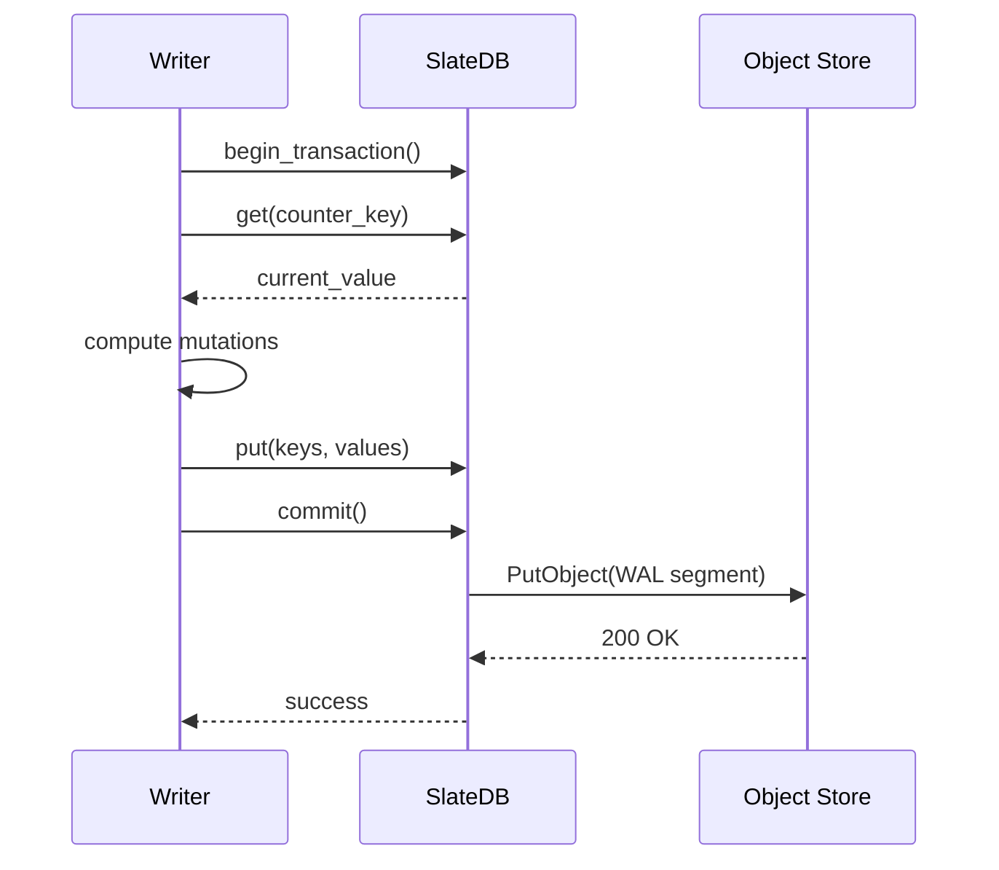

# Transaction Model

Every catalog mutation is atomic via SlateDB's `DbTransaction`.

## Transaction Lifecycle

## Batch Size Limits

Maximum transaction batch: 64 MiB. Exceeding returns `SQLSTATE 54001`.
