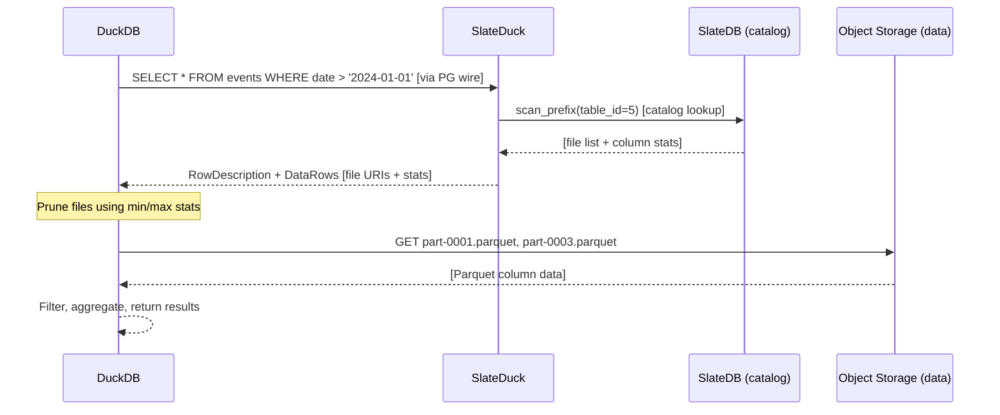
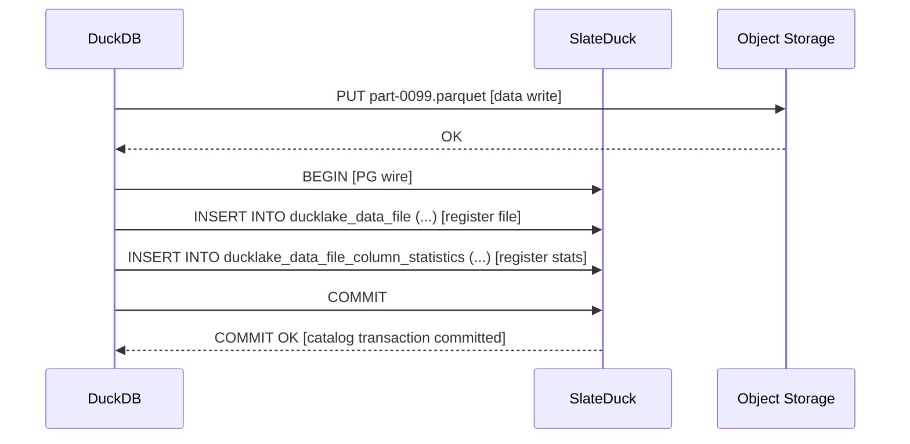

# Catalog vs Data

SlateDuck draws a sharp architectural line between two distinct planes of operation: the **catalog plane**, which manages metadata about your lakehouse, and the **data plane**, which stores the actual analytical records in Parquet files. Understanding this separation is not merely an implementation detail — it is the conceptual foundation that determines SlateDuck's resource usage, failure modes, scaling characteristics, operational model, and security posture. Every important property of the system follows from this one architectural decision, and operators who understand it deeply will find that most questions about performance, availability, and cost answer themselves.

## The Two Planes

Think of your lakehouse as having two completely independent layers of storage, each with its own purpose, its own access patterns, and its own infrastructure.

The **data plane** is your analytical data itself — the actual records, the measurements, the events, the transactions. These live as Parquet files in object storage. A table with a billion rows might be spread across hundreds or thousands of individual Parquet files, each containing a compressed column-oriented slice of the data. These files are immutable once written: a data pipeline that adds new records creates new Parquet files rather than modifying existing ones. When old data is superseded by newer versions, the old files eventually get replaced, but they are never overwritten in place. DuckDB reads these files directly from object storage when executing queries — it communicates with S3, GCS, or Azure Blob directly, without SlateDuck in the middle.

The **catalog plane** is the metadata that makes the data queryable — the knowledge of what exists and where to find it. It answers questions like: Which Parquet files belong to the `events` table? What schema does that table have? When was each file added, and by which transaction? What does the data look like at any given point in history? What are the column-level statistics that help the query planner skip irrelevant files? All of this information lives in SlateDuck, stored as key-value entries in SlateDB, which in turn persists to object storage. DuckDB communicates with SlateDuck over the PostgreSQL wire protocol to obtain catalog metadata before and during query execution — but only for metadata. Once DuckDB has the file list and statistics it needs, it reads the actual data files without involving SlateDuck at all.

The connection between the two planes is elegantly simple: path strings. SlateDuck's catalog records the location of each data file as a URI — something like `s3://my-bucket/data/events/part-00001.parquet` — and returns these URIs to DuckDB when asked about table contents. DuckDB then takes those URIs and fetches the corresponding files. The catalog and the data never need to be stored together or accessed through the same system; the path string is the only coupling.

## What Lives in the Catalog

The catalog contains everything DuckDB needs to know *about* your data without actually reading it. Concretely, this means:

**Schemas and Tables.** Every schema (namespace) and every table within each schema is tracked in the catalog with a unique integer ID. The table record includes its name, the schema it belongs to, when it was created, and basic configuration like whether it has a default sort order.

**Column Definitions.** For each table, the catalog records every column: its name, its data type, its ordinal position, whether it accepts nulls, its default value if any, and the snapshot at which it was added or removed. When you run `ALTER TABLE events ADD COLUMN session_id UUID`, the catalog records a new column row with the current snapshot ID as its `begin_snapshot`. The old column rows remain unchanged — time travel back to before the migration will show the schema as it was before.

**Data File Registrations.** Every Parquet file that belongs to a table is registered in the catalog with its full path, the table it belongs to, how many rows it contains, its total byte size, and the snapshot at which it was added. When a data pipeline writes 50 new Parquet files for a `COPY` operation, DuckDB issues 50 INSERT statements to the catalog registering those files, all within a single transaction. If the transaction commits, all 50 files are atomically visible. If it rolls back, none of them appear.

**Column Statistics.** For each data file and each column within it, the catalog stores min and max values, null counts, and NaN presence flags. These statistics are the secret sauce of analytical performance: when DuckDB plans a query with a `WHERE date > '2024-01-01'` predicate, it asks the catalog for the min/max statistics for the `date` column in every file. Files where the max date is before January 1st, 2024 can be skipped entirely — DuckDB never fetches them from object storage. On a large table with thousands of files, this pruning can reduce the actual data read by 99% or more.

**Delete Files.** For row-level deletes (marking specific rows as removed without rewriting entire Parquet files), DuckDB writes "delete files" that reference the rows to be excluded. These delete files are registered in the catalog alongside the data files they affect.

**Snapshot History.** Every catalog mutation creates a new snapshot with a monotonically increasing integer ID, recorded in the `ducklake_snapshot` table. The snapshot record includes the timestamp, an optional commit message, and the operation that triggered it. This gives you a complete audit trail of every change to your lakehouse's structure and contents.

**Views and Macros.** Saved SQL queries (views) and user-defined functions (macros) are stored in the catalog, versioned just like tables and columns.

All of this metadata is stored as Protobuf-encoded key-value pairs in SlateDB. The total size of a typical catalog is small relative to the data it describes: a catalog tracking 10,000 Parquet files with 50 columns each might occupy 50–100 MB of storage, even though the Parquet files themselves represent terabytes of data. This asymmetry — enormous data plane, tiny catalog plane — is a consequence of the catalog storing statistics and metadata rather than actual data values.

## What Lives Outside the Catalog

The actual analytical data — the rows you query with `SELECT`, the events in your event stream, the financial transactions in your ledger — lives exclusively in the data plane. SlateDuck never reads it, never touches it, and never caches it. Its only relationship with data files is recording their existence in the catalog.

This means that when a DuckDB query scans a billion rows, SlateDuck's contribution to that query is a handful of metadata lookups that complete in milliseconds. The remaining seconds or minutes of query execution time are entirely between DuckDB and object storage. SlateDuck has left the building before the real work begins.

The catalog does store one critical piece of data-adjacent information: column statistics. These are not the actual column values, but summary statistics computed from the actual values: the minimum and maximum value of the `date` column across all rows in a specific Parquet file. These statistics live in the catalog because they need to be queryable without reading the data files — the whole point is to tell the query planner whether a file is worth reading at all. But they are summaries, not copies of the data, and their size is proportional to the number of files and columns, not the number of rows.

This separation has profound implications:

**SlateDuck's resource usage is bounded by catalog size, not data size.** A catalog tracking 1 TB of data uses the same memory and CPU as one tracking 1 PB of data (assuming similar numbers of files and columns). You can scale your data storage independently of your catalog infrastructure.

**SlateDuck never becomes a bottleneck for read queries.** Once DuckDB has obtained the list of relevant data files from the catalog, it reads them directly from object storage in parallel. SlateDuck is out of the critical path for the actual data scan.

**Catalog operations and data operations have different failure domains.** If SlateDuck is temporarily unavailable, existing DuckDB sessions that have already cached the file list can continue reading data. New sessions or DDL operations will fail until SlateDuck recovers, but reads in progress are unaffected.

## The Query Lifecycle in Practice

To make the two-plane separation concrete, trace through the lifecycle of a typical analytical query.

Suppose a DuckDB client issues:

```sql
SELECT event_type, COUNT(*) as cnt
FROM events
WHERE created_at >= '2024-06-01'
GROUP BY event_type
ORDER BY cnt DESC;
```

**Step 1: Schema resolution.** DuckDB sends a catalog query asking what the current schema of the `events` table is. SlateDuck looks up the table by name, finds the column definitions visible at the current snapshot, and returns a row description. This takes one or two SlateDB lookups — milliseconds.

**Step 2: File discovery.** DuckDB sends a catalog query asking for all data files registered for the `events` table, along with their column statistics for `created_at`. SlateDuck does a prefix scan over the data file namespace for this table's ID, applies MVCC filtering to return only files visible at the current snapshot, and joins in the column statistics. This returns a list of file URIs with their `created_at` min/max ranges. Milliseconds.

**Step 3: File pruning.** DuckDB looks at the returned statistics. Files where `max(created_at) < '2024-06-01'` are excluded from the plan — they cannot possibly contain relevant rows. Only the files that might contain rows after June 1st are retained. For a year-long table with monthly partitions, this might reduce 12 files to 2.

**Step 4: Data scan.** DuckDB fetches the retained Parquet files directly from S3. It applies the `WHERE` predicate during the Parquet read (using the file's internal row group statistics for further pruning), computes the `GROUP BY` aggregation, sorts the results, and returns them to the client. SlateDuck is not involved in this step at all.

**Step 5: Complete.** The catalog round trip (steps 1 and 2) took perhaps 20–100 milliseconds against S3. The actual data scan (step 4) took seconds or minutes depending on how much data was retained. The catalog was the minority of the total query time, as it should be.

## The Interaction Pattern



For writes, the pattern is symmetric but inverted: DuckDB writes Parquet files directly to object storage, then registers them with SlateDuck:



This pattern means SlateDuck handles many small metadata requests (typically returning a few hundred rows at most) while DuckDB handles the heavy lifting of scanning potentially gigabytes of Parquet data.

## Scaling Properties

The two-plane separation has profound implications for how the system scales.

**Data plane scaling is trivially horizontal.** You can run ten, a hundred, or a thousand DuckDB instances concurrently, all reading from the same Parquet files in the same bucket. Object storage is designed to handle massive parallelism — it serves GET requests at any scale. Each DuckDB instance is fully independent: it asks SlateDuck for the file list once, then reads the files directly. There is no shared state between DuckDB instances for the data plane.

**Catalog plane scaling is read-heavy and bounded.** The catalog metadata is small and changes slowly relative to query frequency. A table with 10,000 files might get 1,000 queries per minute against its metadata, but the metadata itself changes only when new files are added or schema migrations run. SlateDuck can serve catalog reads from SlateDB's block cache for popular tables, making them very fast. For extreme read scale, you can run multiple SlateDuck reader processes that independently open the immutable SST files from the shared bucket.

**Write throughput is bounded by the catalog's single-writer constraint.** Only one SlateDuck process can write to a given catalog at a time (this is SlateDB's single-writer guarantee). This means that all catalog mutations — all `INSERT INTO ducklake_data_file` calls, all `ALTER TABLE` operations — must flow through a single process. For most workloads this is not a bottleneck: catalog writes are small and infrequent compared to data writes. But workloads that need to register thousands of new files per second from dozens of concurrent pipeline processes will hit this limit. The solution is partitioning: separate catalogs for separate datasets.

## The Data Lifecycle

Understanding what happens to data at each stage of its lifecycle helps clarify the catalog's role.

**Creation.** A data pipeline writes Parquet files to the data plane (DuckDB does this directly). It then registers those files in the catalog via SlateDuck. The pipeline issues INSERT statements to the catalog: one per file, recording the path, row count, size, and statistics. When it commits the transaction, all the files atomically become visible to subsequent queries.

**Query.** Query engines ask SlateDuck for the file list, receive the paths and statistics, read the relevant files directly from object storage, and return results. SlateDuck is involved only in the metadata lookup phase.

**Modification.** When data needs to be updated or deleted, DuckDB writes new Parquet files or delete files (depending on the operation) to object storage, then registers the changes in the catalog. Old file registrations are superseded by setting their `end_snapshot` in the catalog; the old Parquet files still exist in the bucket until they are explicitly garbage collected.

**Compaction.** Over time, many small Parquet files benefit from compaction into fewer larger files. Compaction creates new Parquet files and registers them in the catalog while removing the registrations for the old files (by setting their `end_snapshot`). The old files are preserved in the bucket for historical queries until the retention window advances past the snapshot at which they were superseded.

**Historical access (time travel).** Reading the catalog at a historical snapshot ID returns the file list as it was at that point, including files that have since been superseded or compacted. DuckDB can fetch those old files from the bucket and reconstruct the past state of the data.

**Garbage collection.** When the retention window advances, old catalog entries become query-inaccessible. Physical deletion of both catalog entries and the corresponding Parquet files requires explicit operator action: `slateduck excise` for catalog entries and a separate bucket lifecycle policy for the orphaned Parquet files. The catalog's GC mechanism advances the visibility floor but does not automatically delete data plane files.

## Why This Separation Matters

**Failure recovery is simple.** If SlateDuck crashes, you restart it. The catalog state is fully persistent in object storage. There is nothing to recover, replay, or reconcile. DuckDB sessions in progress may get a connection error and need to reconnect, but no data is lost.

**Cost accounting is transparent.** You can separately measure and optimize the cost of catalog operations (small, frequent requests to a small storage footprint) versus data operations (large, parallel reads from a large storage footprint). They have different optimization strategies and different cost profiles. A catalog tracking 1 PB of Parquet data still costs only a few dollars per month in catalog storage; the Parquet data storage is where the real bill is.

**Operational complexity is contained.** When something goes wrong, the two-plane model limits the diagnosis space. Slow queries? Check the data plane (file organization, statistics quality, object store latency). Catalog errors? Check the catalog plane (SlateDuck health, SlateDB compaction, network connectivity). Wrong results? The catalog told DuckDB about the wrong files or wrong statistics. There is no mysterious interaction where a catalog problem causes a data corruption, or vice versa.

## Security Boundaries

The catalog/data separation creates natural security isolation that you should exploit in production deployments.

SlateDuck needs write access to the catalog prefix in your bucket (where SlateDB stores its SST files and WAL segments). It does not need access to the data prefix where your Parquet files live. You can configure IAM policies with minimal permissions:

```json
{
  "Statement": [{
    "Effect": "Allow",
    "Action": ["s3:GetObject", "s3:PutObject", "s3:DeleteObject", "s3:ListBucket"],
    "Resource": [
      "arn:aws:s3:::my-bucket/catalog/*",
      "arn:aws:s3:::my-bucket"
    ],
    "Condition": {
      "StringLike": {
        "s3:prefix": ["catalog/*"]
      }
    }
  }]
}
```

DuckDB, when writing data, needs write access to the data prefix. When reading data, it needs read access to the data prefix. It does not need access to the catalog prefix at all — SlateDuck serves catalog metadata to DuckDB over the wire protocol, and DuckDB never directly accesses the catalog SST files.

This means a compromised DuckDB client instance can at most read data (if it has read credentials) or write data files (if it has write credentials) — but it cannot corrupt the catalog, because it has no bucket access to the catalog prefix. Similarly, a compromised SlateDuck process can corrupt catalog metadata, but it cannot exfiltrate or modify the actual analytical data, because it has no access to the data prefix. The blast radius of any single-component compromise is bounded. See [Credential Isolation](../deployment/credential-isolation.md) for a full guide to configuring these permissions in production.

## Cost Implications

The two-plane model also has distinct cost profiles worth understanding.

**Catalog storage costs are small and bounded.** Catalog entries are tiny — each row is a few hundred bytes of Protobuf. Even a large, active catalog with millions of file registrations and decades of history will occupy at most a few gigabytes of storage. At typical object-storage pricing, this is pennies per month.

**Data storage costs scale linearly with your data.** Parquet files are large and numerous. Cost scales with data volume, retention period, and compression efficiency. This is entirely independent of SlateDuck.

**Catalog request costs accumulate for high-query-rate workloads.** Every DuckDB query involves a few catalog API calls, each of which triggers a few object-store GET requests (from SlateDB's block cache misses). For workloads running thousands of queries per minute, these accumulate. SlateDB's block cache reduces this significantly — frequently accessed metadata stays in RAM — but it is worth monitoring catalog GET costs in high-throughput deployments.

**Data request costs dominate for analytical workloads.** A query that scans 1 TB of Parquet data will generate far more GET costs from the data plane than from the catalog plane. Optimizing predicate pushdown (better statistics, better file organization) has a much larger impact on data transfer costs than optimizing catalog access patterns.

## Debugging and Introspection

When something goes wrong with a query, the catalog/data separation helps you diagnose the problem.

**Wrong results?** Check the catalog: are the expected files registered? Are the statistics correct? You can query the catalog tables directly through SlateDuck:

```sql
SELECT * FROM ducklake_data_file
WHERE table_id = (SELECT id FROM ducklake_table WHERE name = 'events')
ORDER BY begin_snapshot DESC
LIMIT 10;
```

This shows the most recently registered files. If files are missing or have wrong statistics, the data ingestion pipeline has a bug.

**Query too slow?** Check whether predicate pushdown is working. If SlateDuck is returning files whose statistics indicate they cannot match the query's predicates, either the statistics are wrong or the predicate is not being pushed down. You can inspect the statistics:

```sql
SELECT f.file_path, s.min_values, s.max_values
FROM ducklake_data_file f
JOIN ducklake_data_file_column_statistics s ON f.id = s.data_file_id
WHERE f.table_id = (SELECT id FROM ducklake_table WHERE name = 'events');
```

**Query fails with "file not found"?** The catalog is referencing a data file that no longer exists in the bucket. This can happen if Parquet files were deleted outside of SlateDuck's knowledge (for example, manual S3 deletion). The catalog entry still exists but the underlying file is gone. This is a data-plane problem that requires either restoring the file from backup or removing it from the catalog with `slateduck excise`.

**Catalog queries slow?** This is a SlateDuck/SlateDB issue, not a data-plane issue. Check SlateDB's block cache hit rate, the number of SST files (compaction may be needed), and the latency to the object store. The data files are not involved.

## Further Reading

- **[The DuckLake Format](ducklake.md)** — Explains the full set of 28 catalog tables and how they represent the lakehouse schema
- **[SlateDB Storage Engine](slatedb.md)** — How the catalog plane is physically stored
- **[Key-Value Mapping](key-value-mapping.md)** — How relational catalog concepts map to binary key-value entries
- **[Credential Isolation](../deployment/credential-isolation.md)** — Practical guide to configuring separate IAM permissions for catalog and data plane access
- **[Catalog Immutability](immutability.md)** — Why the catalog plane never deletes committed entries and what that enables
