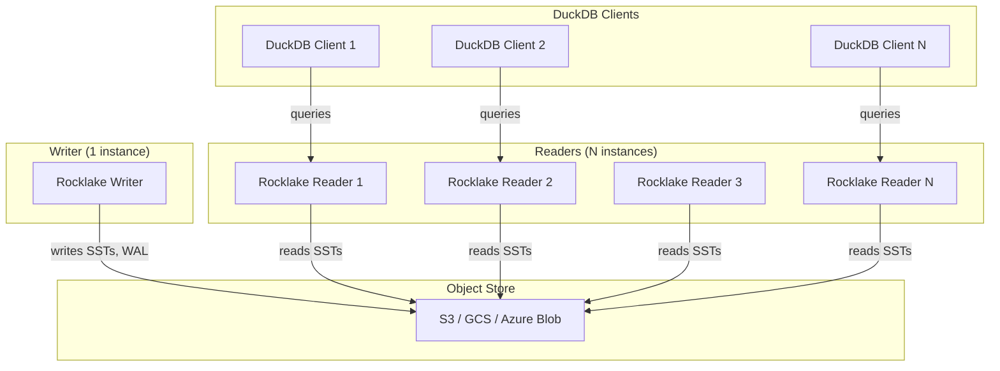

# Horizontal Read Scale-Out

One of Rocklake's most powerful operational properties is that you can add unlimited concurrent readers without any configuration change, any writer-side modification, any coordination protocol, or any additional infrastructure. This is not the "read replica" model from traditional databases where each replica must receive and apply a change stream from the primary. This is something fundamentally different: readers are independent processes that open immutable files directly from the object store, apply the MVCC visibility filter locally, and return results — with zero communication with the writer or with each other.

This property is a direct mechanical consequence of the immutability guarantee. Because committed catalog entries occupy distinct, never-modified keys in immutable SST files, any process that can read from the object store can serve catalog queries. There is no shared mutable state, no lock to acquire, no lease to renew, no coordination message to send. The object store handles concurrent reads natively — that is literally what object stores are designed for.

This page explains why immutability enables this property, what the reader model looks like in practice, how reader freshness works, how to deploy a realistic multi-reader topology, and how this differs from traditional read-replica architectures.

## Why Immutability Enables Unlimited Readers

In a traditional database with mutable rows (like PostgreSQL), a reader must coordinate with the writer because the data the reader is accessing might be changing underneath it. PostgreSQL solves this with MVCC at the heap level — readers see a snapshot of the data as of their transaction start time, and the buffer manager ensures that concurrent writes do not corrupt the reader's view. But this coordination has a cost: the buffer pool is shared, the lock manager maintains metadata about active readers, and replication to read replicas requires streaming WAL entries from the primary to each replica.

In Rocklake, there is no shared buffer pool and no streaming replication because there is nothing to replicate. The catalog data lives in immutable SST files in the object store. Once an SST file is written, its bytes never change. A reader that opens the current manifest (which points to the current set of SST files) can read those files for as long as it needs without worrying that they will be modified or deleted. The writer might be creating new SST files concurrently, but those new files contain new data at new snapshot IDs — they do not modify or replace the data that existing readers are accessing.

This means:

**Adding readers does not load the writer.** In PostgreSQL's read-replica model, each replica adds load to the primary (WAL generation and streaming). In Rocklake, the writer is completely unaware of readers. You can have one reader or ten thousand readers, and the writer's performance is unchanged.

**Readers do not need to be in the same network as the writer.** A reader just needs access to the object-store bucket. It can be in a different region, a different cloud, a different continent — anywhere that can issue GET requests to the bucket.

**Reader failures do not affect the writer or other readers.** If a reader crashes, hangs, or becomes network-partitioned, no other process is affected. There is no "replica lag" alarm to fire, no "slot" to clean up, no "subscriber" to re-register.

**Reader deployment is stateless.** A reader process can start, serve queries, and stop without leaving any persistent state or registration. The next time it starts, it re-reads the manifest and is immediately ready to serve queries.

## The Reader Model in Practice

A Rocklake reader process works like this:

1. **Open the manifest.** The reader fetches the SlateDB manifest file from the object store. This small file describes the current state of the database: which SST files exist and what key ranges they cover.

2. **Resolve key ranges.** When a query arrives (for example, "list all data files for table 5"), the reader determines which SST files might contain keys with the data-file tag and table-ID prefix.

3. **Fetch SST blocks.** The reader issues GET requests to the object store to fetch the relevant blocks from the identified SST files. These blocks are typically cached locally for subsequent queries.

4. **Apply MVCC filter.** The reader decodes the key-value entries from the SST blocks and applies the visibility filter (`begin_snapshot <= target AND (end_snapshot IS NULL OR target < end_snapshot)`) to return only the entries visible at the target snapshot.

5. **Return results.** The filtered entries are decoded from Protobuf and returned to the client.

At no point in this sequence does the reader communicate with the writer or with any other reader. Every step involves either local computation or direct reads from the object store.

## Reader Freshness

Readers do not see writes instantaneously. There is a brief window between when the writer commits a transaction and when a new reader opening the catalog will see that transaction's effects. This window is determined by the writer's `flush()` behavior:

- The writer commits a `DbTransaction` (the write is now durable in the WAL — it will survive a crash)
- The writer calls `flush()` (the manifest is updated to include the new WAL entries, making them visible to readers who open the manifest after this point)

Between the commit and the flush, the write is durable but not visible to new readers. Rocklake calls `flush()` after every commit, so this window is typically the duration of a single object-store PUT (50–100 ms on S3 Standard).

For readers that are already open (they fetched the manifest before the flush), they will not see the new write until they re-read the manifest. In Rocklake's PG-wire sidecar deployment, readers periodically refresh their manifest view. The practical staleness for a continuously-running reader is typically 1–5 seconds.

For most analytical workloads, this freshness window is inconsequential. You loaded data five minutes ago; the reader seeing it 100 ms later versus 5 seconds later makes no practical difference to a planning query that takes 30 seconds to execute.

## Deployment Topology: One Writer, Many Readers

The canonical Rocklake deployment for high-read-throughput workloads looks like this:



The writer handles all catalog mutations: schema changes, file registrations, counter increments. The readers handle all catalog queries: file listings, schema lookups, statistics retrieval. A load balancer (or client-side routing) distributes read queries across the reader pool.

Adding more readers is a pure scale-out operation: start more reader processes pointed at the same bucket path. No writer-side change, no configuration update, no restartneeded.

## How This Differs from PostgreSQL Read Replicas

The difference between Rocklake's reader model and PostgreSQL's read-replica model is worth understanding clearly, because they appear similar (one writer, many readers) but work fundamentally differently:

| Property | PostgreSQL Read Replicas | Rocklake Readers |
|----------|------------------------|-------------------|
| Replication mechanism | Streaming WAL from primary to each replica | None — readers read directly from object store |
| Primary awareness of replicas | Yes — must stream WAL, can be throttled by slow replicas | None — writer is unaware of readers |
| Replica lag | Non-zero, variable, depends on replication speed | Non-zero, bounded by flush interval (~100 ms) |
| Adding replicas | Requires primary reconfiguration, consumes primary resources | No reconfiguration, no primary impact |
| Replica failure impact | Primary may stall if synchronous replication; slot cleanup needed | Zero impact on writer or other readers |
| Geographic distribution | Possible but requires cross-region WAL streaming (latency, cost) | Natural — readers anywhere that can reach the bucket |
| Data consistency model | Each replica has a consistent but potentially stale view | Each reader has a consistent view at a specific manifest version |
| Maximum replicas | Practically limited by primary WAL streaming capacity | Unlimited — bounded only by object-store read throughput |

The fundamental difference is architectural: PostgreSQL replicas are dependent on the primary for their data (they receive a stream of changes), while Rocklake readers are independent of the writer (they read directly from the same immutable files the writer produced).

## The Single-Writer Constraint

The flip side of unlimited readers is a single writer. Rocklake enforces that at most one process may write to a given catalog at any time. This constraint is what makes the reader model possible — because there is one writer, the catalog evolves as a single linear sequence of snapshots, and readers can safely read any snapshot without worrying about concurrent conflicting writes from other writers.

The single-writer constraint is enforced by SlateDB's fencing mechanism (described in detail on the [Writer Fencing](writer-fencing.md) page). Briefly: when a writer opens the catalog, it registers itself with a fencing token in the manifest. If a second process tries to write, the first writer is fenced off and can no longer commit.

For workloads that genuinely need concurrent writes from multiple processes, the recommended approach is dataset partitioning: one catalog per independent dataset, each with its own writer. Cross-dataset queries work by attaching multiple catalogs in DuckDB and joining across them.

## Multi-Writer via Dataset Partitioning

If your organization has multiple teams or pipelines that need to write catalog mutations concurrently, you can partition into multiple independent catalogs:

```
s3://my-bucket/catalogs/team-alpha-events/    ← Writer A
s3://my-bucket/catalogs/team-alpha-users/     ← Writer A
s3://my-bucket/catalogs/team-beta-metrics/    ← Writer B
s3://my-bucket/catalogs/shared-reference/     ← Writer C
```

Each catalog has its own writer, its own snapshot sequence, its own garbage collection policy, and its own reader pool. DuckDB can attach all of them simultaneously and run cross-catalog joins. The trade-off is that cross-catalog transactions are not atomic — each catalog advances independently.

This is an explicit partitioning model, not transparent sharding. You choose partition boundaries based on your organizational structure and write-independence requirements. In practice, most analytics workloads are naturally partitioned by team, domain, or data source, and the single-writer-per-partition model works well without feeling like a constraint.

## When Single-Writer Is Not Enough

If your workload requires atomic multi-writer transactions against the same tables (multiple concurrent processes inserting data into the same table with transactional isolation between them), Rocklake is not the right choice. Consider PostgreSQL-backed DuckLake instead, which provides full multi-writer SERIALIZABLE isolation through PostgreSQL's mature concurrency control.

However, in our experience, the vast majority of analytics catalog workloads are naturally single-writer (one pipeline loads data, many queries read it) or naturally partitionable (different datasets are independently managed). The single-writer constraint is a real constraint, but it is one that aligns with how most data platforms are actually structured.

## Further Reading

- **[Writer Fencing](writer-fencing.md)** — How the single-writer constraint is enforced and what happens during failover
- **[Catalog Immutability](immutability.md)** — The principle that enables reader independence
- **[Deployment: Kubernetes](../deployment/kubernetes.md)** — How to deploy the writer + reader topology in Kubernetes
- **[Design Decisions: Single-Writer Model](../design-decisions/single-writer.md)** — The full trade-off analysis against multi-writer alternatives
