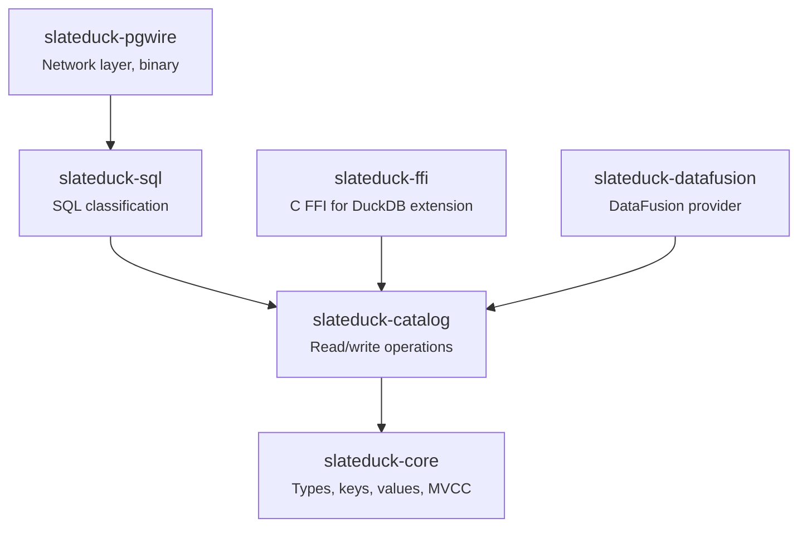

# Architecture Guide for Contributors

This page explains how the SlateDuck codebase is organized, what each module does, where to find things, and most importantly — where to make changes for common types of contributions. It is written for someone who has just cloned the repository and needs to orient themselves quickly without reading every file in the project.

SlateDuck is a Cargo workspace with seven crates. Each crate has a single, well-defined responsibility. Dependencies flow in one direction (from higher-level crates to lower-level crates), which means you can understand any crate by understanding only what is below it in the dependency graph. You never need to understand the entire codebase to make a contribution — just the crate (or two) that your change touches.

## The Dependency Graph



Information flows from top (network layer) to bottom (persistence layer). Each crate depends only on crates below it — never on peers or ancestors. This means:

- Changes to `core` may require changes in all dependent crates
- Changes to `catalog` may require changes in `sql`, `pgwire`, `ffi`, `datafusion`
- Changes to `pgwire` never require changes in any other crate
- You can compile and test any crate independently

## Crate Responsibilities

### slateduck-core

**The foundation.** Contains types that every other crate needs:

- **Tag definitions** (`tags.rs`): The byte constants that identify entity types in keys
- **Key encoding** (`keys.rs`): Functions to encode/decode composite keys to/from bytes, preserving sort order
- **Value encoding** (`values.rs`): Protobuf-based serialization of row data
- **MVCC types** (`mvcc.rs`): Snapshot IDs, visibility logic, tombstone markers
- **Row structs** (`rows.rs`): The protobuf-derived structs for each catalog table (SchemaRow, TableRow, ColumnRow, etc.)
- **Error types** (`error.rs`): Core error enum shared by dependent crates

**Key invariant:** This crate has no I/O. It does not read from or write to storage. It only defines types and encoding functions. This makes it fast to compile and trivial to test (pure functions, no async).

**When to modify this crate:**
- Adding a new catalog entity type (table → tag, key struct, row struct, encoding)
- Changing the key encoding format (rare, breaking change)
- Adding a new field to an existing row struct
- Fixing a sort order bug

### slateduck-catalog

**The persistence layer.** Reads from and writes to SlateDB:

- **CatalogReader** (`reader.rs`): Prefix scans, point lookups, MVCC-filtered reads
- **CatalogWriter** (`writer.rs`): Transactional writes, WriteBatch construction, commit
- **GarbageCollector** (`gc.rs`): Retention policies, tombstone cleanup, snapshot advancement
- **Performance layer** (`performance.rs`): Hot key cache, secondary index, batch optimization
- **Store** (`store.rs`): Opens SlateDB, manages configuration, provides readers/writers

**Key invariant:** All reads go through the reader. All writes go through the writer. There is no other path to storage. This means correctness can be verified by testing reader and writer in isolation and combination.

**When to modify this crate:**
- Implementing a new read operation (e.g., "list columns for table X")
- Implementing a new write operation (e.g., "create table with columns")
- Changing MVCC semantics
- Optimizing read performance
- Modifying garbage collection behavior

### slateduck-sql

**The SQL classifier.** Receives SQL strings from the wire protocol and determines what operation DuckDB is requesting:

- **Classifier** (`classifier.rs`): Pattern matching against known DuckLake SQL patterns
- **Statement types** (`statement.rs`): The `StatementKind` enum (CreateSchema, CreateTable, DropTable, InsertDataFile, etc.)
- **Extraction** (`extract.rs`): Pulls relevant parameters from SQL (table name, schema name, column definitions, etc.)

**Key invariant:** The classifier does NOT parse SQL into an AST. It uses string matching and regex to identify known patterns. This is intentional — DuckDB sends predictable SQL patterns, and a full SQL parser would be unnecessarily complex.

**When to modify this crate:**
- Supporting a new DuckLake SQL statement
- Fixing misclassification of an existing statement
- Handling a new DuckDB version that changes SQL patterns

### slateduck-pgwire

**The network layer and binary.** Implements the PostgreSQL wire protocol and ties everything together:

- **Server** (`server.rs`): TCP listener, connection management
- **Handler** (`handler.rs`): Message-level protocol handling (Query, Parse, Bind, Execute)
- **Session** (`session.rs`): Per-connection state (current schema, transaction state)
- **Executor** (`executor.rs`): Dispatches classified SQL to catalog operations
- **Main** (`main.rs`): CLI argument parsing, startup, graceful shutdown

**Key invariant:** This crate contains no business logic beyond protocol handling and dispatch. All catalog logic lives in `catalog`. All SQL classification lives in `sql`. The pgwire crate is purely "glue."

**When to modify this crate:**
- Adding a new executor arm (dispatching a new statement type)
- Fixing wire protocol issues (message format, authentication, SSL)
- Adding CLI options or configuration
- Changing server behavior (connection limits, timeouts)

### slateduck-ffi

**The C FFI.** Exposes catalog operations through a C-compatible interface for use by the native DuckDB extension:

- **C API** (`lib.rs`): `extern "C"` functions that DuckDB's extension system can call
- **Conversion** (`convert.rs`): Translates between C types and Rust types

**Key invariant:** This crate owns no state. It delegates everything to `catalog`. The FFI boundary is thin — just type conversion and error translation.

**When to modify this crate:**
- Exposing a new catalog operation to the native extension
- Fixing ABI compatibility issues
- Changing the C API signature (requires coordinating with the C++ extension code)

### slateduck-datafusion

**The DataFusion integration.** Implements Apache DataFusion's `CatalogProvider` trait:

- **Provider** (`catalog_provider.rs`): Implements `CatalogProvider` and `SchemaProvider`
- **Table** (`table_provider.rs`): Wraps SlateDuck tables as DataFusion `TableProvider`

**When to modify this crate:**
- Supporting additional DataFusion query patterns
- Exposing new catalog metadata to DataFusion queries
- Fixing compatibility with newer DataFusion versions

## Where to Make Changes

### Adding a New DuckLake SQL Statement

This is the most common type of contribution. Follow these steps:

**Step 1: Add a wire corpus entry**

Capture the actual SQL that DuckDB sends by running DuckDB with the ducklake extension and observing the wire traffic:

```
tests/fixtures/wire-corpus/duckdb-X.Y.Z/new-statement.sql
```

**Step 2: Add a StatementKind variant**

In `crates/slateduck-sql/src/statement.rs`:

```rust
pub enum StatementKind {
    // ... existing variants ...
    NewStatement,  // Add your variant
}
```

**Step 3: Add classification logic**

In `crates/slateduck-sql/src/classifier.rs`, add a pattern match for the new SQL:

```rust
if sql.starts_with("INSERT INTO ducklake_new_thing") {
    return Ok(Classification {
        kind: StatementKind::NewStatement,
        // ... extracted parameters ...
    });
}
```

**Step 4: Implement the catalog operation**

If the statement requires new storage operations:

- Add key/value types in `slateduck-core` (if new entity type)
- Add reader/writer methods in `slateduck-catalog`

**Step 5: Add an executor arm**

In `crates/slateduck-pgwire/src/executor.rs`:

```rust
StatementKind::NewStatement => {
    let result = self.catalog.new_operation(params).await?;
    // ... format response ...
}
```

**Step 6: Add tests**

- Wire corpus test (verifies classification)
- Integration test (verifies full round-trip)
- Unit tests for any new encoding logic

### Adding a New Catalog Table (Tag)

This involves touching `core` and `catalog`:

**Step 1: Allocate a tag byte**

In `crates/slateduck-core/src/tags.rs`:

```rust
pub const TAG_NEW_ENTITY: u8 = 0x1D;  // Next available byte
```

**Step 2: Define the row struct**

In `crates/slateduck-core/src/rows.rs`:

```rust
#[derive(Clone, Debug, PartialEq, prost::Message)]
pub struct NewEntityRow {
    #[prost(uint32, tag = "1")]
    pub entity_id: u32,
    #[prost(string, tag = "2")]
    pub name: String,
    // ... fields ...
}
```

**Step 3: Add key encoding**

In `crates/slateduck-core/src/keys.rs`:

```rust
pub struct NewEntityKey {
    pub parent_id: u32,
    pub entity_id: u32,
    pub snapshot: u64,
}

impl NewEntityKey {
    pub fn encode(&self) -> Vec<u8> { ... }
    pub fn decode(bytes: &[u8]) -> Result<Self, DecodeError> { ... }
    pub fn prefix(parent_id: u32) -> Vec<u8> { ... }
}
```

**Step 4: Add read/write operations**

In `crates/slateduck-catalog/src/reader.rs` and `writer.rs`.

### Fixing a Wire Protocol Bug

1. Reproduce the issue by connecting DuckDB to SlateDuck and observing the error
2. Check `crates/slateduck-pgwire/src/handler.rs` for message handling
3. Check `crates/slateduck-pgwire/src/session.rs` for session state
4. Add a regression test in `crates/slateduck-pgwire/tests/`
5. Fix the bug
6. Verify the test passes

### Improving Performance

1. Add a benchmark in `crates/slateduck-catalog/benches/catalog_bench.rs`
2. Run `cargo bench` to establish a baseline
3. Profile (use `cargo flamegraph` or `perf`)
4. Identify the bottleneck
5. Optimize
6. Run `cargo bench` again to verify improvement
7. Include before/after numbers in the PR description

Common optimization points:
- `crates/slateduck-catalog/src/performance.rs` — Hot key cache, secondary index
- `crates/slateduck-core/src/keys.rs` — Key encoding (called on every read/write)
- `crates/slateduck-catalog/src/reader.rs` — Prefix scan deserialization

## Key Design Principles

Keep these in mind when contributing:

### No Panics in Library Code

Return `Result` types. Reserve `.unwrap()` for cases where failure is provably impossible (and document why). The binary (`pgwire`) may panic on unrecoverable startup errors, but library code must never panic.

### No Unnecessary Allocations in the Read Path

Keys are encoded into stack buffers where possible. Values are decoded in place. The read path (prefix scan → deserialize → filter → return) should allocate as little as possible because it runs on every query.

### Keep the SQL Surface Bounded

Do not add support for arbitrary SQL. Every new statement must correspond to an actual DuckDB ducklake pattern (observed in the wire corpus). SlateDuck implements DuckLake, not a general-purpose SQL engine.

### Tests Before Implementation

For any new feature or bug fix:
1. Write the test (or wire corpus entry) first
2. Verify it fails (red)
3. Implement the fix/feature
4. Verify it passes (green)
5. Refactor if needed

### Atomic Operations

Every catalog modification must be a single atomic WriteBatch. If an operation requires multiple key-value writes, they all go in one batch. There is no multi-batch transaction support (and by design there never will be — single WriteBatch atomicity is sufficient for DuckLake's needs).

## File Discovery Cheat Sheet

| I want to find... | Look in... |
|-------------------|-----------|
| Key encoding for entity X | `crates/slateduck-core/src/keys.rs` |
| Protobuf row definition for entity X | `crates/slateduck-core/src/rows.rs` |
| Tag byte assignment | `crates/slateduck-core/src/tags.rs` |
| How entity X is read from storage | `crates/slateduck-catalog/src/reader.rs` |
| How entity X is written to storage | `crates/slateduck-catalog/src/writer.rs` |
| How SQL statement Y is classified | `crates/slateduck-sql/src/classifier.rs` |
| How SQL statement Y is executed | `crates/slateduck-pgwire/src/executor.rs` |
| Wire protocol message handling | `crates/slateduck-pgwire/src/handler.rs` |
| Connection session state | `crates/slateduck-pgwire/src/session.rs` |
| Garbage collection logic | `crates/slateduck-catalog/src/gc.rs` |
| Performance optimizations | `crates/slateduck-catalog/src/performance.rs` |
| C FFI bindings | `crates/slateduck-ffi/src/lib.rs` |
| Integration tests for catalog | `crates/slateduck-catalog/tests/` |
| Wire corpus fixtures | `tests/fixtures/wire-corpus/` |
| Benchmarks | `crates/slateduck-catalog/benches/` |

## Further Reading

- **[Development Setup](development-setup.md)** — Building and running the project
- **[Code Style](code-style.md)** — Naming, formatting, and patterns
- **[Testing](testing.md)** — Test types and how to write them
- **[Architecture Overview](../architecture/overview.md)** — High-level system architecture (for users, not just contributors)
