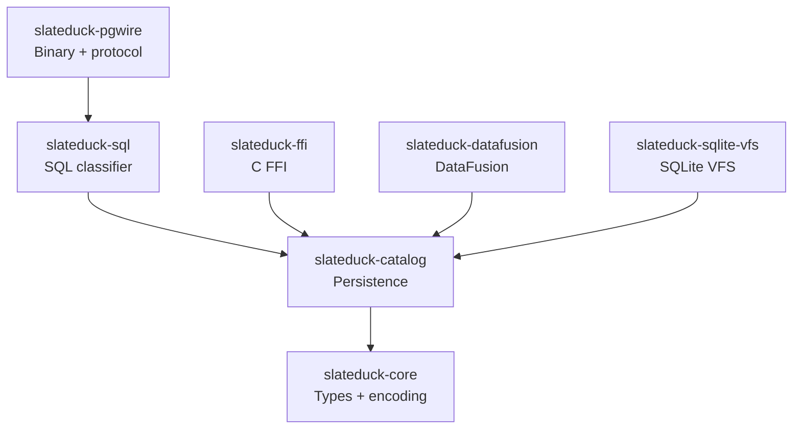

# Development Setup

This page walks you through setting up a complete local development environment for SlateDuck. By the end, you will be able to build all crates, run the full test suite, start a local SlateDuck instance, connect to it with DuckDB, and make changes with confidence that the test suite will catch regressions. The process is straightforward — if you can compile Rust code and have basic command-line skills, you can be contributing within 30 minutes.

## Prerequisites

### Required

| Tool | Minimum Version | Purpose | Installation |
|------|----------------|---------|-------------|
| Rust toolchain | 1.80+ | Build SlateDuck | [rustup.rs](https://rustup.rs) |
| Git | 2.30+ | Version control | System package manager |
| C compiler | Any recent | Build native dependencies | Xcode CLI (macOS), gcc (Linux) |

**Rust installation:**

```bash
# Install rustup (manages Rust versions and components)
curl --proto '=https' --tlsv1.2 -sSf https://sh.rustup.rs | sh

# Ensure you have the latest stable toolchain
rustup update stable

# Verify installation
rustc --version    # Should show 1.80.0 or higher
cargo --version    # Should show corresponding cargo version
```

**C compiler (needed for some native dependencies like ring, openssl-sys):**

=== "macOS"

    ```bash
    xcode-select --install
    ```

=== "Ubuntu/Debian"

    ```bash
    sudo apt install build-essential pkg-config libssl-dev
    ```

=== "Fedora/RHEL"

    ```bash
    sudo dnf install gcc openssl-devel
    ```

### Recommended

| Tool | Purpose | When Needed |
|------|---------|-------------|
| Docker | Integration tests with MinIO | S3-compatible storage tests |
| DuckDB | End-to-end protocol testing | Verifying DuckLake compatibility |
| Python 3.10+ | Documentation builds | When editing docs |
| MinIO CLI (mc) | Object storage inspection | Debugging storage issues |
| psql | Manual protocol testing | Sending raw SQL to SlateDuck |

**DuckDB installation:**

```bash
# macOS (Homebrew)
brew install duckdb

# Or download from https://duckdb.org/docs/installation/
```

**Docker (for MinIO):**

```bash
# macOS
brew install --cask docker

# Linux
curl -fsSL https://get.docker.com | sh
```

## Clone and Build

```bash
# Clone the repository
git clone https://github.com/slateduck/slateduck.git
cd slateduck

# Build all crates in debug mode (faster compile, slower runtime)
cargo build

# Build in release mode (slower compile, faster runtime — for benchmarks)
cargo build --release
```

The first build downloads and compiles all dependencies. This takes 2–5 minutes depending on your machine. Subsequent builds are incremental and take seconds.

### Workspace Structure

After cloning, the workspace contains:

```
slateduck/
├── Cargo.toml            # Workspace manifest (lists all member crates)
├── crates/
│   ├── slateduck-core/       # Foundation: types, keys, values, MVCC
│   ├── slateduck-catalog/    # Persistence: read/write operations, GC
│   ├── slateduck-sql/        # SQL classifier (pattern matching)
│   ├── slateduck-pgwire/     # PG wire protocol server (binary lives here)
│   ├── slateduck-ffi/        # C FFI for native DuckDB extension
│   ├── slateduck-datafusion/ # DataFusion catalog provider
│   └── slateduck-sqlite-vfs/ # SQLite VFS layer (experimental)
├── tests/
│   ├── fixtures/             # Wire corpus and test data
│   └── golden/               # Golden test runner
├── docs/                     # Documentation source (MkDocs)
├── benchmarks/               # Benchmark results (JSON)
└── extension/                # DuckDB native extension (C++)
```

### Dependency Graph

Crates depend on each other in a strict hierarchy:



You only need to understand the crates relevant to your change. Most contributions touch one or two crates.

## Running Tests

```bash
# Run the complete test suite (all crates)
cargo test

# Run tests for a specific crate
cargo test -p slateduck-core
cargo test -p slateduck-catalog
cargo test -p slateduck-sql
cargo test -p slateduck-pgwire

# Run a specific test by name
cargo test test_schema_key_roundtrip

# Run tests with output visible (for print debugging)
cargo test -- --nocapture

# Run only integration tests
cargo test -p slateduck-catalog --test integration_tests

# Run property-based tests
cargo test -p slateduck-core --test property_tests
```

The complete test suite should pass on a fresh clone without any additional configuration. Tests use local filesystem storage by default (no S3 access required). If a test requires external services (MinIO, DuckDB), it is gated behind a feature flag or environment variable.

### Test Performance

| Test Category | Typical Duration | Runs By Default |
|--------------|-----------------|-----------------|
| Unit tests | 2–5 seconds | Yes |
| Integration tests | 5–15 seconds | Yes |
| Property-based tests | 10–30 seconds | Yes |
| Wire corpus tests | 1–3 seconds | Yes |
| Benchmark suite | 1–5 minutes | No (cargo bench) |
| S3 integration tests | 30–120 seconds | No (requires S3) |

## Running SlateDuck Locally

For end-to-end testing, run a local SlateDuck instance:

```bash
# Start SlateDuck with local filesystem storage
cargo run -- serve --catalog ./dev-catalog --bind 127.0.0.1:5432

# In another terminal, connect with psql
psql -h 127.0.0.1 -p 5432 -U slateduck

# Or connect with DuckDB
duckdb -c "ATTACH 'ducklake:postgresql://localhost:5432/slateduck' AS lake;"
```

The local filesystem storage is perfect for development — zero latency, no cloud credentials needed, and you can inspect the catalog files directly.

### Using MinIO for S3-Compatible Testing

For testing with S3-compatible storage (more realistic than local filesystem):

```bash
# Start MinIO
docker run -p 9000:9000 -p 9001:9001 \
  -e MINIO_ROOT_USER=minioadmin \
  -e MINIO_ROOT_PASSWORD=minioadmin \
  minio/minio server /data --console-address :9001

# Create a bucket
mc alias set local http://localhost:9000 minioadmin minioadmin
mc mb local/slateduck-dev

# Start SlateDuck pointing to MinIO
AWS_ACCESS_KEY_ID=minioadmin \
AWS_SECRET_ACCESS_KEY=minioadmin \
AWS_ENDPOINT_URL=http://localhost:9000 \
cargo run -- serve --catalog s3://slateduck-dev/catalog/ --bind 127.0.0.1:5432
```

## Editor Setup

### VS Code

Recommended extensions:

- **rust-analyzer** — Full IDE features (completion, navigation, diagnostics)
- **Even Better TOML** — Syntax highlighting for Cargo.toml
- **CodeLLDB** — Debugging support

Settings (`.vscode/settings.json`):

```json
{
  "rust-analyzer.check.command": "clippy",
  "rust-analyzer.cargo.features": "all",
  "editor.formatOnSave": true,
  "[rust]": {
    "editor.defaultFormatter": "rust-lang.rust-analyzer"
  }
}
```

### IntelliJ/CLion

Install the Rust plugin. The workspace is automatically detected from `Cargo.toml`.

### Neovim

Use `rust-analyzer` via the native LSP client or nvim-lspconfig. Configuration varies by setup.

## Development Workflow

The standard workflow for contributing:

### 1. Create a Feature Branch

```bash
git checkout main
git pull origin main
git checkout -b fix/description-of-change
```

Branch naming conventions:
- `fix/` — Bug fixes
- `feat/` — New features
- `docs/` — Documentation changes
- `test/` — Test additions
- `refactor/` — Code restructuring

### 2. Make Your Changes

Edit files, add tests, update documentation as needed.

### 3. Validate Locally

```bash
# Format code (required — CI rejects unformatted code)
cargo fmt

# Lint (required — CI rejects clippy warnings)
cargo clippy --all-targets --all-features

# Run tests (required — CI rejects failing tests)
cargo test
```

### 4. Commit

```bash
git add .
git commit -m "fix: correct MVCC visibility at boundary snapshots"
```

Use [Conventional Commits](https://www.conventionalcommits.org/) format:
- `feat:` — New feature
- `fix:` — Bug fix
- `docs:` — Documentation only
- `test:` — Adding or fixing tests
- `refactor:` — Code change that neither fixes a bug nor adds a feature
- `perf:` — Performance improvement

### 5. Push and Open PR

```bash
git push origin fix/description-of-change
```

Open a Pull Request on GitHub. The PR template asks for:
- Description of the change
- Related issue (if any)
- Test coverage explanation
- Breaking change notice (if applicable)

## Documentation Development

SlateDuck's documentation is built with MkDocs Material:

```bash
# Install Python dependencies
pip install -r requirements-docs.txt

# Serve locally with hot reload (auto-refreshes on file changes)
mkdocs serve
# → Open http://127.0.0.1:8000

# Build the static site (for verifying production build)
mkdocs build --strict
```

The `--strict` flag makes MkDocs treat warnings as errors (broken links, missing pages). This is what CI uses — fix warnings before pushing.

## Troubleshooting

### Build Fails with Missing System Dependencies

```bash
# macOS: ensure Xcode CLI tools are installed
xcode-select --install

# Linux: install OpenSSL development headers
sudo apt install libssl-dev    # Debian/Ubuntu
sudo dnf install openssl-devel # Fedora/RHEL
```

### Tests Fail on First Run

If tests fail immediately after cloning, verify:
- Rust version: `rustc --version` (must be 1.80+)
- Clean build: `cargo clean && cargo build`
- No conflicting environment variables (`AWS_*`, `SLATEDUCK_*`)

### Slow Compilation

- Use `cargo build` (not `cargo build --release`) for development
- The `sccache` tool can speed up repeated builds: `cargo install sccache`
- Incremental compilation is enabled by default in debug mode

### Linker Errors on Linux

If you see linker errors related to OpenSSL or other system libraries:

```bash
# Install all development dependencies at once (Ubuntu/Debian)
sudo apt install build-essential pkg-config libssl-dev cmake

# Verify pkg-config can find OpenSSL
pkg-config --modversion openssl
```

### Port Already in Use

If SlateDuck fails to start with "address already in use":

```bash
# Check what is using port 5432
lsof -i :5432

# Use a different port
cargo run -- serve --catalog ./dev-catalog --bind 127.0.0.1:5433
```

## Common Development Tasks

### Adding a Wire Corpus Entry

When you need to capture new SQL patterns from DuckDB:

```bash
# Start SlateDuck with verbose protocol logging
RUST_LOG=slateduck_pgwire=trace cargo run -- serve --catalog ./dev-catalog --bind 127.0.0.1:5433

# In another terminal, run DuckDB with the new operation
duckdb -c "
ATTACH 'ducklake:postgresql://localhost:5433/slateduck' AS lake;
USE lake;
CREATE SCHEMA test_schema;
"

# Copy the SQL from the log output to the corpus file
# tests/fixtures/wire-corpus/duckdb-X.Y.Z/new-operation.sql
```

### Debugging a Specific Test

```bash
# Run a single test with full output and backtrace
RUST_BACKTRACE=1 cargo test test_name_here -- --nocapture

# Run with debug logging
RUST_LOG=debug cargo test test_name_here -- --nocapture
```

### Profiling Performance

```bash
# Install flamegraph tool
cargo install flamegraph

# Generate a flamegraph of the benchmark suite
cargo flamegraph --bench catalog_bench -- --bench prefix_scan

# Or profile the running server
cargo build --release
flamegraph -- ./target/release/slateduck serve --catalog ./bench-catalog
```

### Inspecting Storage Contents

During development, it can be useful to inspect what SlateDuck has written to storage:

```bash
# For local filesystem storage
ls -la ./dev-catalog/
find ./dev-catalog/ -type f | head -20

# For MinIO
mc ls local/slateduck-dev/ --recursive
```

## Further Reading

- **[Architecture Guide](architecture-guide.md)** — Understanding the codebase structure
- **[Testing](testing.md)** — Writing and running tests
- **[Code Style](code-style.md)** — Formatting and conventions
