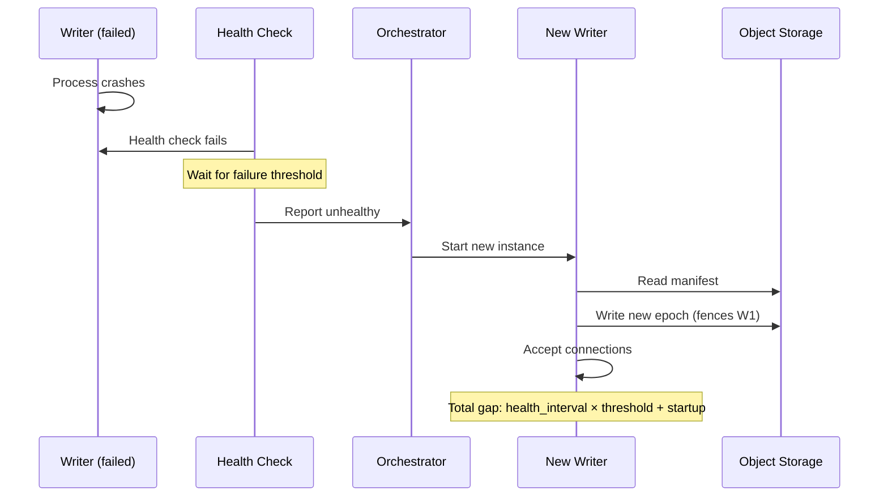

# High Availability

Rocklake achieves high availability through rapid failover rather than active-active replication. Because the single-writer model means only one instance can modify the catalog at a time, HA focuses on minimizing the gap between a writer failure and its replacement taking over. The system is designed around a specific insight: for a stateless binary whose entire state lives in durable object storage, "recovery" is not the expensive operation it is in traditional databases — it is simply starting a new process and reading the manifest.

This page explains the availability model, failover mechanics, monitoring strategies, and how to achieve specific uptime targets with Rocklake.

## Understanding Rocklake's Availability Profile

Rocklake's availability depends on three independent components:

| Component | Typical Availability | Your Control |
|-----------|---------------------|--------------|
| Object storage (S3/GCS/Azure) | 99.99% (provider SLA) | No — provider-managed |
| Network (within a region) | 99.99%+ | Partial — VPC design, multiple AZs |
| Rocklake process | Depends on deployment | Full — orchestration, monitoring, failover |

The first two components are managed by your cloud provider and are effectively always available. The third — the Rocklake process itself — is where your operational decisions matter. Every HA strategy in this page is about keeping the Rocklake process running or replacing it quickly when it fails.

### Why Failover is Fast

Traditional database failover is slow because the replacement must:

1. Replay transaction logs
2. Rebuild in-memory indexes
3. Verify data integrity
4. Catch up with replication lag

Rocklake skips all of this. When a new instance starts:

1. It reads the manifest from object storage (one GET, ~20ms)
2. It builds the in-memory catalog index from the manifest (in-memory, ~10ms)
3. It increments the writer epoch (one PUT, ~20ms)
4. It starts accepting connections

**Total time from process start to accepting connections: 50–200ms.** The bottleneck is not Rocklake — it is the orchestrator's health check interval.

## Failover Mechanics

### The Failover Sequence



### Timeline Analysis

The total unavailability window is:

$$T_{unavailable} = T_{detection} + T_{decision} + T_{startup}$$

Where:

- $T_{detection}$ = health check interval × failure threshold (e.g., 10s × 3 = 30s)
- $T_{decision}$ = orchestrator scheduling time (typically 1–5s)
- $T_{startup}$ = Rocklake cold start (50–200ms, negligible)

For practical purposes, the startup time is so fast that **detection time dominates the failover window**.

### Configuring Detection Speed

| Orchestrator | Health Check Config | Fastest Detection | Recommended |
|---|---|---|---|
| Kubernetes (liveness) | `periodSeconds: 2, failureThreshold: 3` | 6s | 10–15s |
| systemd (watchdog) | `WatchdogSec=10` | 10s | 15–30s |
| ECS (health check) | `interval: 5, retries: 2` | 10s | 15–20s |
| Custom (external) | Depends on implementation | 1–2s | 5–10s |

Faster detection risks false positives — a brief network glitch might trigger unnecessary failover. Slower detection risks longer unavailability. The right balance depends on your SLA requirements.

## Deployment Patterns for HA

### Pattern 1: Kubernetes with Aggressive Probes

The recommended pattern for most production deployments:

```yaml
apiVersion: apps/v1
kind: Deployment
metadata:
  name: rocklake-writer
spec:
  replicas: 1
  strategy:
    type: Recreate
  template:
    spec:
      terminationGracePeriodSeconds: 60
      containers:
        - name: rocklake
          image: ghcr.io/rocklake/rocklake:0.8.0
          livenessProbe:
            tcpSocket:
              port: 5432
            initialDelaySeconds: 5
            periodSeconds: 5
            failureThreshold: 3
            # Detection time: 5s × 3 = 15s
          readinessProbe:
            tcpSocket:
              port: 5432
            periodSeconds: 3
            failureThreshold: 2
```

With this configuration:

- **Worst-case failover:** 15s (detection) + 5s (scheduling) + 0.2s (startup) = ~20s
- **Typical failover:** 10s (detection) + 2s (scheduling) + 0.1s (startup) = ~12s

### Pattern 2: Hot Standby with External Monitor

For tighter failover targets, run a standby instance in read-only mode that can be promoted:

```
┌─────────────────┐     ┌─────────────────┐
│  Writer (active) │     │ Reader (standby) │
│  Port 5432       │     │ Port 5432        │
│  Read/Write      │     │ Read-only        │
└────────┬────────┘     └────────┬─────────┘
         │                        │
         ▼                        ▼
    ┌──────────┐           ┌──────────┐
    │ Load     │           │ External │
    │ Balancer │◄──────────│ Monitor  │
    └──────────┘           └──────────┘
```

When the external monitor detects writer failure:

1. Signal the load balancer to redirect traffic to the standby
2. Restart the standby without `--read-only` flag (it becomes the writer)
3. Start a new read-only standby

This achieves 2–5 second failover because there is no cold start — the standby is already running and has a warm manifest cache.

### Pattern 3: systemd with Socket Activation

For bare-metal deployments, systemd can restart Rocklake within seconds:

```ini
[Service]
Type=notify
WatchdogSec=10
Restart=always
RestartSec=1
StartLimitBurst=10
StartLimitIntervalSec=60
```

With `WatchdogSec=10`, systemd kills the process if it stops sending heartbeats for 10 seconds. With `RestartSec=1`, the new process starts 1 second later. Total gap: ~11 seconds worst case.

## Read Availability vs. Write Availability

Rocklake's architecture naturally provides higher read availability than write availability:

### Read Availability

- Multiple read-only instances serve catalog queries simultaneously
- If the writer fails, readers continue serving their last-seen snapshot
- Readers are independently scalable and independently restartable
- A single reader failure has no impact if others are healthy

### Write Availability

- Limited by single-writer: only one instance can write at a time
- During failover, writes are unavailable (reads continue on existing replicas)
- For analytics workloads where writes are infrequent ETL operations, brief write unavailability is acceptable

### Practical Impact

Most DuckLake catalog interactions are reads (query planning, table metadata resolution). Writes happen only during schema changes, data ingestion registration, and compaction. A typical analytics team might do:

- **1,000+ reads/minute** — table metadata lookups during query planning
- **5–50 writes/day** — schema changes, new partition registration, GC

Brief write unavailability (10–30 seconds) is invisible to most users because their DuckDB sessions buffer writes and retry automatically.

## Achieving Specific SLA Targets

### 99.9% (43 minutes downtime/month)

**Configuration:**

- Kubernetes Deployment with liveness probe (period: 10s, threshold: 3)
- Single AZ is sufficient
- No hot standby needed

**Budget:** With 30-second worst-case failover, you can tolerate ~86 failures per month before exceeding the SLA. This is more than sufficient for any realistic failure rate.

### 99.95% (22 minutes downtime/month)

**Configuration:**

- Kubernetes with faster probes (period: 5s, threshold: 2)
- Multiple AZ spread for the node pool
- PodDisruptionBudget to prevent maintenance evictions

**Budget:** ~44 failures per month at 30-second recovery.

### 99.99% (4.3 minutes downtime/month)

**Configuration:**

- Hot standby pattern with external monitor
- 5-second failover target
- Multi-AZ with pod anti-affinity
- Automated rollback on failed deployments

**Budget:** ~52 failures per month at 5-second recovery.

### 99.999% (26 seconds downtime/month)

This is **not achievable** with Rocklake's single-writer model. If you need five-nines write availability, consider:

- Active-active replication (not supported by Rocklake's architecture)
- DuckLake's PostgreSQL backend with Aurora Multi-Master
- Accepting read-only mode during writer failover (reads can achieve 99.999%)

## Monitoring for HA

### Key Metrics

| Metric | Alert Threshold | Meaning |
|--------|----------------|---------|
| Writer epoch changes | > 2/hour | Frequent failovers indicate instability |
| Liveness probe failures | > 0/minute | Process may be unhealthy |
| Connection errors (client) | Spike | Clients seeing failover gap |
| Object storage latency | > 200ms P99 | Underlying storage degraded |
| Memory usage | > 80% of limit | OOM kill imminent |

### Alerting Rules (Prometheus)

```yaml
groups:
  - name: rocklake-ha
    rules:
      - alert: RocklakeWriterDown
        expr: up{job="rocklake-writer"} == 0
        for: 30s
        labels:
          severity: critical
        annotations:
          summary: "Rocklake writer is down"

      - alert: RocklakeFrequentFailover
        expr: increase(rocklake_epoch_changes_total[1h]) > 3
        labels:
          severity: warning
        annotations:
          summary: "Rocklake writer failing over frequently"
```

## What Rocklake Does NOT Provide

It is important to set expectations clearly:

- **No active-active writes.** Two writers cannot modify the same catalog simultaneously. This is a fundamental architectural decision (not a missing feature).
- **No synchronous replication.** Readers see committed data after object storage propagation (typically <1 second, but not zero).
- **No automatic leader election.** Rocklake relies on an external orchestrator (Kubernetes, ECS, systemd) to restart failed instances.
- **No sub-second failover** without the hot standby pattern.

If you need these properties for your catalog, consider DuckLake's PostgreSQL backend (which supports Aurora Multi-AZ failover) and treat Rocklake as the cost-optimized option for workloads where brief unavailability is acceptable.

## Failure Modes and Recovery

Understanding the specific failure modes helps design appropriate HA strategies:

### Process Crash (Panic, OOM, Segfault)

**Impact:** Writer unavailable. All in-flight transactions are lost (uncommitted writes).

**Recovery:** Orchestrator restarts the process. New instance reads manifest and resumes from the last committed snapshot. Recovery time: 50–200ms from restart.

**Data loss:** None for committed data (object storage is durable). In-flight writes that were not yet committed to the WAL are lost — the client will receive a connection error and should retry.

### Network Partition (Cannot Reach Object Storage)

**Impact:** Writer cannot commit new snapshots. Reads from cache continue working. New client connections succeed but queries that require uncached data will time out.

**Recovery:** When network restores, the writer resumes normally. No data loss, no restart needed.

**Duration tolerance:** Rocklake can serve cached reads indefinitely during a partition. Writes fail immediately with a clear error. Clients should implement retry with backoff.

### Object Storage Outage (Extremely Rare)

**Impact:** Complete unavailability — cannot read or write anything.

**Recovery:** When storage recovers, Rocklake resumes automatically. Object storage providers have never had a complete regional outage lasting more than a few hours.

**Mitigation:** For extreme durability requirements, maintain a cross-region catalog copy that can serve reads during a regional outage.

### Slow Object Storage (Latency Spike)

**Impact:** All operations slow down proportionally. Queries that require 5 SST block reads go from 50ms to 500ms.

**Recovery:** Automatic when storage latency returns to normal.

**Mitigation:** Larger block cache (reduces storage round-trips for hot keys), S3 Express One Zone (lower baseline latency), or pre-warming the cache during known high-load periods.

## Measuring Availability

Track availability using the standard formula:

```
Availability = (Total Time - Downtime) / Total Time × 100%
```

For Rocklake, "downtime" means "the writer cannot accept new connections." Define this precisely in your SLO:

| Target | Allowed Downtime/Month | Strategy Required |
|--------|----------------------|------------------|
| 99.0% | 7.3 hours | Basic systemd restart |
| 99.9% | 43.8 minutes | Kubernetes with health probes |
| 99.95% | 21.9 minutes | Kubernetes + aggressive probes |
| 99.99% | 4.4 minutes | Hot standby + <5s failover |

Most Rocklake deployments achieve 99.9%+ availability with standard Kubernetes deployment and health probes, because the combination of fast startup (200ms) and aggressive liveness probes (10s interval, 2 failure threshold) means failures are detected and recovered within 30 seconds.

## Further Reading

- **[Multi-Region](multi-region.md)** — Cross-region readers for disaster recovery
- **[Kubernetes](kubernetes.md)** — Detailed Kubernetes manifests with HA probes
- **[Binary Deployment](binary.md)** — systemd configuration for bare-metal HA
- **[Concepts: Single Writer](../concepts/single-writer-many-readers.md)** — Architectural rationale
