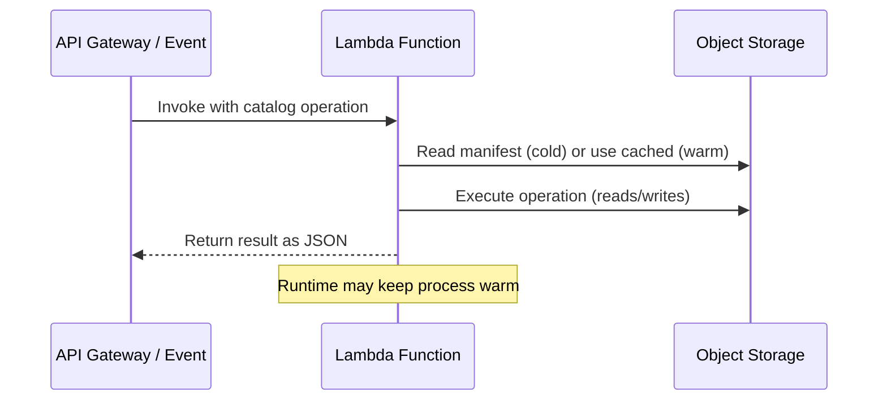

# Lambda / Serverless Deployment

Rocklake can run as a serverless function for workloads with infrequent catalog access, where keeping a persistent process running would be wasteful and expensive. This deployment model trades latency (cold start penalty) for cost efficiency (pay only for actual milliseconds of computation). For catalogs that are accessed a few times per hour rather than thousands of times per second, serverless is the economically rational choice.

The architecture leverages a key property of Rocklake's design: all state is in object storage. There is no local WAL to recover, no in-memory state that must survive across invocations, no warm-up period beyond reading the manifest. A fresh Rocklake instance can serve a catalog operation within 50–100ms of starting.

## How It Works

In serverless mode, Rocklake operates with a different lifecycle than the persistent PG-wire server. Each function invocation follows this flow:



1. **Cold start (first invocation):** The function initializes a Rocklake instance, reads the SlateDB manifest from object storage (one GET request, 20–50ms), and builds the in-memory catalog index.
2. **Execute operation:** Processes one or more catalog operations from the event payload. This may involve additional object storage reads/writes depending on the operation.
3. **Return result:** Sends the operation result back as structured JSON.
4. **Warm invocations:** If the runtime reuses the execution environment (which Lambda does for ~5–15 minutes after the last invocation), subsequent requests skip the manifest read and execute immediately.

The warm path is the common case for any catalog accessed more than once every few minutes, bringing operation latency down to 5–20ms.

## AWS Lambda

### Building the Function

Package Rocklake as a Lambda custom runtime (provided.al2023):

```bash
# Build for Amazon Linux 2023 (x86_64)
cargo build --release --target x86_64-unknown-linux-gnu --features lambda

# Package as Lambda deployment artifact
cp target/x86_64-unknown-linux-gnu/release/rocklake-lambda bootstrap
zip lambda.zip bootstrap
```

For ARM64 (Graviton2, more cost-effective):

```bash
cargo build --release --target aarch64-unknown-linux-gnu --features lambda
cp target/aarch64-unknown-linux-gnu/release/rocklake-lambda bootstrap
zip lambda.zip bootstrap
```

### Lambda Configuration

```yaml
# SAM template (template.yaml)
AWSTemplateFormatVersion: '2010-09-09'
Transform: AWS::Serverless-2016-10-31

Resources:
  RocklakeFunction:
    Type: AWS::Serverless::Function
    Properties:
      FunctionName: rocklake-catalog
      Handler: bootstrap
      Runtime: provided.al2023
      Architectures:
        - arm64
      MemorySize: 256
      Timeout: 30
      Environment:
        Variables:
          ROCKLAKE_STORAGE: s3://my-lakehouse-bucket/catalog/
          RUST_LOG: info
      Policies:
        - S3CrudPolicy:
            BucketName: my-lakehouse-bucket
      Events:
        ApiGateway:
          Type: HttpApi
          Properties:
            Path: /catalog/{proxy+}
            Method: ANY
```

Deploy:

```bash
sam build && sam deploy --guided
```

### Event Format

The Lambda handler accepts catalog operations as JSON events:

```json
{
  "operation": "query",
  "sql": "SELECT * FROM ducklake.tables WHERE schema_name = 'analytics'",
  "catalog": "s3://my-lakehouse-bucket/catalog/"
}
```

Write operations:

```json
{
  "operation": "execute",
  "sql": "CREATE TABLE analytics.events (id BIGINT, ts TIMESTAMP, data JSON)",
  "catalog": "s3://my-lakehouse-bucket/catalog/"
}
```

Response format:

```json
{
  "status": "ok",
  "rows": [...],
  "affected_rows": 0,
  "duration_ms": 12
}
```

### IAM Permissions

The Lambda execution role needs S3 access to the catalog bucket:

```json
{
  "Version": "2012-10-17",
  "Statement": [
    {
      "Effect": "Allow",
      "Action": [
        "s3:GetObject",
        "s3:PutObject",
        "s3:DeleteObject",
        "s3:ListBucket"
      ],
      "Resource": [
        "arn:aws:s3:::my-lakehouse-bucket",
        "arn:aws:s3:::my-lakehouse-bucket/catalog/*"
      ]
    }
  ]
}
```

### Provisioned Concurrency

For latency-sensitive workloads that still want serverless economics, use provisioned concurrency to eliminate cold starts:

```yaml
ProvisionedConcurrencyConfig:
  ProvisionedConcurrentExecutions: 2
```

This keeps 2 execution environments warm at all times. Cost is significantly lower than a persistent EC2 instance while providing consistent <10ms response times.

## Google Cloud Functions

Rocklake can also run as a Google Cloud Function:

```bash
# Build for Cloud Functions (x86_64 Linux)
cargo build --release --target x86_64-unknown-linux-gnu --features gcf

# Deploy
gcloud functions deploy rocklake-catalog \
  --runtime=provided \
  --trigger-http \
  --memory=256MB \
  --timeout=30s \
  --set-env-vars="ROCKLAKE_STORAGE=gs://my-bucket/catalog/" \
  --source=./deploy/
```

## Azure Functions

For Azure:

```bash
# Build
cargo build --release --target x86_64-unknown-linux-gnu --features azure-func

# Deploy using Azure Functions Core Tools
func azure functionapp publish rocklake-catalog
```

## DuckDB Integration via Proxy

DuckDB's `ducklake` extension expects a persistent PG-wire connection. To use DuckDB with a serverless Rocklake backend, you need a translation layer:

### Option 1: API Gateway + Lambda (HTTP Mode)

Use Rocklake's HTTP catalog API (separate from PG-wire) with a DuckDB httpfs-based catalog connector:

```sql
-- Future: HTTP-based catalog access
ATTACH 'ducklake:https://api.example.com/catalog' AS lake;
```

### Option 2: PG-Wire Proxy

Run a lightweight proxy that maintains PG-wire connections to DuckDB clients and translates them to Lambda invocations:

```
DuckDB → PG-wire → Proxy (persistent) → Lambda invocation → S3
```

This is useful when you have many catalogs but few concurrent users per catalog. The proxy multiplexes many DuckDB connections across on-demand Lambda invocations.

### Option 3: Embedded Mode (FFI)

For batch workloads, use Rocklake's FFI integration to embed the catalog directly in your application, bypassing the network entirely:

```python
import duckdb
# Load Rocklake as a DuckDB extension (no separate server)
conn = duckdb.connect()
conn.execute("LOAD rocklake")
conn.execute("ATTACH 'ducklake:s3://my-bucket/catalog/' AS lake")
```

## Use Cases

### Infrequent Access Patterns

If your DuckLake catalog is queried only a few times per hour — for example, a daily ETL job that registers new Parquet files, or a weekly reporting pipeline that reads table metadata — a persistent Rocklake process running 24/7 is economically wasteful. Lambda invocations cost fractions of a cent for the actual milliseconds of execution.

### Burst Workloads

Analytics teams that run intensive catalog operations for 30 minutes during morning standup queries, then nothing for 23.5 hours, benefit from serverless scaling. There is no need to provision for peak; the function scales automatically.

### Multi-Catalog Management

SaaS platforms managing hundreds of independent lakehouse catalogs (one per tenant) would need hundreds of persistent processes in a traditional deployment. With serverless, a single Lambda function handles all catalogs on-demand, opening the appropriate catalog based on the event payload.

### Development and Staging

Development environments where catalogs are accessed only during working hours save 60–70% compared to persistent instances by using serverless deployment.

## Limitations

### Cold Start Latency

The first invocation after an idle period requires:

1. Runtime initialization (~20ms for Rust)
2. Reading SlateDB manifest from S3 (~20–50ms)
3. Building in-memory index (~5–10ms)

Total cold start: **50–100ms**. This is fast compared to JVM-based serverless functions (which take 500ms–5s) but may be noticeable for interactive applications. Mitigation strategies:

- **Provisioned concurrency** — eliminates cold starts entirely
- **Scheduled warming** — ping the function every 5 minutes to keep it warm
- **Client retry** — first request may be slow; subsequent requests are fast

### Single Writer Semantics

Only one Lambda invocation should write to a given catalog concurrently. Without coordination, two simultaneous writes would result in one being fenced. Solutions:

- **Reserved concurrency = 1** for writer functions (guarantees serial execution)
- **SQS queue** in front of write operations (serializes writes)
- **Separate reader/writer functions** with different concurrency limits

### Connection Model Mismatch

DuckDB's PG-wire connection model assumes persistent TCP connections. Serverless functions are inherently request/response. The proxy approaches described above bridge this gap, but add complexity and latency.

## Cost Comparison

| Scenario | Lambda (ARM64) | EC2 t3.micro | EC2 t3.small | Fargate (0.25 vCPU) |
|----------|---------------|--------------|--------------|---------------------|
| 100 ops/day, 50ms avg | $0.0001/day | $0.25/day | $0.50/day | $0.30/day |
| 1,000 ops/day, 50ms avg | $0.001/day | $0.25/day | $0.50/day | $0.30/day |
| 10,000 ops/day, 50ms avg | $0.01/day | $0.25/day | $0.50/day | $0.30/day |
| 100,000 ops/day, 50ms avg | $0.10/day | $0.25/day | $0.50/day | $0.30/day |
| 1M ops/day, 50ms avg | $1.00/day | $0.25/day | $0.50/day | $0.30/day |

The crossover point is approximately **500,000 operations per day** (roughly 5–6 ops/second sustained). Below that, serverless is cheaper. Above that, persistent instances win on cost.

For most catalog workloads (metadata operations, not data scanning), 500,000 ops/day is very high. Most teams fall well below this threshold, making serverless the economically rational default.

## Monitoring

### CloudWatch Metrics

Key metrics to monitor for Lambda-deployed Rocklake:

- **Duration** — P50, P95, P99 execution time. Alert if P99 exceeds 5 seconds.
- **ConcurrentExecutions** — Detect if reserved concurrency is being exhausted.
- **Throttles** — Indicates write serialization is too aggressive.
- **ColdStart rate** — Track what percentage of invocations hit cold start.

### Custom Metrics

Rocklake emits custom CloudWatch metrics in serverless mode:

- `rocklake.operation.duration` — Per-operation timing
- `rocklake.manifest.read_ms` — Manifest read latency (cold start indicator)
- `rocklake.storage.bytes_read` — Object storage bytes read per invocation

## Other Serverless Platforms

### Google Cloud Functions

The deployment model is similar to Lambda. Build for Linux x86_64 or ARM64, package as a custom runtime, and configure an HTTP trigger:

```bash
# Build for GCF
cargo build --release --target x86_64-unknown-linux-gnu --features cloud-functions

# Deploy
gcloud functions deploy rocklake-catalog \
    --runtime=provided \
    --trigger-http \
    --entry-point=handler \
    --source=./deploy/ \
    --set-env-vars "ROCKLAKE_STORAGE=gs://my-bucket/catalog/"
```

GCS (Google Cloud Storage) provides lower latency than S3 from GCF, since both are within Google's network. Expect 10–30ms for manifest reads.

### Azure Functions

```bash
# Build for Azure Functions custom handler
cargo build --release --target x86_64-unknown-linux-gnu --features azure-functions

# Deploy with Azure CLI
func azure functionapp publish my-rocklake-app
```

Azure Blob Storage is the natural backend. Configure the storage connection string in Application Settings.

### Cloudflare Workers (Not Recommended)

While technically possible, Cloudflare Workers have significant limitations for Rocklake:

- 50ms CPU time limit (free) / 30s (paid) — tight for catalog operations
- No TCP socket support — cannot use S3 SDK directly
- Limited memory (128 MB) — constrains block cache size

Workers are better suited for routing/proxy logic (pointing DuckDB clients to the nearest Rocklake instance) than hosting the catalog itself.

## When to Choose Serverless

### Choose Serverless When:

- Catalog is accessed less than 10,000 times per day
- Cold start latency (50–100ms) is acceptable for your use case
- You want zero operational overhead (no servers, no processes, no health checks)
- Budget is the primary constraint and usage is bursty/infrequent
- The catalog is used by scheduled jobs (ETL runs) rather than interactive users

### Choose Persistent Deployment When:

- Sub-10ms catalog latency is required (interactive dashboards, notebooks)
- Multiple DuckDB clients share the catalog simultaneously via PG-wire
- Write concurrency is high (many concurrent ETL pipelines)
- Operational observability (metrics, health checks, graceful shutdown) is needed
- Cost is not a concern relative to the value of lower latency

### Hybrid: Serverless Writes + Persistent Reads

A common pattern for cost-optimized deployments:

- **Lambda function** handles infrequent writes (ETL pipeline commits, schema changes) — these are serialized naturally by Lambda's concurrency model
- **Persistent Rocklake instance** (Fly.io, ECS, Kubernetes) handles reads from DuckDB clients — provides low latency for interactive users

This works because SlateDB supports one writer (the Lambda function) and unlimited concurrent readers (the persistent instance in read-only mode).

## Further Reading

- **[Binary Deployment](binary.md)** — Persistent process for high-throughput workloads
- **[High Availability](high-availability.md)** — Failover patterns for persistent deployments
- **[Configuration](configuration.md)** — Environment variables for Lambda configuration
