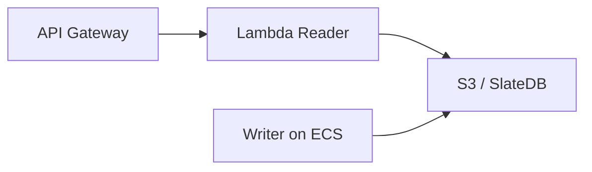

# AWS Lambda Deployment

SlateDuck readers can run in Lambda for serverless catalog access.

## Architecture

## Cold Start

- Runtime initialization: ~50 ms
- First SlateDB read: ~40 ms
- Total cold start: ~100 ms
- Warm invocations: ~40-60 ms

## When to Use

- Infrequent, bursty read workloads
- Cost optimization (pay per invocation)
- Multi-tenant isolation
