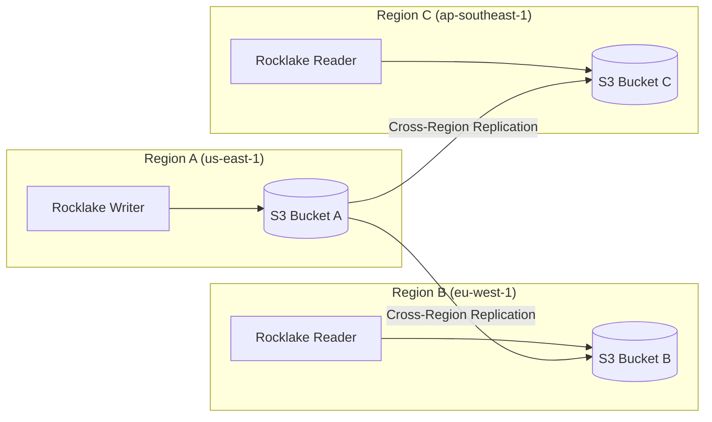

# Multi-Region Deployment

Multi-region deployment allows Rocklake to serve catalog queries from multiple geographic regions with low latency. A data team in Frankfurt should not wait 150ms for a round-trip to Virginia every time DuckDB resolves a table name — they should hit a local Rocklake instance that responds in 5ms. Because Rocklake uses object storage as its durable layer, multi-region deployment leverages your cloud provider's built-in cross-region replication rather than implementing its own replication protocol.

This page covers the architecture of multi-region Rocklake deployments, configuration for each cloud provider, replication lag characteristics, failover procedures, and the cost trade-offs of geographic distribution.

## Architecture

The multi-region pattern is simple: one writer in the primary region, read-only replicas in secondary regions reading from replicated object storage.



The flow is unidirectional: writes go to the primary, replication propagates to secondaries, readers in secondaries serve local queries. There is no bidirectional replication, no conflict resolution, no vector clocks. The single-writer model eliminates the entire class of multi-region consistency problems that plague distributed databases.

### Why This Works

Traditional databases struggle with multi-region because replicating transaction logs across continents introduces latency into the write path. Rocklake does not have this problem because:

1. **Writes are local.** The writer commits to its local-region S3 bucket. The write path has zero cross-region latency.
2. **Replication is asynchronous.** Cross-region copy happens in the background, managed by the cloud provider.
3. **Readers are independent.** Each reader opens its own view of the catalog from its local bucket. It does not coordinate with the writer.
4. **Staleness is bounded.** Object storage replication has known latency bounds (seconds to minutes, depending on provider).

## Setup: AWS S3 Cross-Region Replication

### Step 1: Create Destination Bucket

```bash
# Create bucket in secondary region
aws s3 mb s3://my-lakehouse-eu-west-1 --region eu-west-1
```

### Step 2: Enable Versioning (Required for CRR)

```bash
# Both source and destination need versioning
aws s3api put-bucket-versioning \
    --bucket my-lakehouse-us-east-1 \
    --versioning-configuration Status=Enabled

aws s3api put-bucket-versioning \
    --bucket my-lakehouse-eu-west-1 \
    --versioning-configuration Status=Enabled
```

### Step 3: Create Replication IAM Role

```json
{
  "Version": "2012-10-17",
  "Statement": [
    {
      "Effect": "Allow",
      "Action": [
        "s3:GetReplicationConfiguration",
        "s3:ListBucket"
      ],
      "Resource": "arn:aws:s3:::my-lakehouse-us-east-1"
    },
    {
      "Effect": "Allow",
      "Action": [
        "s3:GetObjectVersionForReplication",
        "s3:GetObjectVersionAcl"
      ],
      "Resource": "arn:aws:s3:::my-lakehouse-us-east-1/catalog/*"
    },
    {
      "Effect": "Allow",
      "Action": [
        "s3:ReplicateObject",
        "s3:ReplicateDelete"
      ],
      "Resource": "arn:aws:s3:::my-lakehouse-eu-west-1/catalog/*"
    }
  ]
}
```

### Step 4: Enable Replication

```bash
aws s3api put-bucket-replication \
    --bucket my-lakehouse-us-east-1 \
    --replication-configuration '{
        "Role": "arn:aws:iam::123456789012:role/s3-replication-role",
        "Rules": [{
            "Status": "Enabled",
            "Priority": 1,
            "Filter": {"Prefix": "catalog/"},
            "Destination": {
                "Bucket": "arn:aws:s3:::my-lakehouse-eu-west-1",
                "Metrics": {"Status": "Enabled", "EventThreshold": {"Minutes": 15}},
                "ReplicationTime": {"Status": "Enabled", "Time": {"Minutes": 15}}
            },
            "DeleteMarkerReplication": {"Status": "Enabled"}
        }]
    }'
```

### Step 5: Deploy Reader in Secondary Region

```bash
# In eu-west-1
AWS_REGION=eu-west-1 rocklake \
    --catalog s3://my-lakehouse-eu-west-1/catalog/ \
    --bind 0.0.0.0:5432 \
    --read-only
```

## Setup: Google Cloud Storage

GCS offers two approaches for multi-region access:

### Option A: Multi-Region Bucket (Simplest)

Create the bucket as multi-region from the start:

```bash
gsutil mb -l US gs://my-lakehouse/
# or
gsutil mb -l EU gs://my-lakehouse/
```

Multi-region buckets replicate data across regions automatically. Deploy readers in any region within the multi-region class — they read from the nearest replica automatically.

### Option B: Dual-Region Bucket

For cost control with specific region pairs:

```bash
gsutil mb -l US-EAST1+US-WEST1 gs://my-lakehouse/
```

### Deploying Readers

```bash
# Reader in any region (GCS handles routing automatically)
rocklake serve --catalog gs://my-lakehouse/catalog/ --bind 0.0.0.0:5432 --read-only
```

## Setup: Azure Blob Storage

### Enable Geo-Redundant Storage (GRS)

When creating the storage account, choose GRS or RA-GRS (Read-Access GRS):

```bash
az storage account create \
    --name mylakehouse \
    --resource-group rg-analytics \
    --location eastus \
    --sku Standard_RAGRS
```

With RA-GRS, the secondary endpoint is readable:

```bash
# Primary (read/write)
rocklake serve --catalog az://catalog@mylakehouse/ --bind 0.0.0.0:5432

# Secondary (read-only, use secondary endpoint)
rocklake serve --catalog az://catalog@mylakehouse-secondary/ --bind 0.0.0.0:5432 --read-only
```

## Replication Lag

Cross-region replication is asynchronous. The lag determines how stale your readers can be:

| Provider | Mechanism | Typical Lag | SLA |
|----------|-----------|-------------|-----|
| AWS S3 CRR (standard) | Asynchronous | 30s – 5 min | 99.99% within 15 min |
| AWS S3 RTC (Replication Time Control) | Asynchronous with SLA | < 15 min | 99.99% within 15 min |
| GCS Multi-Region | Synchronous-ish | < 1 second | Strongly consistent |
| GCS Dual-Region (turbo) | Synchronous-ish | < 1 second | RPO = 0 (turbo replication) |
| Azure RA-GRS | Asynchronous | < 15 min typical | No firm SLA |
| Azure GZRS | Asynchronous | < 15 min typical | No firm SLA |

### What "Lag" Means for Rocklake

During the replication lag window, readers in secondary regions serve a slightly older catalog snapshot. Concretely:

- A table created 30 seconds ago might not be visible to the EU reader yet
- A schema change committed in us-east-1 takes 30 seconds to propagate to eu-west-1
- Data files referenced by the catalog are typically in a separate bucket (e.g., a data lake bucket) that may have its own replication characteristics

For most analytics workloads, this is invisible:

- Dashboard queries use stable table schemas
- Batch ETL runs once per hour (not every second)
- Ad-hoc analysts are not racing against schema changes

### Monitoring Replication Lag

```bash
# AWS: Check replication metrics
aws cloudwatch get-metric-statistics \
    --namespace AWS/S3 \
    --metric-name ReplicationLatency \
    --dimensions Name=SourceBucket,Value=my-lakehouse-us-east-1 \
    --start-time $(date -v-1H +%Y-%m-%dT%H:%M:%S) \
    --end-time $(date +%Y-%m-%dT%H:%M:%S) \
    --period 300 \
    --statistics Average
```

## Client Routing

Route clients to their nearest Rocklake instance for lowest latency.

### DNS-Based Routing (AWS Route 53)

```bash
# Latency-based routing
aws route53 change-resource-record-sets \
    --hosted-zone-id Z123456 \
    --change-batch '{
        "Changes": [{
            "Action": "CREATE",
            "ResourceRecordSet": {
                "Name": "catalog.example.com",
                "Type": "A",
                "SetIdentifier": "us-east-1",
                "Region": "us-east-1",
                "TTL": 60,
                "ResourceRecords": [{"Value": "10.0.1.100"}]
            }
        }, {
            "Action": "CREATE",
            "ResourceRecordSet": {
                "Name": "catalog.example.com",
                "Type": "A",
                "SetIdentifier": "eu-west-1",
                "Region": "eu-west-1",
                "TTL": 60,
                "ResourceRecords": [{"Value": "10.1.1.100"}]
            }
        }]
    }'
```

Clients connect to `catalog.example.com:5432` and DNS routes them to the nearest region.

### Application-Level Routing

For more control, route in application configuration:

```python
import os

REGION = os.environ.get("AWS_REGION", "us-east-1")
CATALOG_HOSTS = {
    "us-east-1": "rocklake-us.internal:5432",
    "eu-west-1": "rocklake-eu.internal:5432",
    "ap-southeast-1": "rocklake-ap.internal:5432",
}

catalog_host = CATALOG_HOSTS.get(REGION, CATALOG_HOSTS["us-east-1"])
```

### Write Routing

All writes must go to the primary region's writer instance. Options:

1. **Separate connection strings:** Applications use the local reader for queries and the primary writer for DDL/DML.
2. **Proxy with routing rules:** A PgBouncer-like proxy routes SELECT to local reader and DDL/DML to primary writer.
3. **Fail-forward:** If a read-only instance receives a write, it returns a clear error. The client retries against the writer endpoint.

## Disaster Recovery

If the primary region becomes unavailable (regional outage):

### Failover Procedure

1. **Verify replication state:** Check the latest manifest file in the secondary bucket. Compare the latest snapshot ID with what was known in the primary.

2. **Promote the reader to writer:**
   ```bash
   # Stop the read-only instance
   # Restart without --read-only
   rocklake serve --catalog s3://my-lakehouse-eu-west-1/catalog/ --bind 0.0.0.0:5432
   ```

3. **Update DNS:** Point the writer endpoint to the new primary.

4. **Inform applications:** Any cached writer connections need to reconnect.

### Data Loss Assessment

With asynchronous replication, any writes that had not yet replicated are lost. The maximum data loss (RPO - Recovery Point Objective) is:

| Provider | RPO |
|----------|-----|
| AWS S3 CRR | Up to 15 minutes |
| GCS Multi-Region | ~0 (synchronous) |
| Azure RA-GRS | Up to 15 minutes |

For Rocklake catalogs, "lost data" means catalog metadata (table definitions, partition registrations) — not the actual data files in the lake. Data files in the lake are independently replicated and are not affected by Rocklake's catalog state.

### Failback Procedure

When the original primary region recovers:

1. Set up replication from the new primary to the recovering region
2. Wait for replication to catch up
3. Either keep the new topology or failback (reverse the roles)

## Cost Considerations

Multi-region deployment adds costs:

| Cost Component | Approximate Monthly Cost |
|---------------|-------------------------|
| S3 CRR data transfer (per GB replicated) | $0.02/GB |
| Secondary bucket storage | Same as primary |
| Secondary Rocklake instance | Same as primary (small) |
| DNS routing (Route 53) | $0.50/hosted zone + $0.60/million queries |

For a typical Rocklake catalog (10–100 MB of metadata), cross-region replication costs are negligible — less than $1/month. The dominant cost is the secondary Rocklake instance, which can be as small as a `t3.micro` ($7/month).

## Example: Three-Region Analytics Platform

```yaml
# Primary: us-east-1 (writer + reader)
# Secondary: eu-west-1 (reader)
# Tertiary: ap-southeast-1 (reader)

regions:
  us-east-1:
    role: primary
    instance: rocklake serve --catalog s3://lakehouse-us/catalog/ --bind 0.0.0.0:5432
    bucket: lakehouse-us
    replicates_to: [lakehouse-eu, lakehouse-ap]

  eu-west-1:
    role: reader
    instance: rocklake serve --catalog s3://lakehouse-eu/catalog/ --bind 0.0.0.0:5432 --read-only
    bucket: lakehouse-eu
    receives_from: lakehouse-us

  ap-southeast-1:
    role: reader
    instance: rocklake serve --catalog s3://lakehouse-ap/catalog/ --bind 0.0.0.0:5432 --read-only
    bucket: lakehouse-ap
    receives_from: lakehouse-us
```

Analytics teams worldwide connect to their local reader. Schema changes and data registration go through the US writer. Replication lag is invisible for normal query workloads.

## Further Reading

- **[High Availability](high-availability.md)** — Single-region HA patterns
- **[Kubernetes](kubernetes.md)** — Reader fleet deployment
- **[Concepts: Single Writer](../concepts/single-writer-many-readers.md)** — Why one writer is sufficient
- **[Networking](networking.md)** — Cross-region network configuration
