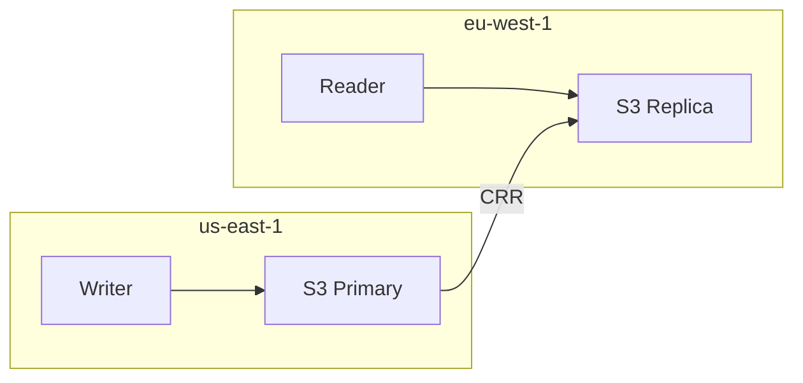

# Multi-Region

## S3 Cross-Region Replication

Writer runs in primary region. Readers in other regions use the replica bucket. Replication lag: typically seconds.

## Considerations

- Replication lag means secondary readers may see stale data
- Writer MUST run in the primary bucket region
- CRR incurs data transfer charges
