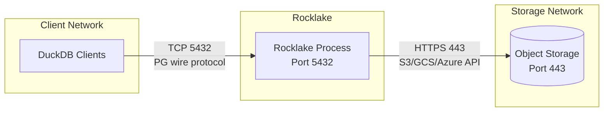

# Networking

Rocklake has minimal networking requirements compared to traditional databases. It needs exactly two network paths: inbound connections from DuckDB clients, and outbound HTTPS to object storage. There is no replication traffic between nodes, no gossip protocol, no membership discovery, no inter-node communication of any kind. This simplicity makes firewall rules straightforward and security posture easy to reason about.

This page covers network topology options, firewall configuration, VPC endpoints for cost and latency optimization, service discovery patterns, load balancing, and connection management.

## Network Requirements

Rocklake requires precisely two network paths:



| Direction | Protocol | Port | Purpose |
|-----------|----------|------|---------|
| **Inbound** | TCP | 5432 (default) | DuckDB client connections (PG wire protocol) |
| **Outbound** | HTTPS | 443 | Object storage API (S3, GCS, Azure Blob) |

No other network access is required. Rocklake does not:

- Phone home or send telemetry
- Communicate with other Rocklake instances
- Require DNS resolution beyond object storage endpoints
- Open listening ports beyond the configured bind address
- Use UDP for anything

## Network Topologies

### Topology 1: Same-Host (Development)

The simplest setup — DuckDB and Rocklake on the same machine:

```
DuckDB → localhost:5432 → Rocklake → (internet) → S3
```

**Configuration:**
```bash
rocklake serve --catalog s3://bucket/catalog/ --bind 127.0.0.1:5432
```

**Security:** No network exposure. Only processes on the same machine can connect. Ideal for development and testing.

**Latency:** Sub-millisecond (loopback).

### Topology 2: Same-VPC (Recommended for Production)

DuckDB and Rocklake in the same VPC with private networking:

```
DuckDB (10.0.1.x) → rocklake.internal:5432 → Rocklake (10.0.2.x) → VPC Endpoint → S3
```

**Configuration:**
```bash
rocklake serve --catalog s3://bucket/catalog/ --bind 0.0.0.0:5432
```

**Security:** Security group rules restrict inbound to port 5432 from the DuckDB client subnet. Outbound restricted to the VPC endpoint for S3.

**Latency:** <1ms within the same AZ, 1–3ms cross-AZ.

### Topology 3: Cross-VPC (Hub-and-Spoke)

Rocklake in a shared-services VPC, DuckDB clients in application VPCs:

```
App VPC A ──┐
            ├──→ Transit Gateway → Shared VPC → Rocklake → VPC Endpoint → S3
App VPC B ──┘
```

**When to use:** Multi-team environments where each team has their own VPC but shares the lakehouse catalog.

**Configuration:** Same as same-VPC, but routing goes through Transit Gateway or VPC peering.

### Topology 4: Public Internet

Rocklake accessible over the internet (for remote teams, multi-cloud, or hybrid setups):

```
DuckDB (anywhere) → (internet) → [LB] → Rocklake → S3
```

**Requirements:**
- TLS mandatory (to encrypt credentials and catalog data in transit)
- Password authentication required
- IP allowlisting or VPN strongly recommended
- DDoS protection (cloud provider's WAF/Shield)

**Configuration:**
```bash
rocklake \
    --catalog s3://bucket/catalog/ \
    --bind 0.0.0.0:5432 \
    --tls-cert /etc/rocklake/cert.pem \
    --tls-key /etc/rocklake/key.pem \
    --auth-user ducklake
```

## Firewall Rules

### Inbound Rules (to Rocklake)

| Source | Port | Protocol | Action | Purpose |
|--------|------|----------|--------|---------|
| DuckDB client CIDR / security group | 5432/tcp | TCP | Allow | Catalog connections |
| Monitoring system | 9090/tcp | TCP | Allow | Prometheus metrics (if enabled) |
| All other | * | * | Deny | Default deny |

### Outbound Rules (from Rocklake)

| Destination | Port | Protocol | Action | Purpose |
|-------------|------|----------|--------|---------|
| S3 VPC endpoint / storage CIDR | 443/tcp | HTTPS | Allow | Object storage |
| DNS resolver | 53/udp+tcp | DNS | Allow | Name resolution |
| All other | * | * | Deny | Default deny |

### AWS Security Group Example

```bash
# Create Rocklake security group
aws ec2 create-security-group \
    --group-name rocklake-sg \
    --description "Rocklake catalog server" \
    --vpc-id vpc-12345

# Allow inbound from DuckDB clients
aws ec2 authorize-security-group-ingress \
    --group-id sg-rocklake \
    --protocol tcp \
    --port 5432 \
    --source-group sg-duckdb-clients

# Allow outbound to S3 (via VPC endpoint, no explicit rule needed with Gateway endpoint)
```

## VPC Endpoints (Private Storage Access)

VPC endpoints let Rocklake reach object storage without traversing the public internet. This provides three benefits:

1. **Lower latency** — no NAT gateway hop, traffic stays on AWS backbone
2. **No data transfer cost** — Gateway endpoints are free, Interface endpoints cost less than NAT
3. **Better security** — traffic never leaves the cloud provider's network

### AWS: S3 Gateway Endpoint

```bash
aws ec2 create-vpc-endpoint \
    --vpc-id vpc-12345 \
    --service-name com.amazonaws.us-east-1.s3 \
    --route-table-ids rtb-12345 \
    --policy-document '{
        "Statement": [{
            "Effect": "Allow",
            "Principal": "*",
            "Action": ["s3:GetObject", "s3:PutObject", "s3:DeleteObject", "s3:ListBucket"],
            "Resource": ["arn:aws:s3:::my-lakehouse-bucket", "arn:aws:s3:::my-lakehouse-bucket/*"]
        }]
    }'
```

Gateway endpoints are free and add no additional hops. They should always be used for S3 access from VPCs.

### AWS: S3 Interface Endpoint (PrivateLink)

For more control (DNS resolution, security group attachment):

```bash
aws ec2 create-vpc-endpoint \
    --vpc-id vpc-12345 \
    --vpc-endpoint-type Interface \
    --service-name com.amazonaws.us-east-1.s3 \
    --subnet-ids subnet-12345 \
    --security-group-ids sg-12345
```

### GCP: Private Google Access

Enable Private Google Access on the subnet where Rocklake runs:

```bash
gcloud compute networks subnets update my-subnet \
    --region=us-east1 \
    --enable-private-ip-google-access
```

### Azure: Private Endpoint

```bash
az network private-endpoint create \
    --name rocklake-storage-pe \
    --resource-group rg-analytics \
    --vnet-name vnet-analytics \
    --subnet subnet-rocklake \
    --private-connection-resource-id /subscriptions/.../storageAccounts/mylakehouse \
    --group-id blob \
    --connection-name rocklake-storage
```

## Load Balancing

### TCP Load Balancer (Recommended)

Rocklake uses the PostgreSQL wire protocol (TCP-based, not HTTP). Use a TCP/Layer 4 load balancer:

**AWS NLB:**
```yaml
apiVersion: v1
kind: Service
metadata:
  name: rocklake
  annotations:
    service.beta.kubernetes.io/aws-load-balancer-type: nlb
    service.beta.kubernetes.io/aws-load-balancer-internal: "true"
spec:
  type: LoadBalancer
  ports:
    - port: 5432
      targetPort: 5432
      protocol: TCP
```

**GCP Internal TCP/UDP Load Balancer:**
```bash
gcloud compute forwarding-rules create rocklake-lb \
    --region=us-east1 \
    --load-balancing-scheme=INTERNAL \
    --ports=5432 \
    --backend-service=rocklake-backend
```

### Health Checks for Load Balancers

Configure the load balancer health check to probe the Rocklake port:

| Provider | Health Check Type | Configuration |
|----------|------------------|---------------|
| AWS NLB | TCP | Port 5432, interval 10s, threshold 3 |
| GCP | TCP | Port 5432, interval 10s, threshold 3 |
| Azure LB | TCP | Port 5432, interval 5s, threshold 2 |

### Load Balancing Strategy for Read Replicas

For read replicas, round-robin or least-connections works well — all readers serve the same data (at a given snapshot):

```
DuckDB clients
      │
      ▼
 ┌─────────┐
 │   NLB   │  Round-robin across readers
 └────┬────┘
      │
 ┌────┼────┐
 ▼    ▼    ▼
R1   R2   R3   (read-only Rocklake instances)
```

### Do NOT Use HTTP Load Balancers

Application load balancers (ALB in AWS, Application Gateway in Azure) operate at Layer 7 (HTTP). Rocklake speaks the PostgreSQL wire protocol, not HTTP. Using an HTTP load balancer will fail silently.

## Service Discovery

### Kubernetes DNS

In Kubernetes, Rocklake is automatically discoverable via cluster DNS:

```
rocklake-writer.rocklake.svc.cluster.local:5432
rocklake-reader.rocklake.svc.cluster.local:5432
```

### AWS Cloud Map

```bash
aws servicediscovery create-service \
    --name rocklake \
    --namespace-id ns-12345 \
    --dns-config "RoutingPolicy=MULTIVALUE,DnsRecords=[{Type=A,TTL=10}]"
```

### Consul

```json
{
  "service": {
    "name": "rocklake",
    "port": 5432,
    "check": {
      "tcp": "localhost:5432",
      "interval": "10s"
    }
  }
}
```

## Connection Pooling

Rocklake supports up to `--max-sessions` concurrent connections (default 64). If you have more DuckDB instances than the session limit, you need connection management.

### Important: Session State Matters

DuckDB's `ducklake` extension maintains per-session state (attached databases, transaction context). This means:

- **Session-level pooling works** (one connection per client session)
- **Transaction-level pooling does NOT work** (PgBouncer transaction mode is incompatible)
- **Statement-level pooling does NOT work** (breaks session state)

### PgBouncer (Session Mode Only)

```ini
[databases]
* = host=rocklake port=5432

[pgbouncer]
pool_mode = session
max_client_conn = 200
default_pool_size = 64
```

### Connection Limits Sizing

| Deployment | Recommended `--max-sessions` | Reasoning |
|-----------|------------------------------|-----------|
| Single developer | 10 | Only a few DuckDB sessions |
| Small team (5-10) | 50 | Default is fine |
| Large team (50+) | 200 | Or use read replicas |
| Public-facing API | 500+ | With PgBouncer in front |

Each session uses approximately 1 MB of memory. 200 sessions = 200 MB additional memory.

## Latency Optimization

### Client-to-Rocklake Latency

| Topology | Expected Latency | Impact on DuckDB |
|----------|-----------------|------------------|
| Same host | <0.1ms | Negligible |
| Same AZ | <1ms | Negligible |
| Cross-AZ (same region) | 1–3ms | Minor (adds to query planning) |
| Cross-region | 50–150ms | Significant (avoid for interactive queries) |
| Public internet | 10–200ms | Use only when necessary |

### Rocklake-to-Storage Latency

| Configuration | Expected Latency | Notes |
|---------------|-----------------|-------|
| VPC endpoint (same region) | 5–15ms | Optimal |
| NAT gateway (same region) | 10–25ms | Adds NAT hop |
| Cross-region to storage | 50–150ms | Avoid — use same-region storage |
| Public internet to storage | 20–100ms | For S3-compatible (MinIO) |

### Optimizing for Low Latency

1. **Deploy Rocklake in the same region as your object storage bucket** — this is the single most important optimization.
2. **Use VPC endpoints** — eliminates the NAT gateway hop.
3. **Deploy in the same AZ** — reduces cross-AZ latency from 1-3ms to <0.5ms.
4. **Enable hot key cache** — `--hot-key-cache true` (default) reduces repeated storage reads.

## MTU and TCP Tuning

For high-throughput deployments (large catalog scans), ensure jumbo frames are enabled:

```bash
# Check MTU on the Rocklake host
ip link show eth0 | grep mtu

# AWS: VPC supports 9001 MTU by default for instances in the same AZ
# GCP: Supports 8896 MTU with jumbo frames enabled on the VPC
```

Rocklake does not require special TCP tuning. The default Linux/macOS TCP settings work well for the typical catalog operation size (small request/response pairs).

## Further Reading

- **[TLS](tls.md)** — Encrypting connections
- **[Configuration](configuration.md)** — Bind address and session limits
- **[Kubernetes](kubernetes.md)** — Service and NetworkPolicy configuration
- **[Multi-Region](multi-region.md)** — Cross-region networking
