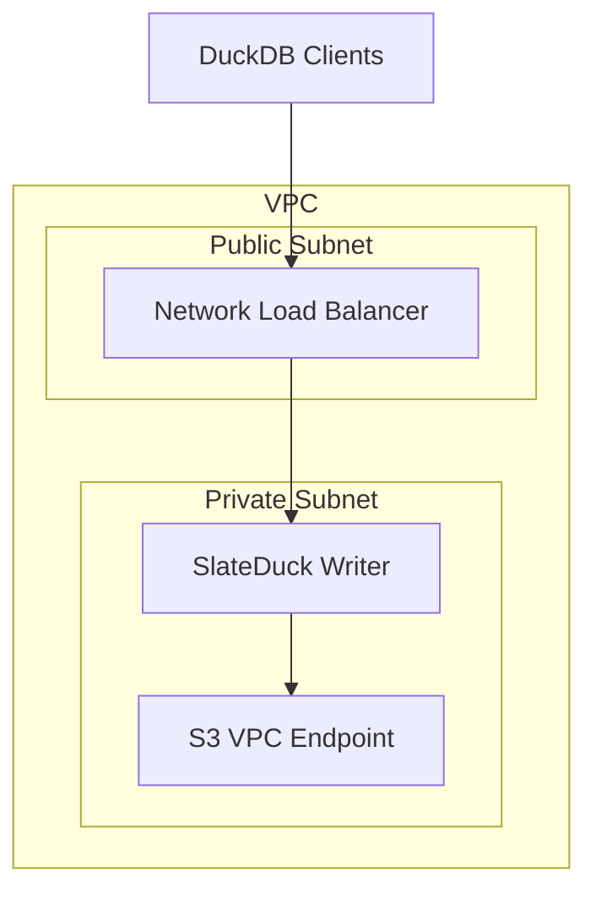

# Networking

## Recommended Architecture

## Security Groups

| Direction | Port | Source | Purpose |
|-----------|------|--------|---------|
| Inbound | 5432 | NLB / VPC CIDR | PG connections |
| Inbound | 9090 | Monitoring SG | Metrics scrape |
| Outbound | 443 | S3 VPC Endpoint | Object-store access |

Use VPC endpoints for S3 access. No public IP on the SlateDuck instance.
