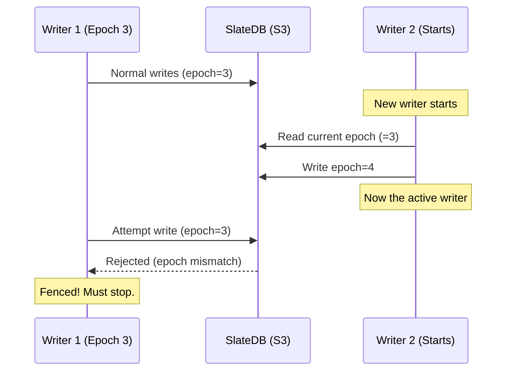

# Single-Writer Model

At any given time, exactly one Rocklake process is authorized to write to a catalog. Multiple readers are supported concurrently without coordination. Writer identity is enforced through an epoch counter stored in the catalog itself. This page documents the decision to use this single-writer concurrency model, examines the alternatives that were evaluated, and provides an honest accounting of the trade-offs involved.

The single-writer model is perhaps Rocklake's most opinionated architectural choice. It is the decision that most frequently surprises people who expect a modern system to support concurrent writes. Understanding why single-writer is correct for this use case — and when it would be wrong — is essential for evaluating whether Rocklake fits your needs.

## The Decision

**Exactly one writer at a time.** No concurrent mutations. No optimistic concurrency control. No conflict resolution. No merge logic. One process writes. If that process dies, a new process claims the writer role by incrementing an epoch counter (fencing the old writer), and normal operation resumes.

**Unlimited concurrent readers.** Any number of processes can read the catalog simultaneously without coordination, locks, or communication with the writer. Readers access immutable data (existing key-value pairs in SlateDB's SST files) and are not affected by ongoing writes.

## Alternatives Considered

### Multi-Writer with Pessimistic Locking

Multiple writers coordinate via distributed locks. Before writing, a process acquires a lock (via DynamoDB, ZooKeeper, etcd, or a custom lock table). After writing, it releases the lock.

**Why rejected:**

- Introduces a dependency on an external coordination service. Rocklake's promise is "object storage only" — no additional infrastructure. Adding a lock table or coordination service defeats this promise.
- Lock management introduces failure modes: lock expiration during long operations, split-brain if the lock service is partitioned, deadlocks if multiple locks are held across operations.
- Adds latency: every write operation must acquire a lock (network round-trip to the lock service) before proceeding.
- Operational burden: the lock service must be monitored, backed up, and maintained.

### Multi-Writer with Optimistic Concurrency Control (OCC)

Multiple writers attempt to commit simultaneously. At commit time, each writer checks whether any of the keys it modified were also modified by another writer since its read. If there is a conflict, the transaction is aborted and retried.

**Why rejected:**

- SlateDB does not natively support conditional writes at the application level (compare-and-swap on arbitrary keys). Implementing OCC on top of SlateDB would require either external coordination (defeating the "object storage only" promise) or complex conflict detection logic built into the catalog layer.
- OCC's conflict detection requires tracking read sets and write sets per transaction. For catalog operations that scan hundreds of keys (listing all columns in a table), the read set is large — increasing the probability of false conflicts.
- Retry logic adds complexity and unpredictable latency. Under contention, multiple writers may retry repeatedly, degrading throughput below what a single writer achieves.
- Correct OCC implementation is notoriously difficult. Serialization anomalies, write skew, and phantom reads are subtle bugs that are hard to test for and hard to detect in production.

### Raft/Paxos Consensus

Multiple replicas agree on the order of mutations through a consensus protocol. All writes go through the leader; followers replicate.

**Why rejected:**

- Requires 3+ running instances for correctness (a minority tolerance of one failure requires three nodes). This is massively over-engineered for a metadata catalog that processes a few writes per minute.
- Introduces consensus latency (2 round-trips per write in Raft, more in multi-region deployments).
- Operational complexity: cluster membership management, leader election monitoring, split-brain detection, follower lag monitoring.
- The entire point of Rocklake is to avoid running a database cluster. Using consensus would make Rocklake itself a distributed database — exactly what we are trying to avoid.

### Object Storage Conditional Writes

Use S3's conditional PUT (If-None-Match / If-Match) or DynamoDB-backed lease to elect a writer without a separate coordination service.

**Why partially considered:**

This is the closest alternative to what Rocklake actually does. SlateDB's manifest file is updated atomically — only one writer can successfully update it. SlateDB itself enforces single-writer semantics at the storage level.

Rocklake's epoch-based fencing builds on top of SlateDB's single-writer model to provide explicit writer identity and graceful failover (rather than relying on storage-level conflicts that produce opaque errors).

### CRDT-Based Eventual Consistency

Use conflict-free replicated data types (CRDTs) to allow concurrent writes that automatically merge without conflicts.

**Why rejected:**

- CRDTs work for specific data structures (counters, sets, registers) but not for arbitrary catalog operations. A "CREATE TABLE" followed by a conflicting "CREATE TABLE" with the same name requires human-level resolution — there is no automatic merge that produces a correct catalog state.
- Eventual consistency means readers might see different catalog states at the same time. DuckDB expects a consistent view — seeing a table in one query and not in the next would break query planning.
- The catalog's integrity constraints (unique names, referential integrity, monotonic counters) are fundamentally incompatible with concurrent unsynchronized writes.

## Why Single-Writer Works

### DuckLake Writes Are Infrequent

A typical analytics workload writes to the catalog a few times per minute:

| Operation | Frequency | Duration |
|-----------|-----------|----------|
| ETL registers new files | Every 5–60 minutes | 10–100ms |
| CREATE TABLE | A few per day | 5–20ms |
| ALTER TABLE | A few per week | 5–20ms |
| DROP TABLE | Rare | 5–20ms |

A single writer handling 10–100 writes per second (Rocklake's practical throughput on S3 Standard) is far more than sufficient for these access patterns. The writer is idle most of the time.

### Catalog Writes Are Small

A typical transaction registers 1–100 data files and creates one snapshot. The write batch is under 100 KB. There is no need for write parallelism to achieve throughput — a single sequential writer easily saturates the catalog's write needs.

Compare to a database serving an e-commerce website (thousands of orders per second) or a social media feed (millions of events per second). Those workloads genuinely need write parallelism. A metadata catalog does not.

### Correctness Is Trivial

With one writer, the snapshot sequence is linear and deterministic:

```
Snapshot 1 → Snapshot 2 → Snapshot 3 → ... → Snapshot N
```

There are no conflicts, no retries, no disambiguation of concurrent mutations, no anomaly classes to reason about. The catalog's history is a simple linear sequence. Testing is straightforward: verify each operation produces the expected output given the previous state.

With multiple writers, you must reason about:

- What happens when two writers create a table with the same name simultaneously?
- What happens when one writer drops a table while another adds a column to it?
- What happens when two writers register files for the same table concurrently?
- What snapshot IDs are assigned to concurrent transactions?

These questions have answers, but the answers are complex and the implementations are bug-prone.

### Operational Simplicity

There is no cluster to manage, no split-brain to resolve, no quorum to maintain, no leader election to monitor. The operational model is:

1. Start one Rocklake process
2. If it crashes, start a new one (it automatically fences the old one)
3. Done

This simplicity is not just a convenience — it is a product design goal. Rocklake exists so that teams can have DuckLake catalogs without the operational burden of running a database. Adding multi-writer complexity would undermine this goal.

## The Costs

### Write Availability Depends on One Process

If the writer process crashes, writes are unavailable until a replacement starts and claims the epoch. The recovery time is typically:

| Deployment | Recovery Time | Mechanism |
|-----------|--------------|-----------|
| Kubernetes | 5–30 seconds | Liveness probe → pod restart |
| systemd | 1–5 seconds | `Restart=always` in service unit |
| Lambda | N/A | Each invocation is a fresh writer |
| Manual | Minutes | Operator notices and restarts |

During recovery, reads continue working normally (readers are independent of the writer). Only write operations are affected.

**Is this acceptable?** For a metadata catalog that processes a few writes per minute, a 5–30 second write outage is almost always invisible to users. The ETL job that was about to register files will retry after a brief delay. No data is lost (the last committed snapshot is durable in object storage).

### No Write Parallelism

Large bulk operations (registering 10,000 files) must go through the single writer sequentially. Each transaction commits as one atomic batch, but if you have multiple independent batch operations, they execute one after another.

**Quantifying the impact:**

| Operation | Files per Batch | Batch Time | Sequential Time for 10 Batches |
|-----------|----------------|-----------|-------------------------------|
| File registration | 100 | 50–200ms | 0.5–2 seconds |
| File registration | 1,000 | 200–500ms | 2–5 seconds |
| Large import | 10,000 | 1–5 seconds | 10–50 seconds |

For most workloads, this is acceptable. If you need to register 100,000 files and cannot wait 50 seconds, consider partitioning into multiple catalogs (one per dataset) with independent writers.

### Writer Failover Is Not Automatic

Rocklake does not include built-in leader election or health checking. It relies on external mechanisms (Kubernetes liveness probes, systemd restart, monitoring alerts) to detect writer failure and start a replacement.

**Why we don't build it in:**

- Health checking is deployment-specific (what constitutes "unhealthy" varies by environment)
- Kubernetes/systemd already provide excellent restart mechanisms
- Building our own adds complexity and failure modes (the health checker itself can fail)
- "Bring your own restart mechanism" is a feature, not a limitation — it gives operators full control

## Epoch-Based Writer Fencing

The single-writer guarantee is enforced through an epoch counter:



The fencing is cooperative — the old writer detects it is fenced on its next write attempt and terminates gracefully. If the old writer has already crashed (the common case), the fencing is purely logical — the new writer increments the epoch and proceeds.

## Multi-Writer via Partitioning

For workloads that genuinely need concurrent writers, Rocklake provides a partitioning strategy: one independent catalog per dataset, each with its own single writer.

```
Dataset A ──→ Rocklake Instance 1 ──→ s3://bucket/catalog-a/
Dataset B ──→ Rocklake Instance 2 ──→ s3://bucket/catalog-b/
Dataset C ──→ Rocklake Instance 3 ──→ s3://bucket/catalog-c/
```

Each catalog is fully independent — its own snapshot sequence, its own epoch, its own writer. This gives you write parallelism across datasets without any of the complexity of multi-writer within a single catalog.

The trade-off is that cross-catalog queries require attaching multiple catalogs in DuckDB and joining across them manually. There is no distributed transaction across catalogs.

## Comparison to Other Systems

| System | Write Model | Complexity | Target Workload |
|--------|-------------|-----------|-----------------|
| Rocklake | Single writer, epoch fencing | Low | Metadata catalog (few writes/min) |
| PostgreSQL | Single writer (primary) + replicas | Medium | General OLTP |
| CockroachDB | Multi-writer, consensus | High | Distributed OLTP |
| DynamoDB | Multi-writer, per-item OCC | Medium | Key-value at scale |
| Apache Iceberg | Optimistic, file-level conflicts | Medium | Lakehouse metadata |
| Delta Lake | Optimistic, log-based | Medium | Lakehouse metadata |

Note that Apache Iceberg and Delta Lake use optimistic concurrency for their metadata — but their metadata is a single JSON/Avro file (the manifest), not a full catalog database. The conflict surface is much smaller (two writers both updating the same manifest file). Rocklake's catalog has thousands of keys, making conflict detection far more complex.

## Further Reading

- **[Concepts: Single Writer, Many Readers](../concepts/single-writer-many-readers.md)** — Detailed explanation of the concurrency model
- **[Concepts: Writer Fencing](../concepts/writer-fencing.md)** — How epoch-based fencing works
- **[Architecture: Transaction Model](../architecture/transaction-model.md)** — How transactions commit atomically
- **[Deployment: High Availability](../deployment/high-availability.md)** — Achieving HA with single-writer
