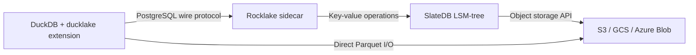

# What is Rocklake?

If you work with data at any scale, you have almost certainly encountered a familiar frustration: your analytical data lives in object storage as Parquet files — cheap, durable, infinitely scalable — but the moment you want to query that data sensibly, you need something else. You need to know which files belong to which tables. You need to know what columns each table has and what types those columns are. You need to know how the schema has changed over time, which files were added in which transaction, and what the data looked like at any particular point in the past. You need, in other words, a catalog.

Every lakehouse solution provides a catalog. Apache Iceberg stores it as JSON manifests and Avro data files scattered through your data lake. Delta Lake stores it as a JSON transaction log alongside your Parquet files. Apache Hive delegates it to a centralized Metastore service backed by a relational database. AWS Glue provides it as a managed service with its own API. Each approach works, but each comes with a cost: either you are managing a complex file-format protocol (Iceberg, Delta) with all the operational challenges of distributed metadata, or you are running a database server (Hive Metastore, Glue, or the PostgreSQL/MySQL backend that powers them) with all the operational challenges of keeping a stateful service healthy.

DuckLake, created by the DuckDB team, takes a refreshingly simple approach. It defines a catalog as a set of 28 SQL tables — schemas, tables, columns, data files, statistics, snapshots — versioned with monotonically increasing snapshot IDs, queryable over the PostgreSQL wire protocol. The catalog is just a database. Not a forest of JSON manifests, not a proprietary API, not a distributed consensus system — just a database with a well-defined schema that any PostgreSQL-compatible client can query. This simplicity is DuckLake's greatest strength. But it also means that running a DuckLake catalog in production requires running a database server. If you choose PostgreSQL, you get a battle-tested, production-grade catalog backend — but you also get all the operational overhead that comes with it: provisioning, patching, connection pooling, WAL management, backup rotation, vacuum scheduling, failover configuration.

Rocklake asks a provocative question: if the catalog is just a database, can that database itself live in the bucket? Can we eliminate the database server entirely, storing every catalog row as a key-value entry in object storage, while still providing the transactional guarantees and wire-protocol compatibility that DuckDB expects?

The answer is yes.

## How Rocklake Works

Rocklake is a sidecar process — a lightweight server that you run alongside your DuckDB instances. It speaks the PostgreSQL wire protocol on one side (so DuckDB connects to it as if it were PostgreSQL) and speaks key-value operations on the other side (translating catalog SQL into reads and writes against SlateDB, an embedded LSM-tree storage engine that persists all state to object storage).

The separation of responsibilities is clean and deliberate. Rocklake handles metadata — it knows where your data lives, what schema it has, how the schema has evolved, which snapshot each change belongs to. DuckDB handles data — it reads Parquet files directly from the object store when executing queries, and writes Parquet files directly to the object store when loading data. Rocklake never sees your actual analytical data, and DuckDB never needs to understand how the catalog is stored. They communicate only through the narrow interface of DuckLake's catalog protocol: a bounded set of SQL statements that describe catalog operations.

When DuckDB needs to plan a query — say, `SELECT * FROM events WHERE date > '2024-01-01'` — it first asks the catalog which Parquet files contain the `events` table, what columns they have, and what the min/max statistics are for predicate pushdown. These questions arrive at Rocklake as PostgreSQL wire messages containing specific SQL queries against the DuckLake catalog tables. Rocklake translates those queries into SlateDB key-value lookups, applies MVCC visibility filtering to ensure DuckDB sees a consistent snapshot, and returns the results as PostgreSQL wire responses. DuckDB then uses that information to read the appropriate Parquet files directly from S3, GCS, or Azure — without any further involvement from Rocklake.

When DuckDB needs to mutate the catalog — creating a table, adding a column, registering a new Parquet file after a `COPY` operation — those mutations arrive as SQL `INSERT` and `UPDATE` statements against the catalog tables. Rocklake accumulates all mutations within a transaction, then commits them atomically as a single SlateDB write batch. If the process crashes between starting and committing the transaction, no partial state exists. If it crashes after committing, the data is durable in object storage and visible to subsequent readers.

## What Makes Rocklake Different

Several properties distinguish Rocklake from other catalog backends, and they all derive from a single architectural decision: storing catalog data as immutable key-value entries in object storage rather than as mutable rows in a traditional database.

**Your catalog is as durable as your bucket.** S3 provides 99.999999999% (eleven nines) durability. When Rocklake writes a catalog entry, that entry is stored as an SST file in your bucket with the same durability guarantees as your Parquet data files. There is no separate backup to configure, no WAL archive to manage, no point-in-time recovery to set up. The bucket is the backup.

**Infinite time travel is the default, not a premium feature.** Every catalog mutation creates a new snapshot with a monotonically increasing ID. Old snapshots are never deleted by normal operation. You can query the state of your catalog at any historical point — what tables existed last Tuesday, what schema a table had before yesterday's migration, which files were registered during a specific batch load — simply by specifying a snapshot ID. This is not implemented as a separate time-travel subsystem; it is the natural consequence of never deleting committed data.

**Horizontal read scale-out requires zero coordination.** Because the underlying storage files are immutable once written, any number of reader processes can open the same catalog concurrently. They do not need to communicate with the writer, they do not need to communicate with each other, and they do not need any form of leader election or distributed lock. Adding more readers is as simple as starting more processes pointed at the same bucket path. Each reader independently opens the current SlateDB manifest and serves queries from the immutable SST files it references.

**The operational surface area is minimal.** There is no vacuum process eating CPU in the background. There is no replication topology to monitor. There is no connection pool to tune. There is no pg_hba.conf to maintain. The sidecar is a single binary that starts, opens a bucket path, and begins serving. When you scale down, you stop the process. The catalog remains in the bucket, intact and queryable by the next process that opens it.

## The Trade-offs

Rocklake is not the right choice for every workload, and this documentation does not pretend otherwise. The most important trade-off is latency: every catalog operation involves at least one round trip to the object store, which on S3 Standard means roughly 20–50 milliseconds per operation. A PostgreSQL-backed catalog on the same network serves the same operations in 1–5 milliseconds. For DuckLake's typical usage pattern — a handful of catalog lookups per query, followed by seconds or minutes of analytical query execution — this latency is negligible. But for workloads that issue many short catalog queries in rapid succession, the latency gap is real and measurable.

The single-writer constraint is another trade-off worth understanding upfront. SlateDB enforces that exactly one writer process may write to a given catalog at a time. Multiple writers are prevented by a fencing mechanism: if a second writer attempts to open the same catalog, the first writer is fenced off and must stop. This simplifies the consistency model enormously (no distributed consensus, no conflict resolution, no merge logic), but it means that all catalog mutations for a given catalog must flow through a single process. For workloads that need concurrent writes from multiple independent processes, the workaround is partitioning: one catalog per dataset, each with its own writer.

These trade-offs are explored in depth in the [Design Decisions](../design-decisions/index.md) section, where each architectural choice is presented alongside the alternatives that were considered and the reasoning behind the choice that was made.

## Deployment Strategies

Rocklake offers three integration paths, each optimized for different deployment scenarios:

**Strategy B — PG-Wire Sidecar.** A standalone process that listens for PostgreSQL wire connections. DuckDB connects to it like any PostgreSQL server using the standard `ducklake` extension ATTACH syntax. This is the simplest, most flexible, and most production-ready deployment model. It supports any DuckDB client (local CLI, application-embedded, serverless function) and any object-store backend (S3, GCS, Azure, MinIO, local filesystem). It is the recommended deployment for all production use cases.

**Strategy C — Native DuckDB Extension.** A shared library (`.duckdb_extension`) loaded directly into DuckDB's process space. Eliminates all network round-trips between DuckDB and the catalog — every catalog operation is a local function call. This provides the lowest possible latency for catalog operations but couples the catalog lifecycle to DuckDB's process. It is available from v0.5 onward and is ideal for single-process analytical workloads where minimizing catalog overhead is critical.

**DataFusion Integration.** For Rust applications built on Apache DataFusion, Rocklake provides a `CatalogProvider` implementation that exposes DuckLake tables as DataFusion table sources. This enables the same catalog to be accessed from both DuckDB (via the PG-wire sidecar) and DataFusion (via the Rust API) without any translation layer.

## What Rocklake Is Not

Clear boundaries help you decide whether Rocklake is right for your use case:

Rocklake is **not a query engine**. It does not execute analytical queries, scan Parquet files, perform joins, or compute aggregates. It is strictly a metadata catalog that tells DuckDB where to find data and what schema it has. DuckDB is the query engine.

Rocklake is **not a general-purpose SQL database**. Its SQL support is intentionally bounded to the exact statement shapes that DuckLake clients emit. You cannot run arbitrary SQL against it — `JOIN` queries, `GROUP BY`, subqueries, window functions — none of these are supported because none of them are needed for catalog operations. Attempting to run unsupported SQL returns a clear error: `SQLSTATE 0A000` (feature not supported).

Rocklake is **not a distributed system with multi-writer consensus**. It uses a single-writer model. If you need multiple independent writers for the same logical dataset, you partition into multiple catalogs. The simplicity of single-writer semantics is what enables the strong consistency guarantees and the crash-safety properties that make the system reliable.

Rocklake is **not a replacement for PostgreSQL in all cases**. If you already run PostgreSQL, have sub-millisecond latency requirements for catalog operations, and do not need infinite time travel or horizontal read scale-out, then a PostgreSQL-backed DuckLake catalog is likely simpler for your use case. Rocklake eliminates infrastructure at the cost of higher per-operation latency. That trade-off is worthwhile when infrastructure elimination matters more than raw catalog latency.

## Where to Go Next

Now that you understand what Rocklake is and what it does, the fastest path to hands-on experience is the [Quickstart (Local)](quickstart.md) guide. It takes under five minutes and requires no cloud credentials — just a local filesystem and a terminal. If you prefer to understand the underlying principles first, the [Concepts](../concepts/index.md) section explains the lakehouse model, the DuckLake format, the SlateDB storage engine, and the immutability principle that makes everything else possible.
