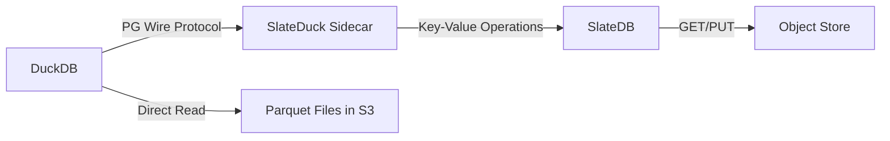

# What is SlateDuck?

SlateDuck is a **DuckLake catalog store** — it implements the metadata catalog that DuckDB's `ducklake` extension expects, backed by [SlateDB](https://slatedb.io) on object storage instead of PostgreSQL or SQLite.

## The Problem

DuckLake is an open lakehouse format that stores data as Parquet files and tracks metadata in a catalog. The catalog answers questions like: what tables exist? which Parquet files belong to which table? what are the column statistics for predicate pushdown?

DuckLake supports two catalog backends:

1. **PostgreSQL** — requires a managed database server
2. **SQLite** — requires a local filesystem with POSIX locking

Both have limitations for cloud-native, serverless architectures where you want zero infrastructure beyond a bucket.

## The Solution

SlateDuck provides a third option: a catalog that lives entirely in object storage. Your lakehouse metadata sits alongside your Parquet files in the same bucket. No database server, no local filesystem, no infrastructure to manage.

## How It Works

1. DuckDB connects to SlateDuck via the PostgreSQL wire protocol
2. SlateDuck translates DuckLake SQL into key-value operations
3. SlateDB persists all catalog state to object storage
4. DuckDB reads Parquet data files directly from the same bucket

## Key Properties

- **Zero infrastructure:** Only a bucket and a binary
- **Infinite time travel:** Every catalog snapshot is preserved forever by default
- **Horizontal read scale-out:** Unlimited stateless readers, no replication protocol
- **DuckLake compatible:** Drop-in replacement for PostgreSQL-backed DuckLake
- **Crash safe:** Atomic transactions via SlateDB's WAL
