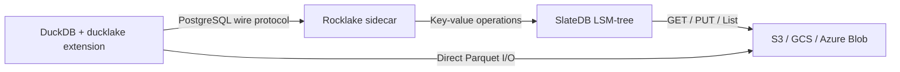

---
hide:
  - navigation
  - toc
---

# Rocklake

## Your entire lakehouse catalog lives in the same S3 bucket as your data

No PostgreSQL server to manage. No SQLite file locks to coordinate.
No infrastructure beyond the bucket you already have.

[Get Started in 5 Minutes](getting-started/quickstart.md){ .md-button .md-button--primary }
[Explore the Architecture](architecture/index.md){ .md-button }

---

## What is Rocklake?

Rocklake is a **DuckLake catalog server** that stores your entire lakehouse metadata — every schema definition, every table registration, every file path, every column statistic — directly in object storage through [SlateDB](https://slatedb.io), an embedded LSM-tree key-value store built for the cloud. You point DuckDB at Rocklake exactly the way you would point it at a PostgreSQL-backed DuckLake catalog, and everything just works. The difference is what you no longer need: no database server to provision, no connection pools to tune, no WAL archives to manage, no failover replicas to monitor. Your catalog becomes as durable and as available as your S3 bucket itself.

Rocklake implements the full DuckLake catalog protocol — all 28 catalog tables, snapshot-based MVCC, atomic schema mutations — and exposes it over the PostgreSQL wire protocol. DuckDB connects, issues its catalog queries, and receives the responses it expects. Behind the scenes, Rocklake translates those SQL statements into key-value reads and writes against SlateDB, which persists everything as immutable sorted-string-table files in your object store. The result is a catalog that inherits the durability, availability, and virtually unlimited capacity of cloud object storage without any of the operational overhead of running a database.

---

## Why Rocklake?

Every lakehouse needs a catalog — something that knows which Parquet files belong to which tables, what schema each table has, how the schema has evolved, and what the data looked like at any point in time. The question is where that catalog lives and what it costs you to keep it running.

| Dimension | PostgreSQL-backed DuckLake | SQLite-backed DuckLake | Rocklake |
|-----------|--------------------------|----------------------|----------|
| Infrastructure required | PostgreSQL server (provisioning, patching, backups) | Local filesystem with POSIX locks | Object storage bucket only |
| Catalog durability | WAL + fsync on attached disk | Single file on local disk | SlateDB LSM on S3/GCS/Azure (11 nines) |
| Catalog size limit | Disk capacity of the DB host | Practical limits of a single file | Unlimited (object storage scales infinitely) |
| Read scale-out | Read replicas with replication lag | None (single-process access) | Unlimited concurrent readers, zero coordination |
| Write model | Multi-writer with locking | Single-writer with file locks | Single writer per catalog (fenced for correctness) |
| Time travel | Requires manual snapshots or WAL retention | Not available | Infinite by default (every snapshot preserved) |
| Catalog operation latency | 1–5 ms (local disk) | Sub-millisecond (local file) | 20–50 ms (object-store round trip) |
| Operational overhead | Vacuuming, upgrades, monitoring, backup rotation | File corruption risk, no remote access | None — the bucket is the infrastructure |

Rocklake wins on simplicity, durability, and horizontal read scale. It is intentionally slower per individual operation (object-store round trips cost 20–50 ms vs. 1–5 ms for local PostgreSQL), but for DuckLake's typical usage pattern — one catalog lookup per analytical query, then DuckDB reads Parquet files directly — that latency is negligible compared to the query execution time. If your workload involves hundreds of short catalog lookups per second, PostgreSQL is likely a better fit. If your workload is analytical queries against large tables with infrequent schema changes, Rocklake eliminates an entire category of infrastructure without meaningful performance compromise.

---

## The Architecture at a Glance

The separation of concerns is clean and deliberate. Rocklake handles **metadata** — it knows where your data lives and what schema it has. DuckDB handles **data** — it reads and writes Parquet files directly from the object store. Rocklake never sees your actual data, and DuckDB never needs to understand how the catalog is stored. This means a compromised catalog cannot corrupt your data files, and a compromised data-plane credential cannot corrupt your catalog.

---

## Key Properties

**Truly serverless.** Rocklake is a single static binary. You point it at a bucket path, and it opens (or creates) a catalog there. There is no schema migration step, no initialization script, no connection string to a backing database. When you are done, you stop the process. The catalog remains in the bucket, ready for the next writer to open it.

**Infinite time travel.** Every mutation to the catalog creates a new immutable snapshot. Old snapshots are never deleted unless you explicitly choose to run garbage collection followed by excision. You can query the catalog as it existed at any point in its history — last week, last month, last year — with a single SQL clause. This is not a premium feature bolted on after the fact; it is the natural consequence of the storage model.

**Horizontal read scale-out with zero coordination.** Because catalog data is stored as immutable files in object storage, any number of reader processes can open the catalog concurrently without communicating with each other or with the writer. There is no replication lag because there is no replication — every reader sees the same durable state directly from the object store. Adding ten more readers requires no configuration change, no leader election, and no additional infrastructure.

**Crash safety by construction.** SlateDB guarantees that a write either completes atomically or does not happen. There is no possibility of a partial update leaving the catalog in an inconsistent state. If the process crashes mid-transaction, the next startup sees a clean, consistent catalog with all previously committed transactions intact.

**Drop-in DuckLake compatibility.** Rocklake supports exactly the SQL statement shapes that DuckDB's `ducklake` extension emits. Switching from a PostgreSQL-backed catalog to Rocklake requires changing a connection string. No client code changes, no migration scripts, no schema adjustments.

---

## Get Started

-   :material-rocket-launch:{ .lg .middle } **Getting Started**

    ---

    Install Rocklake, connect DuckDB, create your first lakehouse table, and run time-travel queries — all in under five minutes.

    [:octicons-arrow-right-24: Quickstart Guide](getting-started/quickstart.md)

-   :material-lightbulb:{ .lg .middle } **Core Concepts**

    ---

    Understand the principles that make Rocklake work: the lakehouse model, DuckLake's catalog schema, SlateDB's storage guarantees, and why immutability enables everything else.

    [:octicons-arrow-right-24: Concepts](concepts/index.md)

-   :material-crane:{ .lg .middle } **Architecture Deep-Dive**

    ---

    Follow the data from DuckDB's SQL statement through the wire protocol, the bounded dispatcher, the key-value layer, and into the object store. See how every byte is encoded.

    [:octicons-arrow-right-24: Architecture](architecture/index.md)

-   :material-server:{ .lg .middle } **Deploy to Production**

    ---

    Step-by-step guides for AWS S3, Google Cloud Storage, Azure Blob, Docker, Kubernetes, and serverless functions. Each guide is self-contained and tested.

    [:octicons-arrow-right-24: Deployment](deployment/index.md)

-   :material-tools:{ .lg .middle } **Day-2 Operations**

    ---

    Monitor health, manage retention, run garbage collection, handle upgrades, and troubleshoot problems. Everything you need after the initial deployment.

    [:octicons-arrow-right-24: Operations](operations/index.md)

-   :material-scale-balance:{ .lg .middle } **Design Decisions**

    ---

    Honest trade-off analysis for every major architectural choice. Why SlateDB over PostgreSQL? Why a bounded SQL dispatcher? Why single-writer? Read the reasoning.

    [:octicons-arrow-right-24: Design Decisions](design-decisions/index.md)

