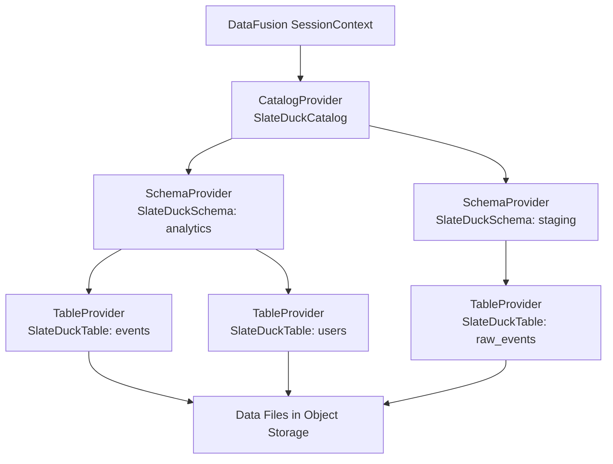

# DataFusion Integration

SlateDuck provides a native integration with Apache DataFusion through the `slateduck-datafusion` crate. This allows Rust applications using DataFusion as their query engine to access DuckLake catalogs directly — without DuckDB, without the PG-wire protocol, and without any network overhead. The catalog is accessed in-process through DataFusion's trait system, making it a natural fit for building custom analytics applications, data platforms, and streaming systems in Rust.

DataFusion is a fast, extensible query engine written in Rust. It is used as the foundation for numerous data systems including Apache Arrow DataFusion itself, InfluxDB IOx, Ballista, and many custom analytics platforms. By implementing DataFusion's catalog traits, SlateDuck becomes a first-class citizen in this ecosystem.

## Architecture

The integration implements three core DataFusion traits that form the catalog hierarchy:



### Trait Implementations

| DataFusion Trait | SlateDuck Implementation | Responsibility |
|-----------------|-------------------------|----------------|
| `CatalogProvider` | `SlateDuckCatalog` | Lists schemas, provides schema access |
| `SchemaProvider` | `SlateDuckSchema` | Lists tables within a schema, provides table access |
| `TableProvider` | `SlateDuckTable` | Provides schema (columns), statistics, creates scan plans |

When DataFusion plans a query against a SlateDuck-backed table, it calls the `TableProvider` to get the Arrow schema, table statistics, and the list of Parquet data files. Then DataFusion's built-in Parquet reader handles the actual data reading — SlateDuck is only responsible for telling DataFusion where to look.

## Usage

### Basic Example

```rust
use slateduck_datafusion::SlateDuckCatalog;
use datafusion::prelude::*;
use std::sync::Arc;

#[tokio::main]
async fn main() -> Result<(), Box<dyn std::error::Error>> {
    // Create a DataFusion session
    let ctx = SessionContext::new();

    // Open a SlateDuck catalog from object storage
    let catalog = SlateDuckCatalog::open("s3://my-bucket/lakehouse/catalog/").await?;

    // Register it with DataFusion under the name "lake"
    ctx.register_catalog("lake", Arc::new(catalog));

    // Query tables through standard SQL
    let df = ctx.sql("SELECT event_type, count(*) as cnt 
                      FROM lake.analytics.events 
                      WHERE timestamp > '2024-03-01' 
                      GROUP BY event_type 
                      ORDER BY cnt DESC")
        .await?;
    
    df.show().await?;
    Ok(())
}
```

### With Custom Object Storage Configuration

```rust
use slateduck_datafusion::{SlateDuckCatalog, CatalogConfig};
use object_store::aws::AmazonS3Builder;

#[tokio::main]
async fn main() -> Result<(), Box<dyn std::error::Error>> {
    // Configure object storage explicitly
    let config = CatalogConfig::builder()
        .storage_url("s3://my-bucket/catalog/")
        .aws_region("us-east-1")
        .aws_endpoint("https://s3.us-east-1.amazonaws.com")
        .build();

    let catalog = SlateDuckCatalog::open_with_config(config).await?;
    
    let ctx = SessionContext::new();
    ctx.register_catalog("lake", Arc::new(catalog));
    
    // Register the same S3 object store for DataFusion to read Parquet files
    let s3 = AmazonS3Builder::from_env()
        .with_bucket_name("my-bucket")
        .build()?;
    ctx.register_object_store("s3://my-bucket", Arc::new(s3));
    
    let df = ctx.sql("SELECT * FROM lake.analytics.events LIMIT 10").await?;
    df.show().await?;
    Ok(())
}
```

### Reading at a Specific Snapshot

```rust
use slateduck_datafusion::SlateDuckCatalog;

// Open catalog at a specific point in time
let catalog = SlateDuckCatalog::open_at_snapshot("s3://bucket/catalog/", 1000).await?;
ctx.register_catalog("lake_snapshot", Arc::new(catalog));

// All queries through this catalog see the state at snapshot 1000
let df = ctx.sql("SELECT count(*) FROM lake_snapshot.analytics.events").await?;
```

### Multiple Catalogs

```rust
// Register multiple catalogs for cross-catalog queries
let prod = SlateDuckCatalog::open("s3://prod-bucket/catalog/").await?;
let staging = SlateDuckCatalog::open("s3://staging-bucket/catalog/").await?;

ctx.register_catalog("prod", Arc::new(prod));
ctx.register_catalog("staging", Arc::new(staging));

// Compare data across environments
let df = ctx.sql("
    SELECT 'prod' as env, count(*) as rows FROM prod.analytics.events
    UNION ALL
    SELECT 'staging' as env, count(*) as rows FROM staging.analytics.events
").await?;
```

### Creating a Provider from an Existing `CatalogStore` (v0.27.2)

When your application already holds a `CatalogStore` (for example, in an
embedded server that uses both the PG-Wire interface and DataFusion), use
`SlateDuckCatalogProvider::from_catalog_store()` to avoid opening a second
connection to the same catalog:

```rust
use slateduck_catalog::store::CatalogStore;
use slateduck_datafusion::SlateDuckCatalogProvider;
use datafusion::prelude::*;
use std::sync::Arc;

// Assume `store` is an Arc<Mutex<CatalogStore>> already open.
let provider = SlateDuckCatalogProvider::from_catalog_store(store.clone()).await?;

let ctx = SessionContext::new();
ctx.register_catalog("lake", Arc::new(provider));
```

**Key difference from `SlateDuckCatalog::open()`**: `from_catalog_store()`
reads the `data_path` key from the catalog metadata automatically, so you do
not need to supply `data_root` explicitly. The bridge uses a single persistent
background thread (started at construction time) to run async catalog calls from
DataFusion's synchronous `TableProvider` trait, avoiding per-query thread spawns.

## What This Enables

### Rust-Native Analytics Applications

Build analytics backends in Rust that access DuckLake catalogs without depending on DuckDB or Python:

```rust
// Example: REST API that queries a DuckLake catalog
async fn query_handler(req: QueryRequest) -> Result<QueryResponse, Error> {
    let ctx = get_session_context(); // Pre-configured with SlateDuck catalog
    let df = ctx.sql(&req.sql).await?;
    let batches = df.collect().await?;
    Ok(QueryResponse::from_arrow(batches))
}
```

### Custom Query Engines

If you are building a specialized query engine on top of DataFusion (streaming analytics, time-series processing, ML feature stores), SlateDuck provides the table metadata layer:

```rust
// Streaming analytics that reads catalog metadata from SlateDuck
// and processes new Parquet files as they arrive
async fn process_new_files(catalog: &SlateDuckCatalog) {
    let table = catalog.get_table("analytics", "events").await?;
    let new_files = table.files_since_snapshot(last_processed_snapshot).await?;
    for file in new_files {
        process_parquet_file(&file.path).await?;
    }
}
```

### Testing and Validation

Use DataFusion to validate catalog consistency by querying the same catalog from both DuckDB and DataFusion and comparing results:

```rust
// Integration test: verify SlateDuck returns same results through both paths
#[tokio::test]
async fn test_catalog_consistency() {
    let catalog = SlateDuckCatalog::open("./test-catalog/").await.unwrap();
    let ctx = SessionContext::new();
    ctx.register_catalog("lake", Arc::new(catalog));
    
    let df = ctx.sql("SELECT count(*) FROM lake.public.events").await.unwrap();
    let batches = df.collect().await.unwrap();
    let count: i64 = batches[0].column(0).as_primitive::<Int64Type>().value(0);
    
    assert_eq!(count, expected_count_from_duckdb);
}
```

### Embedded Analytics

For applications that need analytics capabilities without external dependencies:

```rust
// Self-contained analytics binary
fn main() {
    let rt = tokio::runtime::Runtime::new().unwrap();
    rt.block_on(async {
        let catalog = SlateDuckCatalog::open("./data/catalog/").await.unwrap();
        let ctx = SessionContext::new();
        ctx.register_catalog("local", Arc::new(catalog));
        
        // Run analytics queries
        let report = ctx.sql("SELECT ...").await.unwrap();
        export_to_csv(report, "output.csv").await;
    });
}
```

## Supported Operations

The DataFusion integration is currently **read-only**:

| Operation | Supported | Notes |
|-----------|-----------|-------|
| List schemas | ✅ | Via `CatalogProvider::schema_names()` |
| List tables | ✅ | Via `SchemaProvider::table_names()` |
| Get table schema (columns) | ✅ | Via `TableProvider::schema()` |
| Get data file locations | ✅ | Via custom scan plan |
| Table statistics (row count, byte size) | ✅ | Via `TableProvider::statistics()` |
| Column statistics (min/max/null_count) | ✅ | Via `TableProvider::statistics()` |
| Partition pruning | ✅ | Using column statistics |
| Projection pushdown | ✅ | Only reads needed columns |
| Filter pushdown | ✅ | Pushes predicates to Parquet reader |
| CREATE TABLE | ❌ | Use PG-wire sidecar or CLI |
| INSERT | ❌ | Use PG-wire sidecar or CLI |
| DROP TABLE | ❌ | Use PG-wire sidecar or CLI |
| ALTER TABLE | ❌ | Use PG-wire sidecar or CLI |
| Time travel (per-query) | ✅ | Open catalog at specific snapshot |

Write operations are not supported through the DataFusion interface. To mutate the catalog, use the PG-wire sidecar (Strategy B), the CLI, or the `slateduck-catalog` crate directly.

## Dependencies

Add to your `Cargo.toml`:

```toml
[dependencies]
slateduck-datafusion = "0.8"
datafusion = "45"
tokio = { version = "1", features = ["full"] }
object-store = "0.12"       # For configuring data file access
```

### Version Compatibility

The `slateduck-datafusion` crate tracks DataFusion's major versions:

| slateduck-datafusion | DataFusion | Rust Edition |
|---------------------|-----------|-------------|
| 0.8.x | 45.x | 2021 |
| 0.7.x | 44.x | 2021 |
| 0.6.x | 43.x | 2021 |

DataFusion's trait interfaces change between major versions (the project is pre-1.0 and evolving rapidly). Each SlateDuck release is pinned to a specific DataFusion major version.

### Transitive Dependencies

`slateduck-datafusion` brings in:

- `slateduck-catalog` — Core catalog implementation
- `slateduck-core` — Key encoding, protobuf, types
- `slatedb` — LSM-tree storage engine
- `object_store` — Object storage abstraction (S3, GCS, Azure, local)
- `prost` — Protobuf encoding/decoding
- `arrow` — Apache Arrow memory format

Total dependency footprint is moderate (~200 crates in the dependency tree).

## Performance

Because the integration is in-process, catalog lookups are dominated by SlateDB read latency (which depends on object storage):

| Operation | Local Storage | S3 Standard | S3 Express |
|-----------|--------------|-------------|------------|
| List schemas | 50μs | 5–20ms | 1–5ms |
| Describe table | 50μs | 5–20ms | 1–5ms |
| List files (10) | 100μs | 10–30ms | 2–10ms |
| Full query plan | 200μs | 20–60ms | 5–15ms |

For development (local storage), the integration is extremely fast. For production (cloud object storage), latency depends on the storage tier.

## Error Handling

The integration propagates errors through DataFusion's error types:

```rust
use datafusion::error::DataFusionError;

match ctx.sql("SELECT * FROM lake.nonexistent.table").await {
    Ok(df) => { /* success */ },
    Err(DataFusionError::Plan(msg)) => {
        // Schema or table not found
        eprintln!("Planning error: {}", msg);
    },
    Err(DataFusionError::External(e)) => {
        // Storage or catalog error
        eprintln!("External error: {}", e);
    },
    Err(e) => {
        eprintln!("Other error: {}", e);
    }
}
```

## Use Cases

### Embedded Analytics Application

The most common use case for the DataFusion integration is building applications that need SQL query capabilities without running a separate database server. The application links against `slateduck-datafusion` and gains the ability to query lakehouse tables directly:

```rust
// Example: REST API that queries the lakehouse
async fn handle_query(query: String) -> Result<Vec<RecordBatch>> {
    let catalog = SlateDuckCatalog::open("s3://bucket/catalog/").await?;
    let ctx = SessionContext::new();
    ctx.register_catalog("lake", Arc::new(catalog));
    
    let df = ctx.sql(&query).await?;
    let batches = df.collect().await?;
    Ok(batches)
}
```

This pattern eliminates the network hop between application and catalog — the query planner reads catalog metadata directly from SlateDB without any intermediate wire protocol overhead.

### Data Pipeline Orchestration

Orchestration frameworks can use DataFusion to inspect and validate catalog state before and after pipeline steps:

```rust
// Validate that a table has expected columns before loading data
let catalog = SlateDuckCatalog::open(&storage_url).await?;
let ctx = SessionContext::new();
ctx.register_catalog("lake", Arc::new(catalog));

let schema = ctx.sql("DESCRIBE lake.analytics.events").await?.collect().await?;
let columns: Vec<String> = schema.iter()
    .flat_map(|b| b.column(0).as_any().downcast_ref::<StringArray>())
    .flat_map(|a| (0..a.len()).map(|i| a.value(i).to_string()))
    .collect();

assert!(columns.contains(&"event_id".to_string()));
assert!(columns.contains(&"created_at".to_string()));
```

### Custom Query Engines

Teams building specialized query engines (streaming processors, ML feature stores, real-time aggregation) can use `slateduck-datafusion` as the metadata layer while implementing their own execution:

```rust
// Use the catalog for metadata but execute differently
let catalog = SlateDuckCatalog::open(&storage_url).await?;
let ctx = SessionContext::new();
ctx.register_catalog("lake", Arc::new(catalog));

// Get the logical plan (not execution)
let plan = ctx.sql("SELECT * FROM lake.analytics.events WHERE date > '2024-01-01'")
    .await?
    .into_optimized_plan()?;

// Extract file list from the plan for custom processing
let files = extract_data_files_from_plan(&plan);
for file in files {
    custom_streaming_processor.ingest(file).await?;
}
```

## Comparison with PG-Wire Integration

| Aspect | DataFusion (in-process) | PG-Wire (networked) |
|--------|------------------------|---------------------|
| Latency | Lowest (no network) | Network round-trip per query |
| Language | Rust only | Any language with PG driver |
| Concurrency | Single process | Multiple clients |
| Write support | Full (direct SlateDB access) | Full (via SlateDuck server) |
| Deployment | Library dependency | Separate server process |
| Memory | Shared address space | Isolated processes |
| Fault isolation | Crash affects host application | Server crash independent |

Choose DataFusion integration when you are building a Rust application and want the lowest possible latency. Choose PG-Wire when you need language flexibility, client isolation, or already have a SlateDuck server running.

## Limitations

- **Rust-only:** The DataFusion integration is available only from Rust code. Other languages must use the PG-wire protocol (via the SlateDuck server) or the C FFI layer.
- **Single-writer:** Like all SlateDuck access paths, the DataFusion integration is subject to the single-writer constraint. Only one process can write to a catalog at a time.
- **No connection pooling:** Since the integration is in-process, there is no concept of connection pooling. Each `SlateDuckCatalog` instance maintains its own SlateDB reader/writer.
- **DataFusion version coupling:** The integration is compiled against a specific DataFusion version. Upgrading DataFusion may require a matching `slateduck-datafusion` release.

## Further Reading

- **[Architecture: Crate Structure](../architecture/crate-structure.md)** — How slateduck-datafusion relates to other crates
- **[DuckDB Integration](duckdb.md)** — Alternative integration via PG-wire
- **[Native Extension](native-extension.md)** — In-process DuckDB integration (also Rust, different interface)
- **[Concepts: SlateDB](../concepts/slatedb.md)** — Understanding the storage layer
