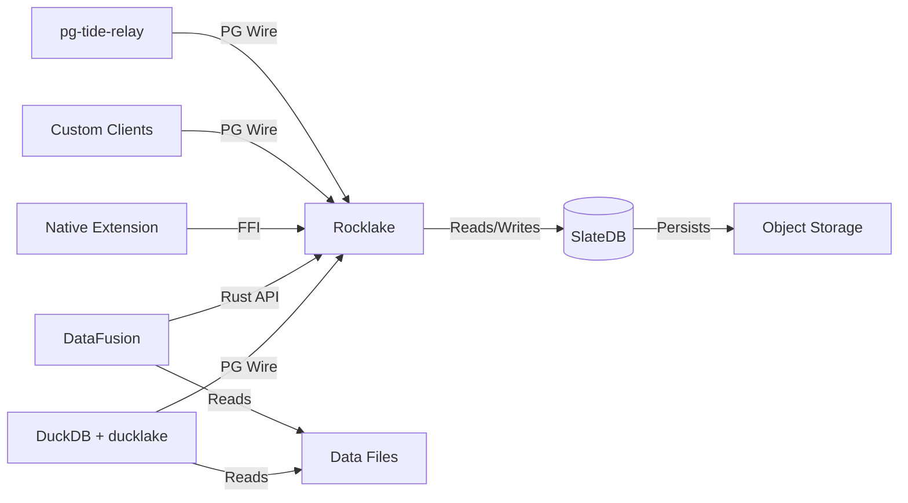
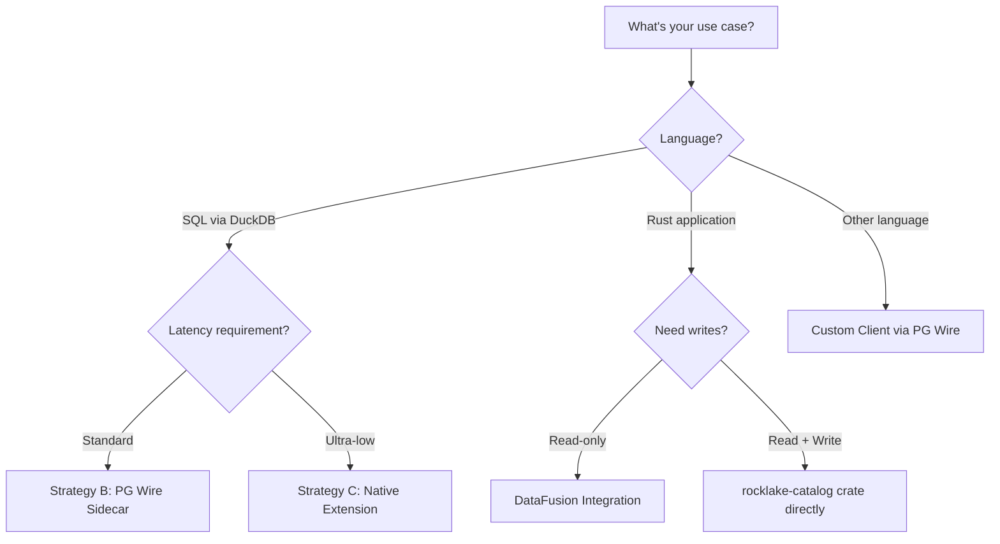

# Integration

Rocklake is designed as an open, interoperable component in the modern data stack. It speaks the PostgreSQL wire protocol, exposes its catalog through standard interfaces, and integrates with multiple query engines and tools. This section covers every integration point: how to connect DuckDB (the primary client), how to embed Rocklake as a native DuckDB extension, how to use it as an Apache DataFusion catalog provider, and how to build custom clients in any language.

The integration philosophy is straightforward: Rocklake manages metadata, everything else manages data. Query engines read and write Parquet files directly in object storage. Rocklake tells them which files exist, what columns they contain, and what statistics are available for partition pruning. This clean separation means Rocklake integrates with any tool that can read Parquet — it just needs to know where to look.

## Integration Architecture



## Integration Strategies

Rocklake supports three deployment strategies, each offering different trade-offs:

| Strategy | Integration Method | Latency | Complexity | Maturity |
|----------|-------------------|---------|------------|----------|
| **B (Sidecar)** | PG wire protocol | 1–5ms per call | Low | Production-ready |
| **C (Extension)** | Native FFI | <1ms (in-process) | Medium | Early stage |
| **DataFusion** | Rust trait impl | <1ms (in-process) | Medium | Read-only |

**Strategy B** is the recommended default. It works with any DuckDB instance, requires no recompilation, and provides clean process isolation. The sidecar (Rocklake server) can be upgraded independently of DuckDB.

**Strategy C** eliminates network overhead entirely by loading the catalog directly into DuckDB's process. Best for latency-sensitive interactive workloads where every millisecond counts. Currently supports a subset of catalog operations.

**DataFusion** is for Rust applications that use Apache DataFusion as their query engine. It provides read-only catalog access through DataFusion's native trait system.

## Pages in This Section

- **[DuckDB](duckdb.md)** — Connecting DuckDB to Rocklake via the PG-wire sidecar (Strategy B). Covers connection strings, supported operations, performance characteristics, multi-instance setups, and troubleshooting.

- **[DuckDB Compatibility](duckdb-compatibility.md)** — Complete SQL compatibility matrix between DuckDB's ducklake extension and Rocklake. Covers every DDL and DML operation, version compatibility, known differences, and the wire corpus testing approach.

- **[Native Extension](native-extension.md)** — Loading Rocklake as a DuckDB extension (Strategy C). Covers building, loading, API surface, limitations, ABI stability, and when to choose this over the sidecar.

- **[DataFusion](datafusion.md)** — Using Rocklake as a DataFusion catalog provider in Rust applications. Covers the trait implementations, usage patterns, supported operations, and dependency management.

- **[Custom Clients](custom-clients.md)** — Building your own client in any language using the PostgreSQL wire protocol. Covers connection details, language-specific examples, protocol constraints, and use cases.

- **[pg-tide-relay](pg-tide-relay.md)** — Relaying DuckLake traffic through intermediate infrastructure for routing, audit logging, authentication, and connection pooling.

## Choosing an Integration



## Quick Start Examples

### DuckDB (Most Common)

```sql
INSTALL ducklake;
LOAD ducklake;
ATTACH 'ducklake:host=localhost;port=5432' AS lake;
USE lake;
SELECT * FROM analytics.events LIMIT 10;
```

### DataFusion (Rust)

```rust
let catalog = RocklakeCatalog::open("s3://bucket/catalog/").await?;
ctx.register_catalog("lake", Arc::new(catalog));
let df = ctx.sql("SELECT * FROM lake.analytics.events").await?;
```

### Custom Client (Python)

```python
import psycopg2
conn = psycopg2.connect(host="localhost", port=5432, dbname="rocklake")
cur = conn.cursor()
cur.execute("SELECT schema_name FROM ducklake_schemas()")
```
