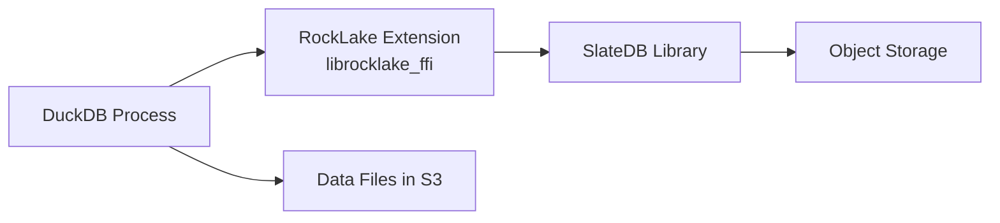

# Native Extension (Strategy C)

The RockLake native extension loads directly into DuckDB's process as a shared library, eliminating all network overhead. Catalog operations become in-process function calls with microsecond latency rather than network round-trips with millisecond latency. This is Strategy C in RockLake's deployment model — the highest-performance option that trades process isolation for raw speed.

Strategy C is ideal for interactive analytical workloads where every millisecond of catalog overhead is noticeable: dashboards with sub-second query expectations, notebook environments where schema exploration should feel instant, and embedded analytics applications where deploying a separate sidecar process adds unwanted complexity.

## Architecture



The extension is built from the `rocklake-ffi` crate, which wraps the full `rocklake-catalog` implementation behind a C-compatible FFI boundary. DuckDB loads it at runtime using its extension loading mechanism. Once loaded, catalog operations execute entirely in-process — no TCP connections, no serialization, no wire protocol overhead.

### How It Works Internally

1. DuckDB calls `LOAD '/path/to/librocklake_ffi.so'`
2. The extension's init function registers catalog provider functions with DuckDB
3. When DuckDB needs catalog information, it calls the registered functions directly
4. The functions call into `rocklake-catalog` (Rust), which reads/writes SlateDB
5. SlateDB reads/writes object storage (S3/GCS/Azure)
6. Results are returned as in-memory C structs — no serialization

## Building the Extension

### Prerequisites

- Rust toolchain (stable, 1.75+)
- C compiler (for DuckDB ABI compatibility)
- CMake 3.20+ (for the extension build system)

### Build Steps

```bash
# Clone the RockLake repository
git clone https://github.com/rocklake/rocklake.git
cd rocklake

# Build the FFI crate in release mode
cargo build --release -p rocklake-ffi

# The shared library is produced at:
# Linux:   target/release/librocklake_ffi.so
# macOS:   target/release/librocklake_ffi.dylib
# Windows: target/release/rocklake_ffi.dll
```

### Cross-Compilation

For building on one platform for deployment on another:

```bash
# Build for Linux x86_64 from macOS
rustup target add x86_64-unknown-linux-gnu
cargo build --release -p rocklake-ffi --target x86_64-unknown-linux-gnu

# Build for Linux aarch64 (ARM)
rustup target add aarch64-unknown-linux-gnu
cargo build --release -p rocklake-ffi --target aarch64-unknown-linux-gnu
```

### Build with CMake (Full Extension Package)

The `extension/` directory contains a CMake build system that produces a properly-packaged DuckDB extension:

```bash
cd extension
mkdir build && cd build
cmake .. -DCMAKE_BUILD_TYPE=Release
make -j$(nproc)
```

This produces an extension file that can be installed through DuckDB's extension mechanism.

## Loading in DuckDB

### Manual Load

```sql
-- Load the extension from a specific path
LOAD '/opt/rocklake/librocklake_ffi.so';

-- Or on macOS
LOAD '/opt/rocklake/librocklake_ffi.dylib';
```

### Extension Directory

Place the library in DuckDB's extension directory for automatic discovery:

```bash
# Default extension directory
~/.duckdb/extensions/v1.5.2/linux_amd64/

# Copy the extension
cp target/release/librocklake_ffi.so ~/.duckdb/extensions/v1.5.2/linux_amd64/rocklake.duckdb_extension
```

Then in DuckDB:

```sql
LOAD rocklake;
```

## Using the Extension

### Opening a Catalog

```sql
-- Load the extension
LOAD rocklake;

-- Open a catalog on S3
SELECT rocklake_open('s3://my-bucket/lakehouse/catalog/');

-- Open a local catalog (for development)
SELECT rocklake_open('./local-catalog/');
```

### Querying Catalog Metadata

```sql
-- List all schemas
SELECT * FROM rocklake_list_schemas();

-- List tables in a schema
SELECT * FROM rocklake_list_tables('analytics');

-- Get column definitions for a table
SELECT * FROM rocklake_describe_table('analytics', 'events');

-- List data files for a table
SELECT * FROM rocklake_list_files('analytics', 'events');
```

### Using with DuckLake-Style Queries

When registered as a catalog provider:

```sql
-- Register as a DuckDB catalog
SELECT rocklake_register_catalog('lake', 's3://my-bucket/catalog/');

-- Now use standard SQL
USE lake;
SELECT * FROM analytics.events WHERE timestamp > '2024-03-01';
```

## API Reference

### Core Functions

| Function | Description | Returns |
|----------|-------------|---------|
| `rocklake_open(path)` | Open a catalog at the given storage path | Status message |
| `rocklake_close()` | Close the currently open catalog | Status message |
| `rocklake_register_catalog(name, path)` | Register as a named DuckDB catalog | Status message |

### Schema Functions

| Function | Description | Returns |
|----------|-------------|---------|
| `rocklake_list_schemas()` | List all schemas in the catalog | Table: schema_id, schema_name |
| `rocklake_create_schema(name)` | Create a new schema | schema_id |
| `rocklake_drop_schema(name)` | Drop a schema | Status message |

### Table Functions

| Function | Description | Returns |
|----------|-------------|---------|
| `rocklake_list_tables(schema)` | List tables in a schema | Table: table_id, table_name, uuid |
| `rocklake_describe_table(schema, table)` | Get column definitions | Table: column_name, data_type, nullable |
| `rocklake_list_files(schema, table)` | List data files | Table: file_path, format, row_count, size |
| `rocklake_table_stats(schema, table)` | Get table statistics | Table: total_rows, total_bytes, file_count |

### Administrative Functions

| Function | Description | Returns |
|----------|-------------|---------|
| `rocklake_inspect()` | Inspect catalog state | Table: key, value |
| `rocklake_snapshot()` | Get current snapshot ID | BIGINT |

## Performance Comparison

Strategy C vs. Strategy B (PG-wire sidecar):

| Operation | Strategy B (Sidecar) | Strategy C (Extension) | Improvement |
|-----------|---------------------|----------------------|-------------|
| List schemas | 2–5ms | 50–200μs | 10–25x |
| Describe table | 2–5ms | 50–200μs | 10–25x |
| List files (10 files) | 3–8ms | 100–500μs | 6–16x |
| List files (1000 files) | 10–30ms | 1–5ms | 6–10x |
| Full query planning | 10–30ms | 0.5–2ms | 10–20x |

The improvement is most dramatic for queries that require many catalog lookups (complex joins, many tables) and for interactive workloads where users notice latency.

### When the Difference Matters

| Workload | Catalog Overhead (B) | Catalog Overhead (C) | Query Time | Overhead % (B) | Overhead % (C) |
|----------|---------------------|---------------------|------------|----------------|----------------|
| Dashboard (small table) | 20ms | 1ms | 50ms | 40% | 2% |
| Analytics (medium) | 20ms | 1ms | 5s | 0.4% | 0.02% |
| Batch ETL (large) | 20ms | 1ms | 60s | 0.03% | 0.002% |

For batch workloads, Strategy B is perfectly fine. For interactive dashboards, Strategy C provides a noticeably snappier experience.

## When to Use Strategy C

### Good Fit

- Interactive notebooks and dashboards requiring instant schema exploration
- Embedded analytics where deploying a sidecar is impractical
- Single-machine deployments (laptop development, single-server analytics)
- Applications where sub-millisecond catalog latency is a requirement
- Environments where simplicity (single process) is valued over isolation

### Not a Good Fit

- Multiple DuckDB instances sharing one catalog (writer coordination is harder)
- Production deployments where independent upgrades are important
- Environments requiring process isolation (a catalog bug could crash DuckDB)
- Workloads that need administrative operations (GC, excision, repair)
- Teams that want clear observability boundaries between catalog and query engine

## Limitations

The native extension currently exposes a subset of RockLake's capabilities:

| Capability | Extension (C) | Sidecar (B) |
|-----------|---------------|-------------|
| Schema/table/column reads | ✅ | ✅ |
| Data file listing | ✅ | ✅ |
| Table statistics | ✅ | ✅ |
| CREATE/DROP operations | ✅ | ✅ |
| INSERT (file registration) | ✅ | ✅ |
| Time travel | ✅ | ✅ |
| GC and excision | ❌ (use CLI) | ❌ (use CLI) |
| Export/Import | ❌ (use CLI) | ❌ (use CLI) |
| Verify/Repair | ❌ (use CLI) | ❌ (use CLI) |
| Multi-client writes | ⚠️ Complex | ✅ Coordinated |
| Connection pooling | N/A | ✅ |
| Independent upgrades | ❌ Coupled | ✅ |

## ABI Stability

The extension targets DuckDB's extension ABI. When DuckDB releases a new ABI version (typically with major releases), the extension must be recompiled:

| DuckDB ABI | RockLake Extension Version | Compatible |
|-----------|---------------------------|------------|
| v5000 | 0.8.x | ✅ |
| v4000 | 0.7.x | ✅ |
| v3000 | Not supported | ❌ |

This is the primary maintenance cost of Strategy C compared to Strategy B. The PG-wire protocol (Strategy B) is extremely stable — it has been backward compatible for over 20 years. DuckDB's extension ABI changes more frequently.

## Object Storage Credentials

The extension uses the same credential chain as the sidecar:

```sql
-- Set credentials before opening the catalog
SET s3_region = 'us-east-1';
SET s3_access_key_id = 'AKIA...';
SET s3_secret_access_key = '...';

-- Or use environment variables (recommended)
-- AWS_REGION, AWS_ACCESS_KEY_ID, AWS_SECRET_ACCESS_KEY
-- Or instance profiles (IRSA, IMDS)

LOAD rocklake;
SELECT rocklake_open('s3://bucket/catalog/');
```

## When to Choose Strategy C

### Choose Strategy C When:

- **Latency is critical.** Interactive dashboards, notebook exploration, and real-time applications benefit from microsecond catalog access versus millisecond network round-trips.
- **Single-user deployment.** A data scientist working locally or a batch job that only needs one DuckDB process does not benefit from a separate server.
- **Minimizing moving parts.** No sidecar to deploy, no port to configure, no health checks to maintain — just a library loaded into DuckDB.
- **Embedded analytics.** Applications that embed DuckDB can embed the RockLake extension too, creating a self-contained analytical engine with no external dependencies beyond object storage.

### Choose Strategy B (PG-Wire) When:

- **Multiple clients.** Several DuckDB instances share one catalog — the server handles coordination.
- **Language flexibility.** You want catalog access from Python, Go, or other languages via PostgreSQL drivers.
- **Process isolation.** A crash in the catalog code should not take down the query engine.
- **ABI stability.** You cannot recompile the extension for every DuckDB release.
- **Operational visibility.** The server provides metrics, health checks, and logging that the extension does not.

### Hybrid Approach

For some deployments, both strategies run simultaneously:

```
Writer: RockLake server (Strategy B) — accepts writes from ETL pipelines
Readers: DuckDB with native extension (Strategy C) — fast reads for dashboards
```

This works because SlateDB supports one writer and unlimited concurrent readers. The extension instances open the catalog in read-only mode while the server handles writes.

## Troubleshooting the Extension

### "Extension load failed: undefined symbol"

This usually means a DuckDB ABI mismatch. Verify version compatibility:

```sql
SELECT version();
-- Must match the DuckDB version the extension was compiled against
```

Recompile against the correct DuckDB version:

```bash
# Specify DuckDB version explicitly
DUCKDB_VERSION=1.5.2 cargo build --release -p rocklake-ffi
```

### "Cannot open catalog: writer conflict"

The extension attempted to open the catalog in write mode, but another writer (the RockLake server or another extension instance) already holds the lease. Open in read-only mode:

```sql
SELECT rocklake_open('s3://bucket/catalog/', read_only := true);
```

### "Timeout connecting to storage"

Object storage credentials are not configured or the endpoint is unreachable. Verify credentials work outside of DuckDB:

```bash
aws s3 ls s3://bucket/catalog/ --region us-east-1
```

### Extension Crashes DuckDB

Because the extension runs in-process, a bug in RockLake's code (panic, segfault, memory corruption) will crash the entire DuckDB process. This is the fundamental trade-off of Strategy C versus Strategy B. If you experience crashes:

1. Update to the latest RockLake extension release
2. Check for known issues on GitHub
3. Switch to Strategy B (PG-wire sidecar) as a workaround
4. Report the crash with a reproduction case

## Further Reading

- **[DuckDB Integration](duckdb.md)** — Strategy B (PG-wire sidecar) usage
- **[Architecture: Crate Structure](../architecture/crate-structure.md)** — How rocklake-ffi relates to other crates
- **[Performance: Latency Model](../performance/latency-model.md)** — Detailed latency analysis
- **[Design Decisions: Strategy B First](../design-decisions/strategy-b-first.md)** — Why Strategy B is the default
