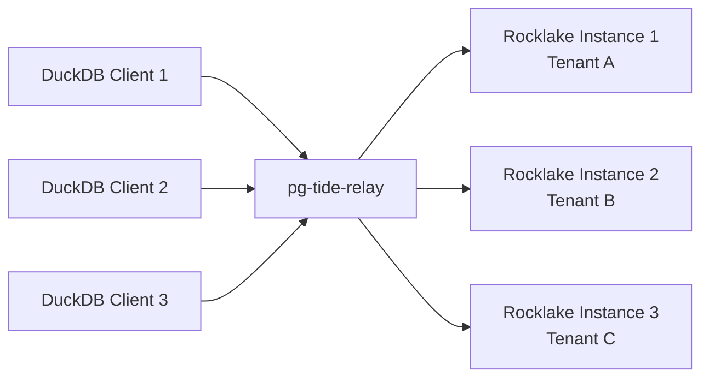

# pg-tide-relay

pg-tide-relay is a concept for relaying DuckLake catalog traffic through intermediate infrastructure that provides capabilities beyond what Rocklake offers natively: connection pooling, multi-tenant routing, enhanced authentication, fine-grained authorization, audit logging, and rate limiting. Rather than connecting DuckDB directly to Rocklake, traffic passes through a proxy layer that adds these enterprise features transparently.

The name "tide-relay" comes from the idea of traffic flowing like tides between DuckDB and Rocklake — the relay simply channels the flow, optionally inspecting or redirecting it along the way.

## Architecture



The relay sits between DuckDB clients and Rocklake instances, intercepting PostgreSQL wire protocol messages. From the client's perspective, the relay looks like a PostgreSQL server. From Rocklake's perspective, the relay looks like a PostgreSQL client. The relay forwards messages bidirectionally, optionally logging, modifying, or routing them.

## Capabilities

### Connection Pooling

Rocklake handles connections efficiently, but in deployments with hundreds of DuckDB instances, a connection pool reduces the total number of connections Rocklake must maintain:

```
100 DuckDB instances → pg-tide-relay (pool: 20 connections) → Rocklake
```

Benefits:

- Reduces Rocklake's memory footprint (fewer concurrent sessions)
- Reduces connection establishment overhead (pre-warmed connections)
- Provides connection queuing during bursts

### Multi-Tenant Routing

Route connections to different Rocklake instances based on client identity:

```
DuckDB (tenant=acme)     → relay → Rocklake (s3://acme-bucket/catalog/)
DuckDB (tenant=globex)   → relay → Rocklake (s3://globex-bucket/catalog/)
DuckDB (tenant=initech)  → relay → Rocklake (s3://initech-bucket/catalog/)
```

Routing can be based on:

- Database name in the startup message (`dbname=acme`)
- Username (`user=acme_reader`)
- Client certificate CN
- Source IP address
- Custom authentication token

### Enhanced Authentication

Add authentication beyond Rocklake's built-in options:

| Auth Method | Description |
|-------------|-------------|
| LDAP/Active Directory | Validate credentials against corporate directory |
| OAuth2/OIDC | Accept JWT tokens from identity providers |
| mTLS (mutual TLS) | Require client certificates |
| API keys | Custom token-based authentication |
| IP allowlisting | Restrict by source network |

### Fine-Grained Authorization

Enforce access control policies at the SQL level:

```
Client (role=reader) → relay inspects SQL → ALLOW (SELECT queries)
Client (role=reader) → relay inspects SQL → DENY (INSERT/UPDATE/DELETE)
Client (role=admin)  → relay inspects SQL → ALLOW (all queries)
```

Authorization rules can be expressed as:

| Role | Allowed Operations | Denied Operations |
|------|-------------------|-------------------|
| reader | SELECT, list schemas/tables | All writes |
| writer | SELECT, INSERT, UPDATE, BEGIN, COMMIT | DROP, schema changes |
| admin | All operations | None |
| auditor | SELECT (read-only) | All writes |

### Audit Logging

Capture a complete record of all catalog operations for compliance:

```json
{
  "timestamp": "2024-12-16T14:30:22Z",
  "client_ip": "10.0.1.50",
  "username": "etl-pipeline",
  "tenant": "acme",
  "sql": "INSERT INTO ducklake_data_files ...",
  "duration_ms": 12,
  "status": "success",
  "rows_affected": 1
}
```

Audit logs can be shipped to:

- S3 (for long-term retention)
- Elasticsearch/OpenSearch (for search and alerting)
- CloudWatch Logs / Cloud Logging (for cloud-native observability)
- Kafka (for real-time streaming)

### Rate Limiting

Protect Rocklake from overload:

| Limit Type | Example Configuration |
|-----------|----------------------|
| Per-client requests/second | 100 req/s per client |
| Per-tenant requests/second | 500 req/s per tenant |
| Global requests/second | 2000 req/s total |
| Concurrent connections | 50 per client, 200 total |

## When to Use a Relay

### Good Fit

- **Multi-tenant SaaS:** Each tenant needs isolated catalog access with separate Rocklake instances
- **Enterprise compliance:** Regulatory requirements mandate comprehensive audit trails of all data access
- **Zero-trust environments:** All connections must be authenticated and authorized, even internal ones
- **High-scale deployments:** Hundreds of DuckDB instances connecting to a shared catalog
- **Gradual migration:** Route some traffic to Rocklake while keeping some on existing PostgreSQL catalog

### Not Needed

- **Single-tenant, single-client:** Direct DuckDB → Rocklake connection is simpler
- **Development environments:** Authentication and routing add unnecessary complexity
- **Latency-sensitive workloads:** The relay adds 0.5–2ms per round-trip
- **Simple deployments:** If you do not need the relay's features, do not add it

## Implementation Approaches

### Option 1: HAProxy (TCP Mode)

The simplest relay — pure TCP forwarding with routing based on connection parameters:

```
frontend rocklake_frontend
    bind *:5432
    mode tcp
    
    # Route based on SNI (requires TLS)
    use_backend tenant_a if { req.ssl_sni -i acme.catalog.internal }
    use_backend tenant_b if { req.ssl_sni -i globex.catalog.internal }
    default_backend tenant_default

backend tenant_a
    mode tcp
    server rocklake-acme 10.0.1.10:5432

backend tenant_b
    mode tcp
    server rocklake-globex 10.0.2.10:5432
```

Limitations: No SQL-level inspection, no audit logging at the query level.

### Option 2: PgBouncer (Connection Pooling)

For pure connection pooling without routing:

```ini
[databases]
rocklake = host=10.0.1.10 port=5432

[pgbouncer]
listen_port = 6432
pool_mode = session
max_client_conn = 200
default_pool_size = 20
```

Limitations: Single backend only, no SQL inspection, no multi-tenant routing.

### Option 3: Custom Rust Proxy

For full control over routing, authentication, authorization, and audit logging, build a custom proxy using the `pgwire` crate (the same crate Rocklake uses for its server):

```rust
use pgwire::api::auth::*;
use pgwire::api::query::*;
use pgwire::api::results::*;

struct TideRelay {
    backends: HashMap<String, BackendConfig>,
    auth_provider: Box<dyn AuthProvider>,
    audit_logger: Box<dyn AuditLogger>,
}

impl SimpleQueryHandler for TideRelay {
    async fn do_query(&self, client: &Client, query: &str) -> Result<Vec<Response>> {
        // 1. Authenticate client
        let identity = self.auth_provider.verify(client)?;
        
        // 2. Authorize the query
        if !self.authorize(&identity, query) {
            return Err(unauthorized_error());
        }
        
        // 3. Route to appropriate backend
        let backend = self.backends.get(&identity.tenant)?;
        
        // 4. Forward query and get response
        let response = backend.forward(query).await?;
        
        // 5. Log the operation
        self.audit_logger.log(AuditEntry {
            client: identity,
            query: query.to_string(),
            status: "success",
            ..
        }).await;
        
        Ok(response)
    }
}
```

### Option 4: Envoy Proxy (Network Filter)

For Kubernetes-native deployments, Envoy can handle TCP proxying with observability:

```yaml
static_resources:
  listeners:
    - name: rocklake_listener
      address:
        socket_address: { address: 0.0.0.0, port_value: 5432 }
      filter_chains:
        - filters:
            - name: envoy.filters.network.tcp_proxy
              typed_config:
                "@type": type.googleapis.com/envoy.extensions.filters.network.tcp_proxy.v3.TcpProxy
                stat_prefix: rocklake
                cluster: rocklake_backend
  clusters:
    - name: rocklake_backend
      connect_timeout: 5s
      load_assignment:
        cluster_name: rocklake_backend
        endpoints:
          - lb_endpoints:
              - endpoint:
                  address:
                    socket_address: { address: rocklake.default.svc, port_value: 5432 }
```

## Performance Impact

The relay adds latency to every catalog round-trip:

| Relay Type | Added Latency | Throughput Impact |
|-----------|---------------|-------------------|
| HAProxy (TCP) | 0.1–0.5ms | Negligible |
| PgBouncer | 0.2–1ms | Negligible |
| Custom Rust proxy | 0.5–2ms | Depends on logic complexity |
| Envoy (TCP) | 0.2–1ms | Negligible |

For Strategy B deployments where each catalog round-trip is already 1–5ms, the relay adds 10–40% overhead. For most analytical workloads (where query execution time dominates), this is imperceptible.

## Deployment Patterns

### Sidecar Pattern (Per-Client Relay)

```
Pod 1: [DuckDB] → [relay sidecar] → Rocklake
Pod 2: [DuckDB] → [relay sidecar] → Rocklake
```

Good for per-client authentication and local connection pooling.

### Centralized Relay

```
All DuckDB instances → [relay service] → Rocklake
```

Good for centralized audit logging and rate limiting.

### Tiered Relay

```
DuckDB instances → [edge relay (auth + rate limit)] → [routing relay (tenant routing)] → Rocklake instances
```

Good for large-scale multi-tenant deployments.

## Implementation Status

pg-tide-relay is currently a design concept. The protocol compatibility between DuckDB, Rocklake, and standard PostgreSQL proxies has been validated — any TCP proxy that passes PostgreSQL wire protocol transparently works as a relay. The project may provide a reference implementation in the future based on community demand.

For now, the recommended approach is:

1. **Simple pooling:** Use PgBouncer in session mode
2. **Simple routing:** Use HAProxy with TCP mode
3. **Full features:** Build a custom Rust proxy using the `pgwire` crate
4. **Kubernetes:** Use Envoy for TCP proxying with metrics

## Building Your Own Relay

If the recommended approaches above do not meet your needs, building a custom relay is straightforward because the protocol between DuckDB and Rocklake is standard PostgreSQL wire protocol. Here is a high-level architecture for a custom Rust-based relay:

### Minimal TCP Proxy

The simplest relay is a transparent TCP proxy that passes bytes between client and server without inspection:

```rust
// Pseudocode for a minimal relay
async fn handle_connection(client: TcpStream, upstream_addr: &str) {
    let server = TcpStream::connect(upstream_addr).await?;
    let (client_read, client_write) = client.into_split();
    let (server_read, server_write) = server.into_split();
    
    // Bidirectional byte copying
    tokio::join!(
        copy(client_read, server_write),
        copy(server_read, client_write),
    );
}
```

This provides connection multiplexing but no protocol awareness. It is equivalent to HAProxy in TCP mode.

### Protocol-Aware Proxy

For features like query logging, routing, or rate limiting, the relay must parse the PostgreSQL wire protocol messages. The key messages to intercept:

| Message | Direction | Purpose |
|---------|-----------|---------|
| StartupMessage | Client → Server | Contains user, database, protocol version |
| Query (Q) | Client → Server | Contains SQL text (simple query protocol) |
| Parse (P) | Client → Server | Contains SQL text (extended query protocol) |
| CommandComplete (C) | Server → Client | Contains affected row count |
| ErrorResponse (E) | Server → Client | Contains error details |
| ReadyForQuery (Z) | Server → Client | Indicates transaction state |

DuckDB uses the extended query protocol exclusively, so your relay must handle Parse/Bind/Describe/Execute message sequences rather than simple Query messages.

### Connection Lifecycle Management

A production relay should handle these lifecycle events:

- **Client disconnect:** Clean up the upstream connection (or return it to the pool)
- **Server disconnect:** Inform the client with an ErrorResponse, attempt reconnection for the next query
- **Startup negotiation:** Forward the startup message and authentication exchange transparently
- **SSL negotiation:** Handle SSLRequest before the startup message if TLS is enabled

### Performance Considerations

The relay sits on the critical path for every query. Minimize overhead:

- **Zero-copy forwarding:** For transparent proxying, avoid copying message bytes into heap-allocated buffers. Use vectored I/O or splice syscalls where possible.
- **Connection reuse:** If implementing pooling, keep upstream connections alive between client requests to avoid repeated TCP handshake and authentication overhead.
- **Async I/O:** Use tokio or async-std to handle thousands of concurrent connections on a single thread. The relay is I/O-bound, not CPU-bound.
- **Health checking:** Periodically send a simple query (`SELECT 1`) to upstream to detect dead connections before clients encounter them.

## Observability Through the Relay

A protocol-aware relay provides a natural instrumentation point:

```
# Prometheus metrics from the relay
rocklake_relay_connections_total{upstream="primary"} 1247
rocklake_relay_connections_active{upstream="primary"} 12
rocklake_relay_queries_total{upstream="primary"} 89432
rocklake_relay_query_duration_seconds_bucket{le="0.01"} 67000
rocklake_relay_query_duration_seconds_bucket{le="0.1"} 85000
rocklake_relay_query_duration_seconds_bucket{le="1.0"} 89400
rocklake_relay_errors_total{upstream="primary",code="XX000"} 3
```

These metrics give you visibility into query patterns, latency distributions, and error rates without modifying Rocklake itself. For teams that cannot instrument DuckDB clients directly, the relay provides the observability layer.

## Further Reading

- **[Custom Clients](custom-clients.md)** — Understanding the PG wire protocol from the client side
- **[Architecture: PG Wire Protocol](../architecture/pg-wire-protocol.md)** — Protocol implementation details
- **[Deployment: Networking](../deployment/networking.md)** — Network architecture options
- **[Deployment: TLS](../deployment/tls.md)** — Securing connections between components
