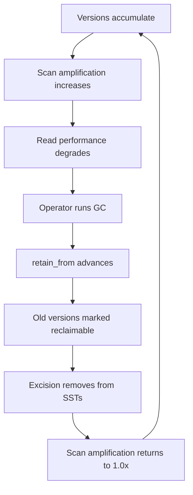

# MVCC Filter

Multi-Version Concurrency Control (MVCC) is the mechanism that allows Rocklake to support time travel, concurrent readers at different snapshots, and non-blocking reads during writes — all without locks. The MVCC filter is the runtime component that determines which rows are visible to a given reader at a given snapshot. It is applied during every prefix scan and every point lookup of versioned entities. This page documents the visibility rules, the implementation, the performance characteristics, and the interaction with garbage collection.

Understanding the MVCC filter is essential for contributors working on the catalog layer, for operators diagnosing unexpected query results (especially involving time travel), and for anyone who wants to understand why GC affects scan performance.

## The Core Problem

Rocklake stores multiple versions of the same logical entity as separate key-value pairs in SlateDB. When a table is altered (adding a column, changing a property), the old version is not updated in place — a new version is created alongside it. Both versions coexist in storage indefinitely (until garbage collection removes the old one).

This means a naive prefix scan for "all columns of table 42" returns ALL versions of all columns — including versions that were superseded months ago. Without MVCC filtering, the reader would see duplicate or contradictory data. The MVCC filter's job is to select exactly the versions that are visible at the reader's snapshot, producing a consistent, point-in-time view of the catalog.

## Visibility Rules

A versioned row has two snapshot fields:

- **begin_snapshot:** The snapshot at which this version was created (came into existence)
- **end_snapshot:** The snapshot at which this version was superseded (ceased to be current). NULL if the version is still current.

A row is visible at snapshot S if and only if:

```
begin_snapshot <= S AND (end_snapshot IS NULL OR end_snapshot > S)
```

In plain language:

1. The row must have been created at or before snapshot S (it existed by then)
2. AND either:
   - The row has not been superseded (end_snapshot is NULL — it is still current), OR
   - The row was superseded after snapshot S (it was still current at time S)

### Examples

Consider a column "email" in table 5 that was created at snapshot 100 and modified at snapshot 300:

```
Version 1: begin_snapshot=100, end_snapshot=300, type=VARCHAR(100)
Version 2: begin_snapshot=300, end_snapshot=NULL, type=VARCHAR(255)
```

| Reader at Snapshot | Version 1 Visible? | Version 2 Visible? | Result |
|-------------------|-------------------|-------------------|--------|
| S=50 | No (100 > 50) | No (300 > 50) | Column does not exist yet |
| S=100 | Yes (100 ≤ 100 AND 300 > 100) | No (300 > 100) | Sees VARCHAR(100) |
| S=200 | Yes (100 ≤ 200 AND 300 > 200) | No (300 > 200) | Sees VARCHAR(100) |
| S=300 | No (100 ≤ 300 BUT 300 > 300 is FALSE) | Yes (300 ≤ 300 AND NULL) | Sees VARCHAR(255) |
| S=500 | No (end_snapshot=300 ≤ 500) | Yes (300 ≤ 500 AND NULL) | Sees VARCHAR(255) |

Note the boundary behavior at S=300: version 1's end_snapshot (300) is NOT greater than S (300), so version 1 is invisible. Version 2's begin_snapshot (300) IS less than or equal to S (300), so version 2 is visible. This ensures exactly one version is visible at any snapshot — no gaps, no overlaps.

### Dropped Entities

When an entity is dropped (e.g., DROP TABLE), the current version gets an end_snapshot but no new version is created:

```
Table 5: begin_snapshot=100, end_snapshot=400
```

At snapshot 400 and beyond, no version of table 5 is visible — it has been dropped. At snapshots 100–399, it is visible.

## Implementation

The MVCC filter is implemented in the `rocklake-core` crate:

```rust
/// Determines whether a versioned row is visible at a given snapshot.
pub fn is_visible(row: &impl Versioned, at_snapshot: u64) -> bool {
    row.begin_snapshot() <= at_snapshot
        && row.end_snapshot().map_or(true, |end| end > at_snapshot)
}
```

The `Versioned` trait is implemented by all row types that participate in MVCC (schemas, tables, columns, views, macros, data files):

```rust
pub trait Versioned {
    fn begin_snapshot(&self) -> u64;
    fn end_snapshot(&self) -> Option<u64>;
}
```

### Application Point: Scan Filtering

The filter is applied during prefix scans in the catalog reader. The typical flow:

1. Catalog reader constructs a prefix key (e.g., `[0x06, table_id=42]` for all columns of table 42)
2. SlateDB prefix scan returns ALL key-value pairs with that prefix (all versions of all columns)
3. Each pair is deserialized from protobuf into a typed row struct
4. The MVCC filter is applied: `rows.filter(|row| is_visible(row, target_snapshot))`
5. Surviving rows are the visible columns at the requested snapshot
6. Results are formatted as PostgreSQL wire protocol rows and returned to the client

### Application Point: Point Lookups

For point lookups (finding a specific entity by ID at a specific snapshot), the process is similar but optimized:

1. Construct a prefix for the entity (tag + entity_id)
2. Scan all versions of that entity (typically 1–5 key-value pairs)
3. Apply MVCC filter to find the visible version
4. Return the single visible version (or error if none is visible — entity does not exist at that snapshot)

### Current-Snapshot Optimization

The most common case is reading at the current snapshot (the latest committed state). For current-snapshot reads, the MVCC filter simplifies to:

```
end_snapshot IS NULL
```

This is because:
- At the current snapshot, `begin_snapshot <= current` is always true for any committed row
- The only distinguishing criterion is whether the row has been superseded

This optimization is applied in the code path for non-time-travel reads, avoiding the full two-condition check.

## Performance Characteristics

### Cost of the Filter Itself

The MVCC filter performs two integer comparisons per row. This is O(1) per row and negligible in absolute terms (nanoseconds). The filter itself is never a performance concern.

### Cost of Scan Amplification

The performance concern is not the filter's execution cost but the I/O required to read rows that will be filtered out. If a prefix scan reads 1,000 rows from SlateDB but only 100 are visible, you have performed 10x more I/O than strictly necessary. This wasted I/O is called scan amplification.

Scan amplification occurs when:

| Cause | Effect | Typical Amplification |
|-------|--------|---------------------|
| Historical versions accumulate | All previous versions are read and discarded | 2–50x (depends on change frequency) |
| Dropped entities persist | Dropped rows are read and filtered out | 1.1–2x |
| GC has not run | Both of the above persist indefinitely | Unbounded |

### Quantifying the Impact

The I/O cost depends on how data is organized in SST blocks:

- All versions of the same entity are adjacent in key order (same prefix, different begin_snapshot suffix)
- Adjacent keys are likely in the same SST block
- One SST block fetch retrieves ~200–500 key-value pairs

If 10 historical versions of a column all fit in the same SST block, reading all 10 costs the same as reading 1 (one block fetch). Amplification only increases actual I/O when versions span multiple SST blocks.

**Best case:** All versions of the scanned entities fit in one SST block. Amplification causes no additional I/O — only additional CPU for deserialization and filtering.

**Worst case:** Each version is in a separate SST block (extremely unlikely due to key adjacency). Amplification directly multiplies I/O.

**Typical case:** Moderate amplification (2–5x), all within 1–2 SST blocks. I/O increase is 0–1 additional block fetch.

## Interaction with Garbage Collection

Garbage collection reduces scan amplification by marking old versions as reclaimable:

1. **GC advances `retain_from`** to a recent snapshot (e.g., retain_from = 500)
2. This means no reader will ever request a snapshot below 500
3. Versions whose `end_snapshot <= 500` are now invisible to ALL valid readers
4. These versions can be safely removed without affecting any reader

After GC, the MVCC filter encounters fewer invisible rows because the old versions have been logically marked for removal. After excision (physical compaction), those rows are physically gone from SST files, reducing both I/O and CPU.

### The GC-MVCC Relationship



This is a steady-state cycle. In a well-operated deployment, GC runs periodically (daily or weekly) to keep amplification low. In an unmanaged deployment, amplification grows indefinitely until someone notices degraded scan performance.

## Non-Versioned Tables

Not all catalog tables participate in MVCC. Some tables use a different visibility model:

| Table | Versioned? | Visibility Model |
|-------|-----------|-----------------|
| ducklake_schema | Yes | begin/end snapshot |
| ducklake_table | Yes | begin/end snapshot |
| ducklake_column | Yes | begin/end snapshot |
| ducklake_view | Yes | begin/end snapshot |
| ducklake_macro | Yes | begin/end snapshot |
| ducklake_data_file | Yes | begin/end snapshot |
| ducklake_snapshot | No | Always visible (immutable after creation) |
| ducklake_catalog | No | Always visible (single entry) |
| ducklake_file_column_stats | No | Visible when parent file is visible |
| counters | No | Always current value |
| system keys | No | Always current value |

For non-versioned tables, no MVCC filter is applied during scans. Every row returned by the prefix scan is included in the result.

For `ducklake_file_column_stats`, visibility is inherited from the parent data file. If a data file is invisible at the requested snapshot, its statistics are also invisible. This inheritance is implemented in the catalog logic layer (not in the MVCC filter itself).

## Edge Cases

### Concurrent Write and Read

Because Rocklake uses a single writer, there is no true concurrency between writes and reads at the MVCC level. However, a reader may be mid-scan when a writer commits a new snapshot. The reader's behavior depends on its snapshot:

- If the reader is using a fixed snapshot (explicit time travel), it is unaffected by new writes
- If the reader is using "current snapshot" mode, it reads the snapshot that was current at the start of its transaction

In practice, this means readers never see "partial transactions" — they see either the complete state before the write or the complete state after. The MVCC filter guarantees this consistency.

### Snapshot ID Gaps

Snapshot IDs may have gaps (if a writer crashes after allocating a snapshot ID but before committing). The MVCC filter handles this correctly because it uses <= and > comparisons, not equality. A gap in snapshot IDs simply means no rows have that specific begin_snapshot — the filter does not require contiguous IDs.

### The Zero Snapshot

Snapshot 0 is a special value: the initial empty catalog state. No user-created rows have begin_snapshot=0. Some system keys may have begin_snapshot=0 (created during catalog initialization). Readers requesting snapshot 0 see only the bare catalog skeleton.

## Testing the Filter

The MVCC filter is tested extensively in `crates/rocklake-core/tests/`:

- Visibility at exact boundaries (begin_snapshot, end_snapshot)
- Multiple versions of the same entity
- Dropped entities (end_snapshot set, no successor)
- Gap handling (non-contiguous snapshot IDs)
- Current-snapshot optimization correctness

The golden test suite (`tests/golden/`) also exercises MVCC indirectly through full catalog operations: creating tables, altering them, dropping them, and verifying that queries at different snapshots return the expected results.

## Further Reading

- **[Architecture: MVCC Implementation](../architecture/mvcc-implementation.md)** — Higher-level MVCC design
- **[Tag Allocation](tag-allocation.md)** — Which tags are versioned vs. unversioned
- **[Operations: Garbage Collection](../operations/garbage-collection.md)** — Reducing scan amplification
- **[Crash Safety](crash-safety.md)** — How MVCC interacts with crash recovery
