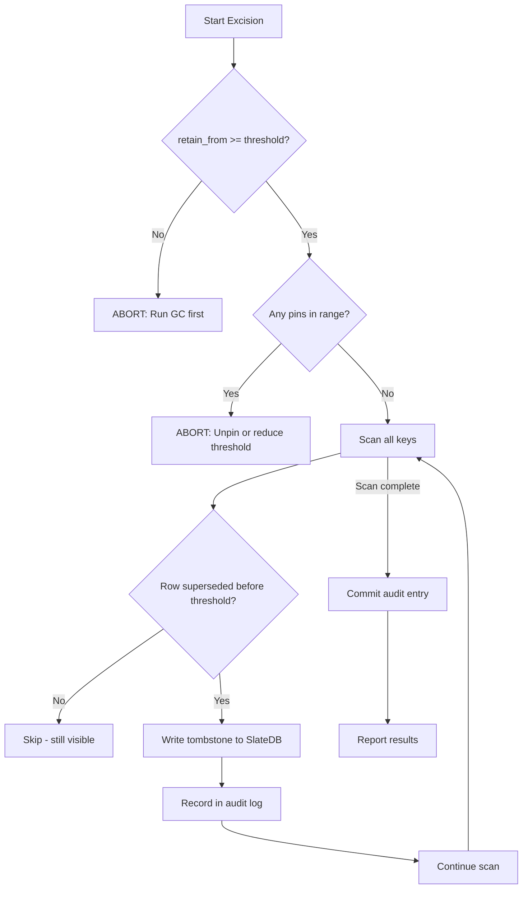

# Excision

Excision is the physical deletion of catalog entries that are no longer visible to any valid reader. It is the second phase of garbage collection (after advancing the retention horizon) and represents the only operation in SlateDuck that permanently destroys data. Because of its destructive and irreversible nature, excision includes multiple safety checks, requires explicit confirmation, and produces a permanent audit trail.

Think of it this way: garbage collection (Phase 1) closes the blinds — old snapshots become invisible to readers, but the data still exists behind the blinds. Excision tears out the walls — the data is gone forever. Most operators never need excision. Those who do should treat it with the same caution as `DROP DATABASE`.

## When to Use Excision

### Appropriate Uses

- **Compliance: GDPR right-to-erasure.** A data subject requests deletion. Their metadata appears in historical catalog snapshots. Excision physically removes those entries.
- **Compliance: Data retention policies.** Regulatory requirements mandate that metadata older than N days must be physically purged (not just made inaccessible).
- **Storage cost optimization.** Very high-churn catalogs (thousands of schema changes per day over years) may accumulate enough superseded versions that storage costs become noticeable.
- **Scan performance.** In extreme cases (millions of superseded versions), excision reduces the number of SST blocks that prefix scans must traverse.

### NOT Appropriate Uses

- **Hiding old snapshots.** Use `slateduck gc --retain-days N` instead — this is reversible.
- **Routine maintenance.** Normal catalogs accumulate negligible storage overhead.
- **"Cleaning up."** If you cannot articulate why the data must be physically gone, you do not need excision.
- **Performance tuning.** SlateDB's compaction handles storage efficiency at the LSM level. Excision is about compliance, not performance.

## How Excision Works

### Eligibility Criteria

Excision scans all keys and identifies rows that meet ALL of these criteria simultaneously:

1. **Superseded:** The row has an `end_snapshot_id` set (a newer version exists)
2. **Beyond horizon:** The `end_snapshot_id` is before the `--before-snapshot` threshold
3. **GC-approved:** The `retain_from` system key is >= the excision threshold (safety interlock)
4. **Not pinned:** No pinned snapshot references the row

If any criterion is not met, the row is preserved.

### Execution Mechanics



Technically, excision writes tombstones to SlateDB for each deleted key. The tombstones are resolved during subsequent compaction, which physically removes the key-value pairs from SST files. The storage space is not reclaimed immediately — it is reclaimed when the affected SST files are compacted.

## Safety Checks

Excision refuses to proceed if any of these conditions are true:

| Check | Condition | Error Message |
|-------|-----------|---------------|
| GC interlock | `retain_from` < `--before-snapshot` | "Retention horizon not advanced. Run GC first." |
| Pin protection | Pinned snapshot in affected range | "Pinned snapshot {id} blocks excision. Unpin first." |
| Future threshold | `--before-snapshot` > latest snapshot | "Cannot excise future snapshots." |
| Confirmation | `--confirm` not provided (interactive) | "Excision is irreversible. Add --confirm to proceed." |

These checks ensure you cannot accidentally delete data that readers still need.

## Running Excision

### Step 1: Preview (Dry Run)

Always start with a dry run to understand the impact:

```bash
slateduck excise --catalog s3://bucket/catalog/ --before-snapshot 1000 --dry-run
```

Output:

```
Excision Dry Run:
  Target: all rows superseded before snapshot 1000
  Current retain_from: 1200 (safety check PASSED)
  Pinned snapshots in range: 0 (safety check PASSED)
  
  Rows eligible for excision:
    ducklake_schemas:    12 rows
    ducklake_tables:     45 rows
    ducklake_columns:   234 rows
    ducklake_files:     890 rows
    ducklake_stats:     450 rows
    Total:             1631 rows
    
  Estimated storage freed: 312 KB (after compaction)
  
  This operation is IRREVERSIBLE. Run without --dry-run and with --confirm to proceed.
```

### Step 2: Create Backup

Before excision, create an NDJSON export as a safety net:

```bash
slateduck export --catalog s3://bucket/catalog/ --output pre-excision-backup.ndjson
```

### Step 3: Execute

```bash
slateduck excise \
    --catalog s3://bucket/catalog/ \
    --before-snapshot 1000 \
    --operator "ops-team@company.com" \
    --reason "GDPR compliance request #12345" \
    --confirm
```

Output:

```
Excision completed:
  Rows deleted: 1631
  Tombstones written: 1631
  Audit entry created: excision-20241216T143022Z
  Duration: 4.2 seconds
  
  Note: Storage will be reclaimed after next SlateDB compaction.
```

### Step 4: Verify

```bash
# Confirm the excised data is gone
slateduck inspect --catalog s3://bucket/catalog/ --key "t/5/v/800"
# Key not found (expected)

# Confirm live data is unaffected
slateduck inspect --catalog s3://bucket/catalog/ --key "t/5/latest"
# Found: table_id=5, name="events", ...
```

## Audit Trail

Every excision creates a permanent audit entry stored under the `0xFF|audit` prefix in the catalog. Audit entries are never themselves subject to excision — they are retained forever.

### Audit Entry Format

```json
{
  "type": "excision",
  "timestamp": "2024-12-16T14:30:22Z",
  "before_snapshot": 1000,
  "rows_deleted": 1631,
  "operator": "ops-team@company.com",
  "reason": "GDPR compliance request #12345",
  "duration_ms": 4200,
  "safety_checks": {
    "retain_from_at_time": 1200,
    "pinned_snapshots_checked": 0
  }
}
```

### Viewing Audit History

```bash
slateduck audit --catalog s3://bucket/catalog/

# Output:
# Timestamp            Type       Rows    Operator
# 2024-12-16T14:30:22  excision   1631    ops-team@company.com
# 2024-11-15T10:00:00  excision    482    admin@company.com
```

## Targeted Excision (GDPR)

For GDPR right-to-erasure requests targeting specific entities:

```bash
# Excise all versions of a specific table's metadata
slateduck excise \
    --catalog s3://bucket/catalog/ \
    --table-id 42 \
    --all-versions \
    --operator "privacy@company.com" \
    --reason "GDPR erasure request: user_profiles table" \
    --confirm
```

This removes all historical versions of a specific table's catalog entries without affecting other tables.

## Recovery After Accidental Excision

Excision is irreversible from SlateDuck's perspective. Recovery options:

| Recovery Method | Availability | Completeness | Complexity |
|----------------|-------------|--------------|------------|
| NDJSON backup import | If backup exists | Full | Low |
| Object versioning recovery | If versioning enabled | Full | High (requires SlateDB expertise) |
| Cross-region replica | If CRR and not yet replicated | Partial | Medium |
| No recovery | Default | — | — |

**Recommendation:** Always take an NDJSON export before excision and retain it for at least 30 days.

## Scheduling Excision

Unlike GC (which runs daily), excision should run infrequently:

| Frequency | Appropriate When |
|-----------|-----------------|
| Never | Most catalogs — storage overhead is negligible |
| Monthly | High-churn catalogs with thousands of daily changes |
| On-demand | Compliance requests (GDPR, retention policy) |
| Weekly | Only for extreme cases (10k+ changes/day for years) |

Kubernetes CronJob for monthly excision:

```yaml
apiVersion: batch/v1
kind: CronJob
metadata:
  name: slateduck-excise
spec:
  schedule: "0 4 1 * *"  # First of every month at 4 AM
  jobTemplate:
    spec:
      template:
        spec:
          containers:
            - name: excise
              image: ghcr.io/slateduck/slateduck:0.8.0
              command:
                - "slateduck"
                - "excise"
                - "--storage"
                - "s3://bucket/catalog/"
                - "--before-snapshot"
                - "$(EXCISION_THRESHOLD)"
                - "--operator"
                - "automated-monthly-gc"
                - "--confirm"
          restartPolicy: OnFailure
```

## Interaction with Other Operations

| Operation | Interaction with Excision |
|-----------|--------------------------|
| GC (Phase 1) | Must run BEFORE excision (sets retain_from) |
| Backup | Should run BEFORE excision (creates recovery point) |
| Checkpoint restore | Fails if excision deleted the checkpoint's data |
| Time travel | Cannot access excised snapshots (even manually) |
| Compaction | Physically removes tombstones written by excision |
| Verify & Repair | Reports excised ranges as intentionally empty |

## Performance and Resource Impact

### Execution Time

Excision performance scales linearly with the number of eligible rows. The operation is I/O-bound — each tombstone write requires a SlateDB write operation, and the entire excision commits as a single WriteBatch:

| Rows to Excise | Approximate Time | Notes |
|----------------|-----------------|-------|
| < 1,000 | 1–3 seconds | Negligible impact |
| 1,000–10,000 | 5–30 seconds | Moderate I/O pressure |
| 10,000–100,000 | 30 seconds–5 minutes | Consider off-peak scheduling |
| > 100,000 | 5–30 minutes | Monitor storage throughput |

### Storage Behavior

Immediately after excision, storage usage actually *increases* slightly because tombstones are additional entries in the LSM tree. Storage decreases only after SlateDB compaction merges the affected SST files and drops the tombstoned entries. This compaction happens automatically but may take minutes to hours depending on compaction configuration and write load.

For operators planning excision of large row counts, it is advisable to trigger a manual compaction afterward:

```bash
# After excision, force compaction to reclaim space immediately
slateduck compact --catalog s3://bucket/catalog/ --full
```

### Concurrent Operations During Excision

Excision holds the writer lease for its entire duration. During execution:

- **Reads**: Unaffected. Readers operate on their existing snapshots.
- **Writes**: Blocked. Any DuckDB client attempting a catalog modification will wait until excision completes.
- **Inspect**: Works normally (read-only operation).
- **Other GC/excision**: Will fail with a lease conflict.

For large excision operations, schedule during maintenance windows to avoid blocking write traffic.

## Frequently Asked Questions

**Q: Does excision delete the actual data files (Parquet files in the data lake)?**

No. Excision removes only catalog metadata — the entries in SlateDuck that describe the data files. The Parquet files themselves remain in the data lake untouched. If you need to delete the actual data files for compliance, you must do so separately after identifying them via the export or inspect commands.

**Q: Can I excise a single row without affecting everything before a snapshot?**

Yes, use targeted excision with `--table-id` to remove all versions of specific entities. For finer-grained control (individual rows), use `--key` to target specific SlateDB keys, though this is an advanced operation that requires understanding the key layout.

**Q: What happens if I run excision on a catalog that has not had GC run?**

The safety interlock prevents this. Excision checks that `retain_from` is at least as high as the `--before-snapshot` threshold. If it is not, excision aborts with an error telling you to run GC first. This prevents accidentally deleting data that readers might still be able to access via time travel.

**Q: Is excision replicated in multi-region setups?**

The tombstones written by excision are normal SlateDB writes, so they replicate through whatever mechanism replicates the underlying object store (CRR, rsync, etc.). After replication and compaction on the replica, the excised data will be physically gone from all copies.

## Further Reading

- **[Garbage Collection](garbage-collection.md)** — Phase 1 (retention horizon advancement)
- **[Backup & Restore](backup-restore.md)** — Creating pre-excision safety copies
- **[Verify & Repair](verify-repair.md)** — Post-excision integrity verification
- **[Concepts: Immutability](../concepts/immutability.md)** — Why excision exists in an append-only system
